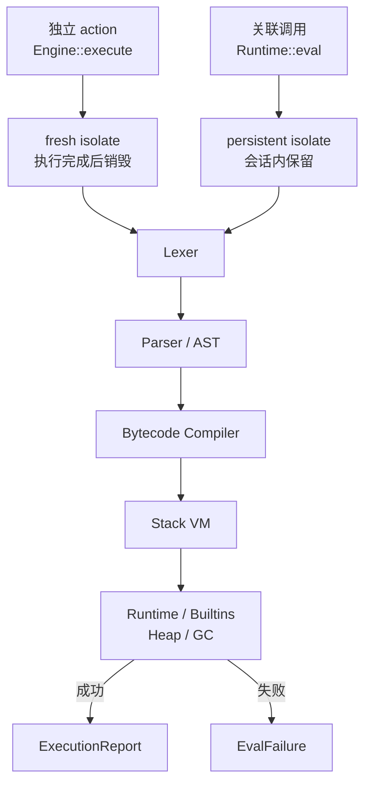
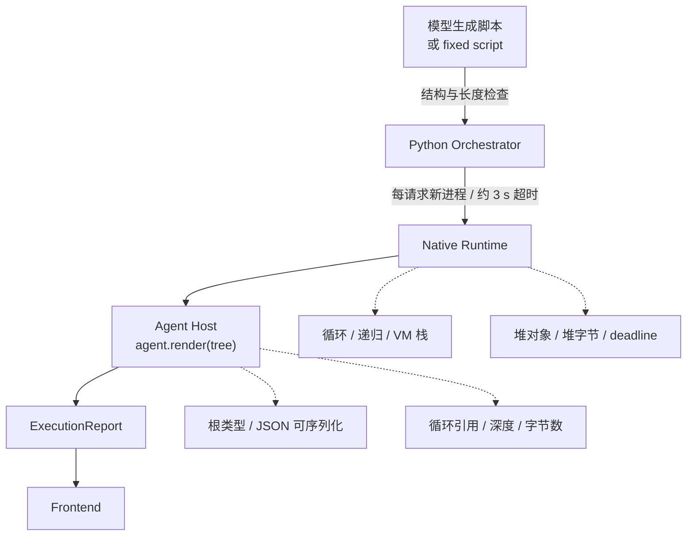
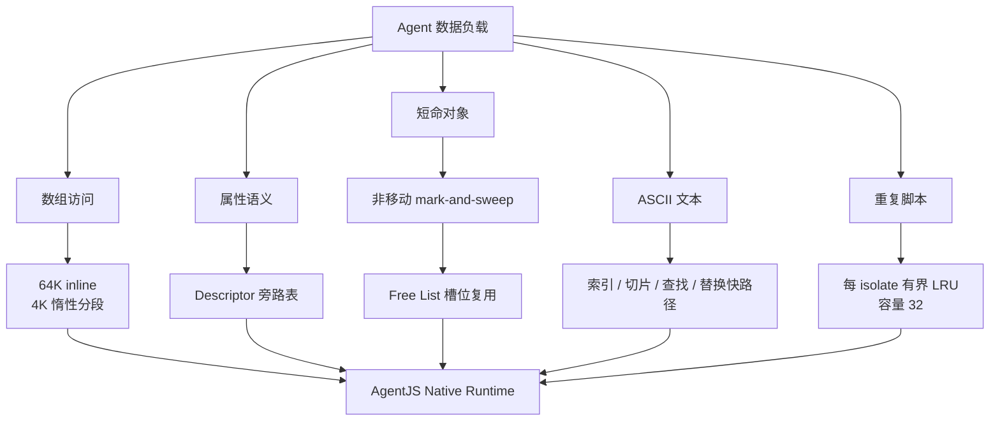
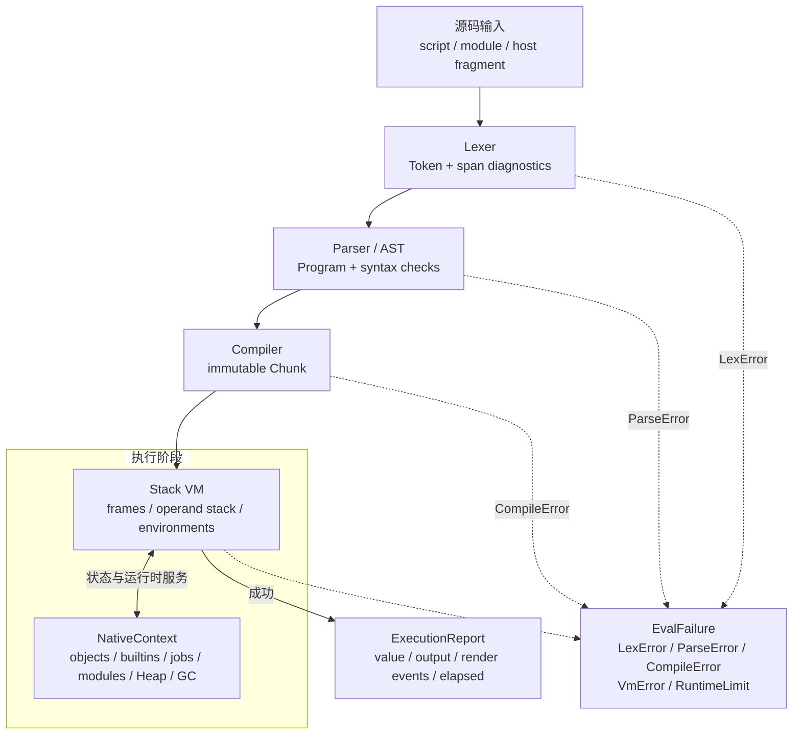
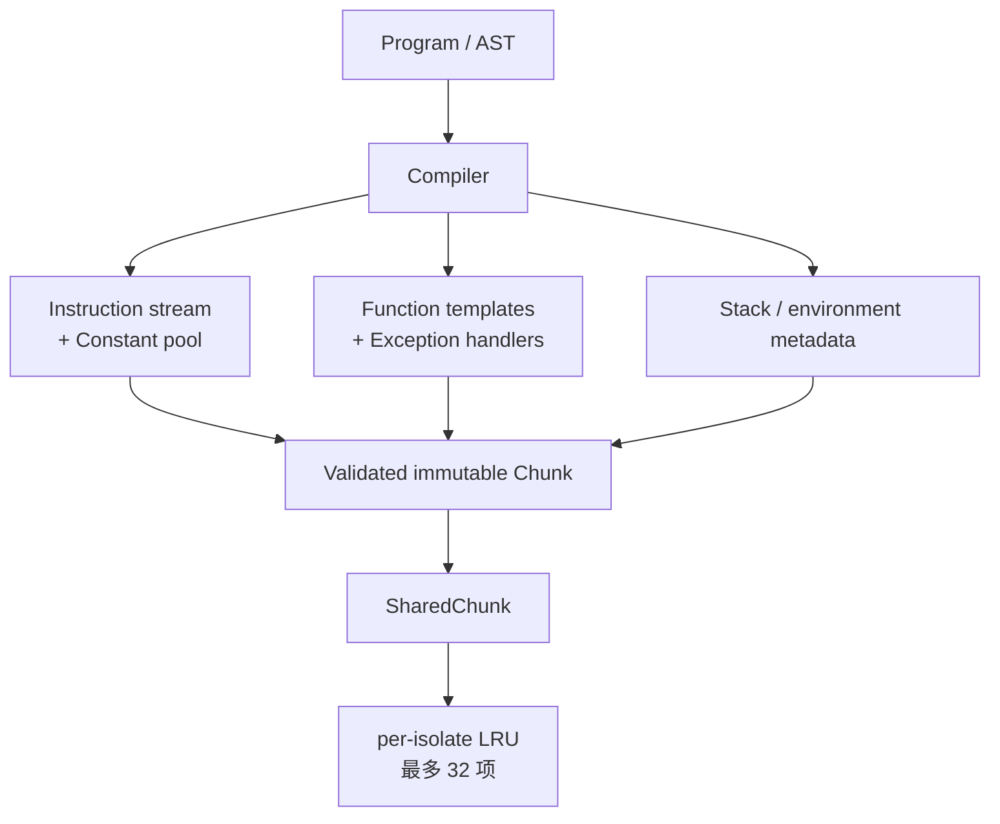
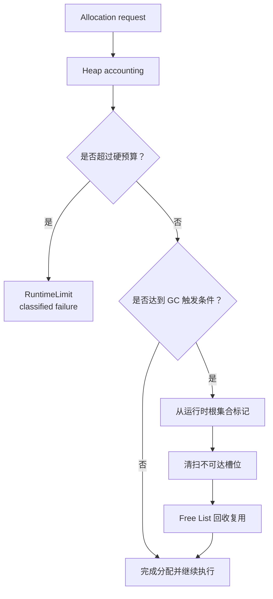
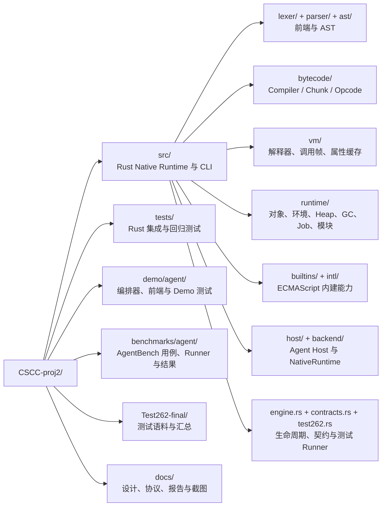
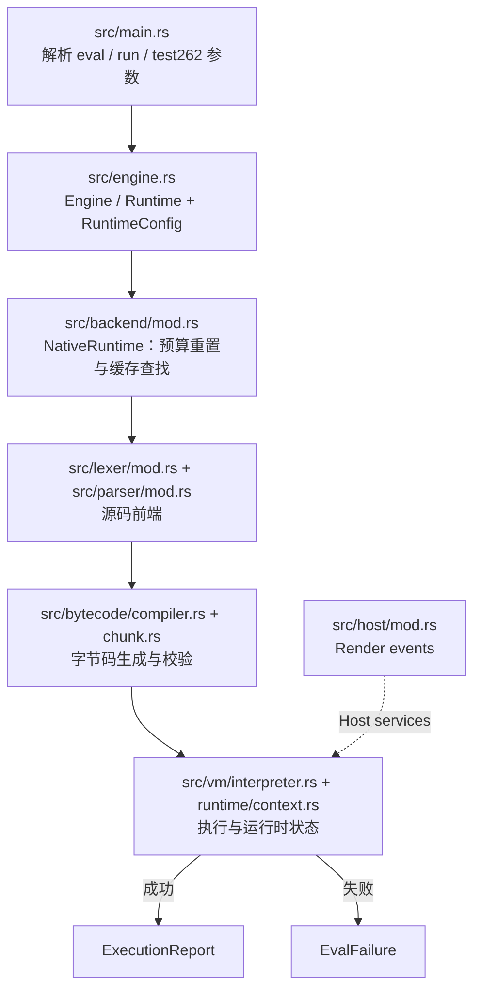
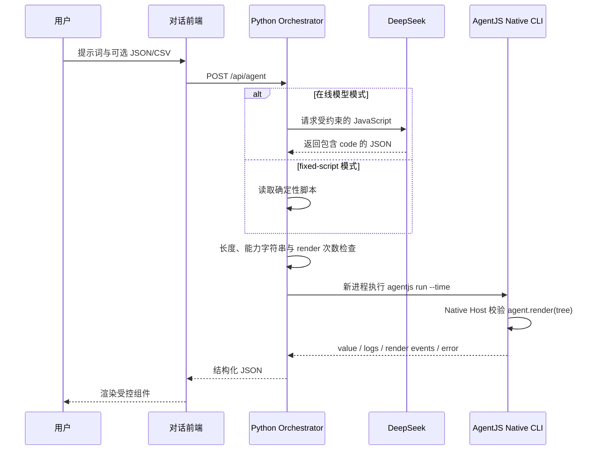
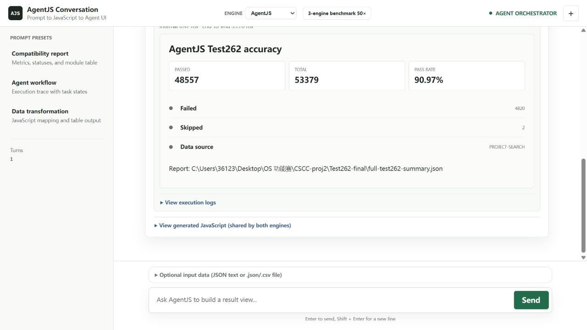

# AgentJS：面向 AI Agent 的轻量级 JavaScript 执行引擎设计与实验报告

> 项目名称：AgentJS
>
> 技术路线：Rust + 自研 Lexer/Parser/AST + 自定义字节码 + 栈式虚拟机 + Native Runtime
>
> 内嵌执行后端：Native（Boa、QuickJS 仅作外部参照）
>
> 报告日期：2026-08-12
>
> 文档编写时仓库 HEAD：`30f023992ecced51b2c7789ba8d57e47797d8f20`

---

## 项目概览

AI Agent 的脚本通常服务于一次工具调用：代码量不大，生命周期很短，却可能在一次规划中被反复生成和执行。AgentJS 针对这一工作负载，构建了从源码、词法分析、语法树、字节码到栈式 VM 和运行时对象模型的 Native 执行链，并把 action 级隔离、资源预算和结构化宿主输出作为一等设计约束。

本报告采用“设计思路—实现描述—代码落点—Benchmark 证据”的顺序，回答项目最关注的四件事：引擎是否真正自研且可独立运行，短任务是否能快速完成，资源是否可被宿主控制，以及执行结果能否进入真实的 Agent 展示链路。报告将引用仓库中已经归档的 Test262、SunSpider、AgentBench 和 Demo 证据。

当前可复核的核心结果为：Test262 **48,557 / 53,379，通过率 90.97%**；SunSpider 1.0.2 **26 / 26** 正确完成；AgentBench 的 cold 端到端耗时几何平均优于 Boa、但落后 QuickJS，batch 模式总体落后于两种参照引擎；归档批次中的 AgentJS 可执行文件为 **10.29 MiB**。

## 一、设计思路

### 1.1 问题背景

在数据整理、规则过滤、文本清洗和工具结果转换等 Agent action 中，JavaScript 执行有四个同时存在的要求：

- **返回要快**：脚本常在一次请求内完成，启动和解析成本会直接进入用户等待时间；
- **调用要稳**：同一服务可能连续执行彼此无关的代码，上一 action 的全局变量、原型修改或异常状态不能污染下一次调用；
- **边界要清楚**：模型生成的脚本是不可信输入，宿主必须能限制循环、递归、栈、堆、墙钟时间和输出规模；
- **结果要可编排**：Agent 需要得到可解析的值、日志和结构化渲染事件，而不是依赖浏览器 DOM 或非标准的隐式副作用。

这类工作负载与浏览器页面或 Node.js 长生命周期服务不同。AgentJS 因而不以复刻 DOM、Node.js API 或 JIT 生态为目标，而是把“短时、隔离、可控、可嵌入”作为执行内核的设计中心。

### 1.2 总体设计目标

| 目标 | 设计回答 | 评审证据 |
| :-- | :-- | :-- |
| Native 独立执行 | 自研 Lexer、Parser/AST、字节码编译器、栈式 VM、Runtime、Builtins、Heap 与 GC 组成完整内嵌链路 | 源码目录、Native CLI、构建与测试 |
| 短任务可预测 | 不走 JIT；源码直接编译为字节码解释执行，减少预热阶段 | AgentBench cold |
| action 级隔离 | `Engine` 为无关 action 创建 fresh isolate；相关调用由 `Runtime` 保持一个 isolate | Engine/Runtime 设计与 Demo 进程模型 |
| 宿主可控 | 循环、递归、VM 栈、堆对象、堆字节、大对象、墙钟和 RenderTree 均有预算 | `RuntimeConfig`、`RuntimeLimit`、Host 校验 |
| ECMAScript 兼容 | 以 Test262 全量汇总和 SunSpider 经典脚本检验语义覆盖 | 90.97%、26/26 |
| 结构化集成与可复现 | `ExecutionReport` 承载 value、output 和 render events，失败由 `EvalFailure` 分类返回；实验保存 JSON、环境与二进制指纹 | Agent Demo、AgentBench 归档 |

上述目标之间存在取舍：兼容性要求扩大内建对象与语义覆盖，轻量化要求控制常驻状态，隔离性又会增加启动成本。报告后半部分不把单一指标当作总分，而是分别给出正确性、冷启动、批处理、内存、体积和集成证据。

### 1.3 创新点 1：Native 执行链与双入口隔离

AgentJS 的第一项核心设计是把“执行实现”和“调用生命周期”分开。所有 Native action 都经过同一条自研链路；宿主根据调用关系选择独立 `Engine` 或持久 `Runtime`，而不是把状态隔离和编译实现混在一个全局上下文中。



*图 1　AgentJS 双入口隔离与 Native 执行链*

两种入口的状态边界如下：

| 入口 | isolate 生命周期 | 适用场景 | 共享内容 |
| --- | --- | --- | --- |
| `Engine::execute` | 每次 action 新建并销毁 | 不同用户请求、模型生成的相互独立脚本 | 不共享可变全局、原型和异常状态 |
| `Runtime::eval` | 会话内持续存在 | REPL、同一工具链的连续片段 | 在明确会话内保留环境、Job Queue 和有界脚本缓存 |

Native 是当前程序唯一的内嵌执行后端。Boa 和 QuickJS 不参与 AgentJS 的执行，也不存在 Native 失败后静默回退到外部引擎的路径；它们只在横向实验中作为参照。这一边界让性能和兼容性结果能够归因于 AgentJS 自身实现。

### 1.4 创新点 2：按 action 隔离的资源预算与受控 Host

Agent action 的安全边界不是单一的“禁止某个字符串”，而是由运行时预算、宿主 API 边界和进程生命周期共同构成：



*图 2　Agent action 的分层执行与宿主边界*

运行时预算及其作用如下：

| 预算 | 默认值/边界 | 超限行为 | 控制对象 |
| --- | --- | --- | --- |
| 循环检查 | 10,000,000 次 | 返回 `RuntimeLimit` | 无限循环与异常长循环 |
| 递归深度 | 256 层 | 返回 `RuntimeLimit` | 深递归调用 |
| VM 操作数栈 | 65,536 个值 | 返回 `RuntimeLimit` | 操作数栈深度增长 |
| 堆对象 | 500,000 个 | 返回 `RuntimeLimit` | 对象、函数和环境数量 |
| 堆字节 | 256 MiB | 返回 `RuntimeLimit` | Heap 与受保护的大块分配 |
| 大对象分配 | 单独计量 | 返回 `RuntimeLimit` | 一次性大数组、字符串等 |
| 墙钟时间 | 可配置 deadline | 返回 `RuntimeLimit` 或宿主超时 | 占用宿主进程的时间 |
| RenderTree | 字节数与嵌套深度上限 | Host 拒绝事件 | 输出数据规模与递归结构 |

默认 Runtime 不暴露文件系统、进程、网络、DOM 或 Node API；文件读取必须由宿主显式安装根目录受限的加载器。Demo 在这些运行时约束之外再启用进程隔离，形成可审计的 action 边界。需要强调的是，Python 层的字符串黑名单不是形式化沙箱，RenderTree 校验也不是完整字段级 Schema；安全主张限定在当前实现的 API 暴露面和超时策略内。

### 1.5 创新点 3：面向 Agent 负载的数据结构与快速路径

Agent 数据通常是“多数普通字段、少量特殊属性、局部大索引、短命临时对象和 ASCII 文本”的组合。AgentJS 针对这一形态做了局部优化，并保持对象 ID 和属性语义稳定：



*图 3　面向 Agent 数据负载的运行时优化布局*

| 机制 | 核心实现 | 预期收益 |
| :-- | :-- | :-- |
| 分段稠密数组 | 前 64K 槽位 inline；之后按 4K 槽位惰性分段；超大索引转入 sparse property | 降低稀疏大索引数组的预分配成本 |
| Descriptor 旁路表 | 普通元素只保存值；非默认属性描述符存放在覆盖表 | 让普通元素路径保持紧凑 |
| 非移动 mark-and-sweep + Free List | 标记清扫保持对象 ID 稳定，回收槽位供后续对象复用 | 适合 action 内临时对象的创建与回收 |
| ASCII 快速路径 | 长度、索引、切片、查找、大小写和替换优先走 ASCII 路径 | 降低日志、JSON 字段和规则文本的处理开销 |
| 有界脚本缓存 | 键包含源码、严格模式和源码类型；命中后更新 LRU，容量为 32 | 复用重复脚本，同时避免缓存无限增长 |

这些优化是完整 Native Runtime 的组成部分，并非本批次单项消融变量。AgentBench 的某个 case 表现较好或较差时，只能评价完整系统在该负载上的结果，不能把差值直接归因于某一个优化。

## 二、实现描述

### 2.1 完整工作流程

一次普通脚本执行的输入、状态和输出可以概括为：



*图 4　一次 AgentJS 求值请求的完整流水线*

`NativePipeline` 以 `SourceParser`、`ProgramCompiler` 和 `ChunkExecutor` 三个契约连接前端、编译器和 VM，使每一层可以独立测试。`NativeRuntime` 负责缓存、预算重置、模块登记和报告组装；`Engine`/`Runtime` 负责把该后端放入正确的 isolate 生命周期。

### 2.2 Lexer、Parser 与 AST

`src/lexer/` 将源码切分为带 span 的 Token，处理关键字、标识符、数字、字符串、模板、正则和 Unicode 标识符；词法错误在进入 VM 前即被分类。`src/parser/` 构造 `Program`、表达式和语句 AST，区分 script、module 与 host fragment，并在解析阶段完成括号、绑定、控制流和模块语法检查。`src/ast/` 保存表达式、语句、函数、类、导入导出和绑定模式等稳定数据类型。

这一层的输出不是“可执行的字符串”，而是带结构信息的 AST。这样做有两个直接作用：一是让编译器可以对跳转、作用域和异常区间做静态布局；二是让 Test262 Runner 能在单个用例失败时区分词法/语法错误与运行时错误。

| 模块 | 输入 | 输出 | 失败形式 |
| --- | --- | --- | --- |
| `lexer` | UTF-8 源码 | `Token` 序列、span | `LexError` |
| `parser` | Token 序列 | `Program` / AST | `ParseError` |
| `ast` | 结构定义 | 编译器和模块系统共享的语义节点 | 由上游报告 |

### 2.3 Compiler 与字节码 Chunk

`src/bytecode/compiler.rs` 把 AST 降低为自定义 `Chunk`，`src/bytecode/opcode.rs` 定义栈效果明确的指令，`src/bytecode/chunk.rs` 保存常量池、函数表、异常处理区间和缓存元数据。编译器同时记录局部变量、上值和环境信息，并校验跳转目标、常量索引、函数索引以及指令栈深度，避免把结构错误推迟到执行阶段。



*图 5　字节码 Chunk 的组成、校验与缓存路径*

栈式字节码的取舍是明确的：它保留了表达式求值顺序和异常恢复所需的栈深度信息，便于先完成语义覆盖与资源检查；代价是部分热点循环会承担更多解释器 dispatch。AgentBench 中字符串扫描和部分批处理短板正体现了这一工程方向，后续优化将优先针对热点指令路径。

### 2.4 Stack VM、调用帧与异步作业

`src/vm/interpreter.rs` 是字节码执行核心。VM 维护操作数栈、`CallFrame` 调用帧、程序计数器、环境链和异常处理状态；`src/vm/frame.rs`、`src/vm/invocation.rs` 分别承载帧根和调用/构造请求。完成记录统一为 `Completion`，`return`、`throw`、`break`、`continue` 和异常传播在同一控制模型中处理。

执行中的关键路径包括：

1. 取指并根据指令的栈效果检查操作数栈；
2. 解析全局、局部和闭包环境，执行属性读写、调用和构造；
3. 遇到 `try/catch/finally` 或 `throw` 时按字节码异常区间恢复栈深度和环境深度；
4. 将 Promise、微任务和模块评估交给 `runtime/job.rs` 与模块注册表，在宿主要求时排空 Job Queue；
5. 在检查点读取循环、墙钟和堆预算，超限后返回可分类的 `EvalFailure`。

这条路径保持“Parser 不执行、VM 不承担顶层源码解析”的层次边界，便于对每一层分别做单元测试和差分检查。

### 2.5 Runtime、Heap、GC 与预算

`src/runtime/context.rs` 的 `NativeContext` 是每个 isolate 的运行时状态容器，连接全局环境、内建对象、模块注册表、Host 服务、Heap、GC 控制器和执行预算。`src/runtime/heap.rs`、`gc.rs`、`memory.rs` 共同记录对象槽位、环境、函数、估算字节数、分配次数和回收统计。

Runtime 的资源路径如下：



*图 6　Heap 预算检查与非移动 GC 决策流程*

GC 采用非移动 mark-and-sweep：从全局环境、当前环境、调用帧、操作数栈、待处理异常和内建根集合出发标记对象、环境和函数，清扫不可达槽位；对象 ID 在清扫过程中保持稳定，空槽由 Free List 重新分配。该设计优先保证属性引用和诊断信息的稳定性，换取了在局部压力负载上可能更高的峰值内存。报告中的 RSS 是宿主侧观测值，不能替代 Heap 内部统计。

### 2.6 对象模型、属性访问与场景优化

`src/runtime/object.rs`、`property.rs`、`property_map.rs` 和 `shape.rs` 定义对象、属性描述符、形状与属性存储；`src/vm/property_cache.rs` 提供属性访问的缓存入口。数组和字符串路径在通用对象模型上增加了针对 Agent 数据的快速分支。

| 实现部位 | 设计要点 | 与负载的对应 |
| --- | --- | --- |
| Array storage | 64K inline + 4K 惰性分段；超大索引进入 sparse property | `large-index-dense-array`、局部窗口写入 |
| Descriptor storage | 普通元素值与非默认 descriptor 分离 | `descriptor-side-table-array` |
| Property access | 形状/属性表与 VM property cache 协同 | `object-property-hot-loop`、规则过滤 |
| String value | ASCII 长度、索引、切片、查找、大小写、替换快路径 | `string-*` 系列任务 |
| Script cache | 源码 hash + strict + source kind 作为键，LRU 容量受 `RuntimeConfig` 限制 | 重复规则和固定工具脚本 |

本节列的是实现机制，不是逐项性能归因。归档批次没有关闭单个开关的消融数据，因而只能把 case 结果解释为完整系统表现。

### 2.7 Builtins、Agent Host 与 RenderTree

`src/builtins/` 安装 Object、Array、Function、String、JSON、Math、RegExp、Promise、Map/Set、TypedArray、Date/Intl 等标准对象；`src/host/mod.rs` 只安装面向 Agent 的最小 Host 面。`agent.render(tree)` 的处理顺序为：根对象类型检查 → 循环引用与 JSON 可序列化检查 → 深度和字节预算检查 → 记录规范化 JSON 事件。

允许的 RenderTree 根类型为 `panel`、`text`、`metrics`、`statuses`、`table` 和 `list`。前端不读取 VM 内部对象，只消费 `ExecutionReport` 中的 render events；因此引擎可以替换而不改变页面协议。Demo 通过 Python 编排器和 Native CLI 新进程完成一次 action，默认约 3 秒宿主超时；DeepSeek 仅是可选的脚本生成端，fixed-script 是可重复的展示路径。

### 2.8 Test262 Runner

`src/test262.rs` 负责发现测试、加载 harness、选择 strict/non-strict 变体、并行调度用例、捕获单用例 panic，并汇总 passed/failed/skipped 和耗时。Runner 的后端参数固定为 Native 时，测试只进入自研执行链；汇总 JSON 是结果证据，但当前文件没有嵌入执行时 commit、Test262 revision、命令或机器信息，正式复测时应额外保存这些元数据。

## 三、代码说明

### 3.1 顶层目录



*图 7　AgentJS 仓库与核心源码层级*

### 3.2 核心模块职责

| 路径 | 职责 | 关键输出/边界 |
| --- | --- | --- |
| `src/lexer/` | Token 化、span 和 Unicode 标识符 | `Token`、`LexError` |
| `src/parser/`、`src/ast/` | 源码解析与稳定 AST | `Program`、`ParseError` |
| `src/bytecode/` | AST 编译、Opcode、Chunk 校验 | `SharedChunk`、常量池、异常区间 |
| `src/vm/` | 操作数栈、调用帧、异常和 Job 驱动 | `Vm`、`Completion` |
| `src/runtime/` | 值、对象、环境、Heap、GC、模块 | `NativeContext`、预算统计 |
| `src/builtins/`、`src/intl/` | 标准构造器、方法、Intl 能力和测试 harness | ECMAScript 内建对象 |
| `src/host/` | `agent.render`、Host 文件加载器、RenderTree 校验 | `RenderEvent` |
| `src/backend/mod.rs` | NativeRuntime、脚本缓存、后端契约 | `BackendKind::Native` |
| `src/engine.rs` | `Engine`/`Runtime` 生命周期、配置和报告 | `ExecutionReport`、`EvalFailure` |
| `src/contracts.rs` | Parser/Compiler/Executor 的可替换协作接口 | `NativePipeline` |
| `src/test262.rs` | 测试发现、调度、汇总和错误隔离 | JSON/Markdown 结果 |
| `demo/agent/server.py` | 请求编排、模型可选调用、进程隔离 | HTTP JSON 与前端数据 |

### 3.3 关键文件与代码工作流

一次从 CLI 到结果的代码路径可简化为：



*图 8　从 CLI 入口到执行报告的代码工作流*

`src/contracts.rs` 是跨层协作边界：Lexer/Parser 实现 `SourceParser`，Compiler 实现 `ProgramCompiler`，VM 实现 `ChunkExecutor`。这种接口把正在替换或独立开发的阶段隔开，测试可以注入 fake stage，而不把测试逻辑耦合到具体实现细节。

### 3.4 设计点到代码位置快速导航

| 设计点 | 代码入口 |
| --- | --- |
| Engine/Runtime 双入口 | `src/engine.rs` 的 `Engine`、`Runtime` |
| Native-only 后端与 32 项 LRU | `src/backend/mod.rs` 的 `BackendKind`、`NativeRuntime` |
| Lexer/Parser/AST | `src/lexer/`、`src/parser/`、`src/ast/` |
| 自定义栈式字节码 | `src/bytecode/compiler.rs`、`src/bytecode/opcode.rs`、`src/bytecode/chunk.rs` |
| 调用帧、Completion、属性缓存 | `src/vm/frame.rs`、`src/vm/invocation.rs`、`src/vm/property_cache.rs` |
| Heap、非移动 GC、Free List | `src/runtime/heap.rs`、`src/runtime/gc.rs`、`src/runtime/stable_arena.rs` |
| 分段数组与 descriptor 旁路 | `src/runtime/object.rs`、`src/runtime/property.rs`、`src/runtime/property_map.rs` |
| ASCII 字符串路径 | `src/runtime/string_value.rs`、`src/builtins/string.rs` |
| `agent.render` 与 RenderTree | `src/host/mod.rs`、`demo/agent/protocol.md` |
| Test262 汇总 | `src/test262.rs`、`Test262-final/full-test262-summary.json` |
| AgentBench | `benchmarks/agent/manifest.json`、`benchmarks/agent/run_agentbench.py` |

## 主要使用的开源项目与依赖说明

| 来源 | 本项目中的用途 | 是否进入 Native 核心 |
| --- | --- | --- |
| Boa `de2221a09c132951c2ebad36e62ecd20b9987215` | 外部正确性与性能参照 | 否 |
| QuickJS `04be246001599f5995fa2f2d8c91a0f198d3f34c` | 轻量引擎性能参照 | 否 |
| Test262 `de8e621cdba4f40cff3cf244e6cfb8cb48746b4a` | ECMAScript 测试语料 | 否 |
| SunSpider 1.0.2 | 经典脚本正确性与热点观察 | 否 |
| DeepSeek | Demo 的可选 JavaScript 生成端 | 否 |
| Rust crates | RegExp、Unicode/Intl 等基础库能力 | 作为 Cargo 依赖进入构建 |

Boa 和 QuickJS 不被链接到 AgentJS Native 执行路径；只有明确选择的外部命令才会启动参照引擎。第三方版本和许可证记录见 [`docs/dependencies.md`](dependencies.md)。

## 四、Benchmark 与评分体系

### 4.1 测试套件设计

| 套件 | 要回答的问题 | 输入规模/样本 | 控制条件 | 主要输出 |
| --- | --- | --- | --- | --- |
| Test262 | ECMAScript 语义覆盖是否达到赛题门槛 | 53,379 个汇总执行项 | Native 全量扫描；失败和跳过不计通过 | passed/failed/skipped、通过率、耗时 |
| SunSpider 1.0.2 | 经典脚本能否完整执行，热点在哪里 | 26 个用例，3 次运行 | AgentJS 与 Boa 各自独立历史批次；60 s timeout | 正确性状态、代表性中位耗时 |
| AgentBench 2.0 cold | 单次 action 的启动至退出成本 | 12 个确定性 case | AgentJS、Boa、QuickJS 同机；warmup=3、repeat=15 | P50 elapsed、观测峰值 RSS |
| AgentBench 2.0 batch | 连续 action 的端到端吞吐 | 同 12 个 case；每进程同一 action 5 次 | 其余条件与 cold 相同 | 5 次 action 总时间 P50、观测峰值 RSS |
| Agent Demo | 能否进入真实 Agent 调用与展示链路 | fixed-script；可选 DeepSeek 在线模式 | 新进程、Host 校验、约 3 s 宿主超时 | value、logs、RenderTree、页面结果 |

AgentBench 的 12 个确定性 case 覆盖 JSON 解析、工具结果聚合、规则过滤、对象属性热循环、短命对象、数组 descriptor、大索引数组和字符串处理；每个 case 都有结果校验。Core benchmark 不调用 AgentJS 专用 `agent.render`，以免把 Host 专有能力混入跨引擎比较。

### 4.2 指标定义与统计口径

本项目没有官方提供的多维加权总分，因而不虚构一个综合评分。评委可以分别查看以下指标：

| 指标 | 定义 | 解释 |
| --- | --- | --- |
| Test262 通过率 | `passed / total × 100%` | 失败和跳过不计通过 |
| 正确完成数 | 通过结果检查且无 error/timeout 的 case 数 | 用于 SunSpider、AgentBench 门控 |
| 相对耗时 | `R_time = 参考引擎耗时 / AgentJS 耗时` | `R_time > 1` 表示 AgentJS 更快 |
| 相对 RSS | `R_rss = 参考引擎 RSS / AgentJS RSS` | `R_rss > 1` 表示 AgentJS 使用更少内存 |
| 总体 AgentBench 值 | 12 个共同通过 case 的比值几何平均 | 避免大耗时 case 直接支配总和 |
| 单项耗时 | 15 个有效样本的 P50 | batch 的 P50 是同进程 5 次 action 总时间 |
| 峰值 RSS | `psutil` 约每 5 ms 采样的最大观测值 | 不是连续监测意义上的绝对峰值 |
| 产物体积 | 归档二进制文件大小 | 与具体批次 SHA-256 一一对应 |

三种引擎的 cold/batch case 在本批次均通过执行、超时和确定性结果检查，故 12 个 case 全部进入几何平均。batch 只是同一脚本进程循环同一 action 5 次，不等价于对持久 `Runtime` 的多次调用，也不是脚本缓存的消融实验。

### 4.3 环境与原始证据

| 项目 | 记录值 |
| --- | --- |
| 测试平台 | Windows 11 `10.0.26200`，AMD64 |
| CPU 标识 | Intel64 Family 6 Model 183 Stepping 1 |
| Rust | `rustc 1.91.0 (f8297e351 2025-10-28)` |
| Python | 3.13.5 |
| AgentBench cold 生成时间 | `2026-08-11T13:46:06Z` |
| AgentBench batch 生成时间 | `2026-08-11T14:27:19Z` |
| AgentBench AgentJS 历史二进制 SHA-256 | `427b4acd131cdab743751c4e488079c5dfa4c79a2b5523a87affc9fbcb407b66` |
| 文档编写时 AgentJS HEAD | `30f023992ecced51b2c7789ba8d57e47797d8f20` |
| 仓库当前固定 Test262 revision | `de8e621cdba4f40cff3cf244e6cfb8cb48746b4a` |

AgentBench 结果严格对应历史 SHA-256 二进制，不等同于当前 HEAD 重新构建后的测量值。Test262 汇总 JSON 没有保存执行时 AgentJS commit、Test262 revision、命令或机器信息；当前固定 revision 只能说明仓库依赖状态，不能反向证明该汇总由当前 HEAD 生成。

原始证据索引：

| 内容 | 仓库记录 |
| --- | --- |
| Test262 汇总 | [`Test262-final/full-test262-summary.json`](../Test262-final/full-test262-summary.json) |
| AgentBench 测试定义与方法 | [`manifest.json`](../benchmarks/agent/manifest.json)、[`run_agentbench.py`](../benchmarks/agent/run_agentbench.py) |
| AgentBench 环境与原始样本 | 由项目 benchmark 结果目录归档；正文仅呈现本节列明的参照项 |
| SunSpider 原始/可读结果 | [`agentjs-sunspider.json`](../benchmarks/sunspider/results/agentjs-sunspider.json)、[`boa-sunspider.json`](../benchmarks/sunspider/results/boa-sunspider.json) 及对应 `.md` |
| Demo 截图 | [`agentjs-demo-test262.png`](assets/agentjs-demo-test262.png) |

### 4.4 Test262 兼容性

| Total | Passed | Failed | Skipped | Pass rate | Elapsed |
| ---: | ---: | ---: | ---: | ---: | ---: |
| 53,379 | **48,557** | 4,820 | 2 | **90.97%** | 452.354 s |

精确通过率为 90.9665%。相对于赛题 60% 门槛，高出 **30.97 个百分点**，兼容性基础验收目标已经达到。Native Runner 对失败与跳过分别计数，二者都没有被折算为通过；本表也没有混入 Boa 或其他参照引擎的数据。

90.97% 表明自研前端、字节码和运行时已经覆盖大部分测试语义，但不等于完整 ECMAScript 一致性。剩余 4,820 个失败可能分布在现代语法、模块、RegExp、Intl/Temporal 和精确错误语义等区域，不能因为某个构造器存在就宣称对应标准族全部实现。

### 4.5 SunSpider 1.0.2

| 类别 | 用例数 | AgentJS 通过 |
| --- | ---: | ---: |
| 3D / access / bitops / controlflow | 12 | 12 |
| crypto / date / math | 8 | 8 |
| regexp / string | 6 | 6 |
| **合计** | **26** | **26** |

AgentJS 在归档记录中没有 wrong result、runtime error 或 timeout。代表性中位耗时如下：

| Case | AgentJS | Boa | 观察 |
| --- | ---: | ---: | --- |
| `bitops-bitwise-and` | **262 ms** | 286 ms | 位运算路径在该用例略快 |
| `regexp-dna` | 3,098 ms | **106 ms** | RegExp 路径存在明显差距 |
| `string-tagcloud` | 8,208 ms | **148 ms** | 复杂字符串与对象处理仍是热点 |

两份 SunSpider 结果分别来自 AgentJS 与 Boa 的历史 3 次运行，未保存共同机器指纹、commit 和二进制哈希。因此 **26 / 26** 用于正确性结论；耗时只用于定位热点，不作为严格同步的引擎排名。

### 4.6 AgentBench 2.0

#### 4.6.1 总体结果

下表的比值统一为“参考引擎 / AgentJS”，对 12 个共同通过 case 取几何平均：

| 模式 | 指标 | Boa / AgentJS | QuickJS / AgentJS |
| --- | --- | ---: | ---: |
| cold | 端到端耗时 | **1.090x** | 0.186x |
| batch | 端到端耗时 | 0.625x | 0.112x |
| cold | 观测峰值 RSS | **1.138x** | 0.472x |
| batch | 观测峰值 RSS | **1.004x** | 0.334x |

**关键观察：**

- cold 与赛题的即时执行场景最接近。Boa 的总体耗时为 AgentJS 的 1.090 倍，说明 AgentJS 在这组冷任务上相对 Boa 具有竞争力；QuickJS 约快 **5.4 倍**，因此不能把优势外推到所有参照引擎。
- batch 中 Boa 约快 AgentJS **1.60 倍**，QuickJS 约快 **8.9 倍**。AgentJS 的连续执行正确性没有问题，但当前吞吐未形成总体领先。
- cold RSS 低于 Boa，batch RSS 与 Boa 接近；QuickJS 在两种模式都更省内存。`rule-filter-dense-window` 的 RSS 峰值说明轻量化不是所有负载上的固定属性。

#### 4.6.2 cold 代表性用例

以下数值为单 action 端到端 P50，按启动、JSON、数组和字符串路径选取，既展示优势也展示短板：

| Case | AgentJS | Boa | QuickJS |
| --- | ---: | ---: | ---: |
| `startup-noop` | 18.5 ms | 23.4 ms | **12.6 ms** |
| `json-parse-transform` | 28.6 ms | 40.2 ms | **17.2 ms** |
| `descriptor-side-table-array` | 424.3 ms | 569.2 ms | **40.0 ms** |
| `large-index-dense-array` | 638.5 ms | 715.9 ms | **52.2 ms** |
| `string-cleanup-replace-window` | 151.5 ms | 1,195.0 ms | **17.8 ms** |
| `string-log-token-slice` | 509.2 ms | 555.4 ms | **17.5 ms** |
| `string-ascii-index-scan` | 470.1 ms | 114.1 ms | **23.2 ms** |
| `rule-filter-dense-window` | 443.2 ms | 295.4 ms | **51.3 ms** |

`startup-noop`、`json-parse-transform` 和两项数组/清洗任务显示 AgentJS 在该批次中可以压低 Boa 的启动或执行成本；`string-ascii-index-scan` 与 `rule-filter-dense-window` 则暴露出字符串循环、数组窗口和对象筛选的解释器开销。表中差异用于定位工程优先级，不被解释为单项优化的因果证据。

#### 4.6.3 RSS 与可执行文件体积

代表性观测峰值 RSS 如下（单位：MiB）：

| 模式 / Case | AgentJS | Boa | QuickJS |
| --- | ---: | ---: | ---: |
| cold / `startup-noop` | 7.02 | 11.33 | **4.33** |
| cold / `descriptor-side-table-array` | 13.32 | 25.93 | **12.23** |
| cold / `rule-filter-dense-window` | 102.07 | 26.83 | **18.40** |
| batch / `string-cleanup-replace-window` | 10.03 | 14.46 | **5.39** |
| batch / `string-log-token-slice` | 10.26 | 13.83 | **5.07** |

同一归档批次记录的可执行文件大小为：

| 引擎 | Bytes | MiB |
| --- | ---: | ---: |
| AgentJS | 10,785,280 | **10.29** |
| Boa | 29,936,640 | 28.55 |
| QuickJS | 1,142,784 | **1.09** |

AgentJS 产物约为 Boa 的 36%，支持“相对 Boa 更轻”的判断；QuickJS 更小，故不能称 AgentJS 是本批次最小引擎。上述体积与 RSS 同样只对应历史 AgentBench 二进制指纹，不能直接套用到当前源码重新构建的文件。

### 4.7 Agent Demo 集成验证

#### 4.7.1 调用链



*图 9　Agent Demo 从脚本生成到结构化展示的调用链*

Python 编排器支持 fixed-script 和可选 DeepSeek 在线模式。脚本进入 Native 前会经过响应结构、长度、受限能力字符串、`return` 和 `agent.render` 调用次数检查；每个请求在独立进程中执行。Native Host 对 RenderTree 根类型、JSON 可序列化性、循环引用、嵌套深度和字节数进行二次校验，允许 `panel`、`text`、`metrics`、`statuses`、`table`、`list` 六类根节点。

#### 4.7.2 展示结果

下图是 2026-08-11 使用 fixed-script 和 Native AgentJS 完成“Compatibility report”的实际页面。它证明了“输入数据 → JavaScript 处理 → `agent.render` → RenderTree → 前端”的链路闭合，不代表 DeepSeek 在线生成质量、成功率或性能。



Demo 的价值在于验证宿主协议，而非把前端页面当作引擎性能测试：页面只消费 RenderTree，VM 的对象、堆和异常状态不会直接暴露给浏览器。

### 4.8 可复现性

#### 4.8.1 构建与 Rust 测试

```powershell
git submodule update --init --recursive
cargo build --release --locked
cargo test --all-targets
python -m unittest discover -s demo\agent\tests -p "test_*.py"
.\target\release\agentjs.exe eval "1 + 2"
```

已验证的本地结果是 Rust 全目标测试通过、Demo Python 测试 **37 / 37** 通过、release 构建成功，`eval "1 + 2"` 输出 `3`。这些是当前源码的冒烟检查，不替代历史 AgentBench 批次。

#### 4.8.2 Test262 复测模板

```powershell
New-Item -ItemType Directory -Path reports\test262-YYYYMMDD-COMMIT -Force
.\target\release\agentjs.exe test262 `
  --root test262 `
  --suite test `
  --backend native `
  --jobs 4 `
  --json reports\test262-YYYYMMDD-COMMIT\summary.json
```

复测目录应同时保存 AgentJS commit、Test262 revision、构建命令、操作系统、CPU、Rust 版本、stdout/stderr 和二进制 SHA-256。上面是复测模板，不声称会重建仓库中已经归档的汇总。

#### 4.8.3 AgentBench 复测模板

```powershell
python benchmarks\agent\run_agentbench.py `
  --engine .\target\release\agentjs.exe `
  --ref boa=.\boa\target\release\boa.exe `
  --ref quickjs=.\quickjs\qjs.exe `
  --group all `
  --mode both `
  --warmup 3 `
  --repeat 15 `
  --batch-repeat 5 `
  --out-dir benchmarks\agent\results\agentjs-boa-quickjs-retest
```

执行前需要构建 Boa 并准备 QuickJS 可执行文件，确认命令行入口一致。当前工作区缺少 `quickjs/qjs.exe`，因此上述命令是复测模板，不能声称当前环境可直接完成全部参照测试。结果目录应保存 cold/batch Markdown、完整 JSON、环境记录、体积和哈希，且不覆盖本报告引用的历史批次。

#### 4.8.4 Demo 启动

```powershell
cargo build --release --locked
python demo\agent\server.py --host 127.0.0.1 --port 8787 --no-browser
```

浏览器访问 `http://127.0.0.1:8787/frontend/agent-chat.html`。未设置 `DEEPSEEK_API_KEY` 时使用 fixed-script；设置后才启用在线模式。现场演示建议优先使用 fixed-script，以保证输入和输出可重复。

## 五、研发过程中遇到的问题与解决方法

本节采用“现象 → 根因 → 解决思路 → 证据/边界”的格式，记录会影响评审判断的工程问题，不把未经归档的开发日志包装成实验结果。

### 5.1 跨层语义必须保持同一条栈约束

**现象：** 同一个 JavaScript 语义会同时影响 Parser 的 AST 形状、Compiler 的跳转布局和 VM 的栈/环境恢复；只修复其中一层，可能出现局部测试通过、组合语句失败的情况。

**根因：** 栈式 VM 依赖指令的消费/产生数量、异常处理区间和环境深度保持一致。

**解决思路：** 以 `contracts.rs` 的 `SourceParser`、`ProgramCompiler`、`ChunkExecutor` 作为跨层边界，在 Chunk 构建阶段检查栈效果、跳转目标和 handler 深度，在 VM 回归测试中覆盖控制流、闭包、异常和 Job Queue。

**证据/边界：** Test262 90.97% 和 SunSpider 26/26 证明大范围语义链路可用，但剩余失败仍说明兼容性工作未结束。

### 5.2 大规模扫描需要独立的证据闭环

**现象：** Test262 汇总数字可以复核，但汇总 JSON 没有执行时 commit、测试 revision、命令和机器信息。

**根因：** 结果文件记录了统计结果，却没有把运行元数据作为同一产物写入。

**解决思路：** 报告明确称其为“仓库保留的最新汇总”，另列仓库当前固定 revision；复测模板要求同步保存 commit、revision、环境和哈希。

**证据/边界：** 90.97% 的门槛结论仍成立，但不能把当前 HEAD 反向描述为该次扫描的执行版本。

### 5.3 性能批次的统计含义必须与调用模型分开

**现象：** batch 比 cold 更慢或更快，容易被误读为持久 Runtime 或脚本缓存的收益证明。

**根因：** 本批次的 batch 是同一脚本进程循环执行同一 case 5 次；它测量的是进程内连续 action 的端到端吞吐，并没有调用 `Runtime` 多次，也没有做优化开关消融。

**解决思路：** 在结果表前定义 P50、几何平均和“参考引擎 / AgentJS”比值，并把 batch 与 cold 的结论分开。

**证据/边界：** 当前证据支持“cold 相对 Boa 有竞争力、batch 总体未领先”，不支持缓存收益或通用吞吐领先的说法。

### 5.4 模型生成脚本与 Host 协议需要双重校验

**现象：** Demo 既要展示模型生成代码，又不能让模型代码直接取得文件、进程或网络能力。

**根因：** Python 字符串黑名单只能挡住已知文本，不能替代语言级沙箱；RenderTree 如果只在前端检查，也会把不受控数据带出宿主。

**解决思路：** 编排器做长度、能力字符串和调用次数检查；Native 进程提供 Runtime 预算和 `agent.render` 校验；Host 只接受六类根节点并限制 JSON 深度和字节数。

**证据/边界：** fixed-script 截图证明协议闭环；黑名单和当前树校验不宣称是形式化安全证明，在线模型质量也未量化。

### 5.5 已知性能与可推广性短板

**现象：** `string-ascii-index-scan`、`rule-filter-dense-window` 和部分 batch 组合落后于参照引擎，个别 RSS 峰值明显偏高。

**根因：** 栈式解释器 dispatch、字符串循环、数组窗口存活对象和 GC 时机仍存在热点；本批次只有单台 Windows 机器和 15 个样本。

**解决思路：** 优先优化 batch 执行路径、字符串扫描和数组峰值；补充多平台、多轮样本、置信区间和逐项消融。

**证据/边界：** 本报告不把一个 case 的差值直接归因于某一数据结构，也不把单机结果外推为所有平台表现。

## 六、AI 使用情况说明

项目开发和本文重构使用 Codex、Claude Code 等 AI 工具辅助代码阅读、任务拆分、失败聚类、表格整理和文字校对。AI 输出不直接作为实验结论：实现主张以 `src/` 源码和测试为准，实验数字以仓库中的 JSON/Markdown 原始产物为准；提交版本仍需由项目成员逐项复核。

## 七、结论与未来计划

### 7.1 当前结论

| 评审问题 | 结论 | 证据 |
| --- | --- | --- |
| ECMAScript 兼容性是否达标 | **达成** | Test262 90.97%，高于 60% 门槛 30.97 个百分点；SunSpider 26/26 |
| 单次冷任务是否有竞争力 | **部分达成** | cold 几何平均快于 Boa，慢于 QuickJS |
| 高频 batch 是否总体领先 | **尚未达成** | batch 几何平均落后 Boa、QuickJS，但 12 个 case 均正确完成 |
| 是否体现轻量化 | **部分达成** | 归档体积和 cold RSS 小于 Boa；QuickJS 更省，个别峰值偏高 |
| 能否进入 Agent 调用链 | **固定脚本路径达成** | Native Host、进程隔离、RenderTree 和前端展示闭环；在线生成质量未量化 |

AgentJS 当前最准确的定位是：一个不依赖外部执行引擎、标准覆盖较高、宿主边界清晰，并在部分冷任务中具备竞争力的 Native Agent Runtime。它不是在所有 workload 上都快于成熟引擎的通用性能冠军；批处理吞吐、字符串热点和峰值 RSS 是下一阶段应公开跟踪的指标。

### 7.2 未来计划

1. 在固定 AgentJS commit 与 Test262 revision 上重新扫描，并把命令、机器、环境和二进制哈希写入同一结果包；
2. 增加真正的 batch 执行路径与持久 `Runtime`/脚本缓存消融，区分进程成本、编译成本和 VM 吞吐；
3. 针对字符串索引/切片/替换、规则过滤和大索引数组增加专门的 profiling 与内存峰值测试；
4. 扩展多平台、多 CPU 和更多样本，报告置信区间与稳定性，而不是只保留单机 P50；
5. 将 RenderTree 协议版本化，补充字段级 Schema、长度和类型约束，并保留 fixed-script 与在线模式的独立指标。

---

## 附录：RenderTree 协议脚本示例

以下脚本展示 Demo wrapper 如何读取输入、计算 Test262 汇总并调用 Native `agent.render`。它是可执行的协议示例，不是一次已留档的 DeepSeek 在线生成结果：

```javascript
var modules = input.modules || [];
var total = modules.reduce(function (sum, item) {
  return sum + item.total;
}, 0);
var passed = modules.reduce(function (sum, item) {
  return sum + item.passed;
}, 0);
var passRate = total === 0 ? "0.00%" : (passed / total * 100).toFixed(2) + "%";

agent.render({
  type: "panel",
  title: "AgentJS Test262 accuracy",
  children: [
    {
      type: "metrics",
      items: [
        { label: "Passed", value: passed },
        { label: "Total", value: total },
        { label: "Pass rate", value: passRate }
      ]
    },
    {
      type: "table",
      columns: ["Module", "Passed", "Total"],
      rows: modules.map(function (item) {
        return [item.module, item.passed, item.total];
      })
    }
  ]
});

return passRate;
```

## License

本报告随 AgentJS 项目仓库发布；代码和第三方依赖的具体许可证以仓库根目录及 [`docs/dependencies.md`](dependencies.md) 中的声明为准。
