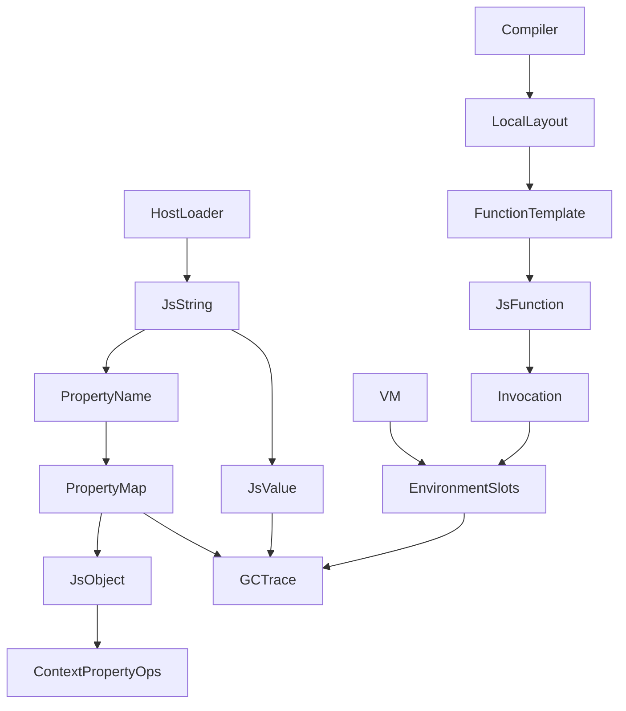

# AgentJS 第二阶段热点修复方案与接口共享文档

> 仓库：`ChaiXinran/CSCC-proj2`  
> 基线分支：`main`  
> 基线提交：`e4382f93fc400aefd07247e301dc40132634e5fd`  
> 文档日期：2026-08-04  
> 适用阶段：Runner / SharedChunk / GC 三线结构修复完成后的第二阶段  
> 并行任务：Local Slot / Compact Property Storage / Shared Runtime String

---

## 1. 文档目的

第一阶段已经完成 Runner 外置资源、SharedChunk、常量池哈希去重和 GC 热路径修复。第二阶段不再扩大 Runner、GC 或 Intl 的功能范围，而是集中处理三个仍位于执行热路径的问题：

1. **名字解析成本**：函数内部局部变量仍使用字符串和环境链查找；
2. **属性存储成本**：属性名保存两份，删除属性需要移动 Vec 并更新所有索引；
3. **字符串复制成本**：`JsValue::String(String)` 的普通克隆复制完整缓冲区。

本文档冻结三组共同依赖的类型、调用方向、文件所有权、兼容语义和验收标准，使三个人可以并行开发而不相互重构。

---

## 2. 当前代码事实与问题定位

### 2.1 函数局部变量仍然走动态名字查找

当前 `Environment` 使用：

```rust
pub struct Environment {
    pub outer: Option<EnvironmentId>,
    pub with_object: Option<ObjectId>,
    bindings: HashMap<String, Binding>,
}
```

函数内部标识符由编译器生成：

```rust
Instruction::LoadName(name_index)
Instruction::StoreName(name_index)
Instruction::DeclareLocal(name_index)
```

当前编译器的判断使函数内部标识符默认进入动态名字查找：

```rust
fn needs_dynamic_name_lookup(&self, name: &str) -> bool {
    self.inside_function() || self.with_depth > 0 || self.is_lexical(name)
}
```

即使是普通参数、循环变量和函数级 `var`，也会重复执行常量池取变量名、Environment HashMap 查找和 outer 链遍历。这会直接影响 `richards`、`splay`、`crypto`、`raytrace` 和 WSL。

### 2.2 PropertyMap 同时存在内存和复杂度问题

当前结构：

```rust
pub struct PropertyEntry {
    pub key: String,
    pub descriptor: PropertyDescriptor,
}

pub struct PropertyMap {
    entries: Vec<PropertyEntry>,
    index: HashMap<String, usize>,
}
```

同一属性名同时保存在 `entries[i].key` 和 HashMap key 中。删除流程还会调用 `Vec::remove()`，然后遍历整个 HashMap 更新后续下标。

### 2.3 运行时字符串克隆仍然复制缓冲区

当前：

```rust
pub enum JsValue {
    // ...
    String(String),
}
```

字符串值进入 operand stack、环境 binding、属性值、Promise job、Generator stack、BoundFunction 参数和兼容 RootSet 时，普通 `Clone` 都可能复制缓冲区。Host loader 虽然返回 `Arc<str>`，`readFile()` builtin 当前仍会转换成 owned `String`。

---

## 3. 第二阶段总体方案

| 组别 | 主线 | 解决的核心问题 | 本阶段范围 |
|---|---|---|---|
| D：Local Slot | 函数局部变量直接槽位访问 | `LoadName/StoreName` 环境链查找过多 | 参数、函数级 `var`、函数声明的 activation 快路径 |
| E：Property Storage | 紧凑有序属性表 | 属性名重复、删除 O(n)、枚举复制 | Tombstone PropertyMap、共享属性名、稳定顺序 |
| F：Shared String | 运行时字符串共享 | `JsValue::String(String)` 深复制 | `JsString(Arc<str>)`、Host 零额外复制、热路径迁移 |
| 集成人 | 接口冻结和统一测试 | 防止公共文件互相覆盖 | `contracts.rs`、导出、冲突解决、最终报告 |

本阶段明确不同时实现：

- JIT；
- 分代 GC；
- 完整 Shape / Hidden Class；
- 多态 Inline Cache；
- 全局字符串驻留池；
- Local Upvalue 专用指令；
- Token、AST 和所有标识符的统一 interning；
- 数组存储再次重构；
- Intl/CLDR 功能扩展。

---

## 4. 强制前置步骤：合并后统一基线

三组建立分支前，必须基于 `e4382f9` 生成统一基线。不能继续引用各自分支合并前的测试报告。

### 4.1 构建与正确性基线

```bash
cargo fmt --all -- --check
cargo check --locked --all-targets
cargo test --locked --all-targets
cargo clippy --locked --all-targets -- -D warnings
cargo build --release --locked
cargo test --release --no-default-features --test native_test262
```

记录：

```text
Test262 total/pass/fail/skip
按目录失败数
构建和测试时间
峰值 RSS
```

### 4.2 JetStream 基线

每项至少运行 5 次，记录 median 和 p90：

```text
richards
splay
crypto
raytrace
hash-map
mobx
web-ssr
ai-astar
jsdom-d3-startup
threejs
WSL
validatorjs
```

每次记录：

```text
功能状态
wall time
peak working set / peak RSS
phase marker
GC collection count
gc total pause
gc max pause
```

GC threshold 至少测：

```text
10_000
100_000
1_000_000
usize::MAX
```

### 4.3 基线输出目录

```text
reports/phase2-baseline-e4382f9/
├── build.txt
├── test262-summary.json
├── jetstream-summary.json
├── gc-threshold-summary.json
└── logs/
```

只有 `cargo check/test/clippy` 通过且基线数据落盘后，三组才能开始功能分支。

---

## 5. 分支与接口冻结流程

### 5.1 最小接口冻结提交

三组分支前，由集成人创建：

```text
phase2-interface-freeze
```

只允许新增类型和导出，不改变执行语义：

```rust
// src/runtime/string_value.rs
pub struct JsString(std::sync::Arc<str>);

// src/bytecode/chunk.rs 或独立 layout.rs
pub struct LocalSlot(pub u16);
```

允许同步修改：

```text
src/runtime/mod.rs
src/bytecode/mod.rs
src/contracts.rs
src/lib.rs
```

禁止在接口冻结提交中修改 `JsValue::String`、增加 opcode、修改 PropertyMap、修改编译器 lowering 或 VM 执行逻辑。

### 5.2 三条分支

```text
perf/local-slots
perf/compact-properties
perf/shared-strings
```

所有分支必须从同一个接口冻结 SHA 创建。

### 5.3 提交粒度

每组至少拆分为：

```text
1. 类型/内部结构
2. 运行逻辑
3. 单元测试
4. Test262 定向测试
5. benchmark 与报告
```

---

## 6. 共享接口一：JsString

### 6.1 类型定义

由 F 组实现，公开形状冻结为：

```rust
use std::{fmt, ops::Deref, sync::Arc};

#[derive(Clone, Default, PartialEq, Eq, PartialOrd, Ord, Hash)]
pub struct JsString(Arc<str>);

impl JsString {
    #[must_use]
    pub fn new(value: impl AsRef<str>) -> Self;

    #[must_use]
    pub fn as_str(&self) -> &str;

    #[must_use]
    pub fn len(&self) -> usize;

    #[must_use]
    pub fn is_empty(&self) -> bool;

    #[must_use]
    pub fn into_owned(self) -> String;

    #[must_use]
    pub fn ptr_eq(left: &Self, right: &Self) -> bool;
}

impl Deref for JsString {
    type Target = str;
}

impl AsRef<str> for JsString;
impl From<&str> for JsString;
impl From<String> for JsString;
impl From<Arc<str>> for JsString;
impl fmt::Display for JsString;
impl fmt::Debug for JsString;
```

### 6.2 语义约束

1. JavaScript 字符串相等仍按内容比较；
2. Arc 指针身份不暴露给 JavaScript；
3. clone 只能增加引用计数，不复制 UTF-8 缓冲区；
4. 不改变项目现有 UTF-8 存储和 UTF-16 辅助语义；
5. 字符串不进入 GC heap；
6. 本阶段不引入全局驻留池。

### 6.3 使用范围

F 组必须修改：

```rust
pub enum JsValue {
    // ...
    String(JsString),
}
```

建议同步修改：

```rust
pub enum PrimitiveValue {
    // ...
    String(JsString),
}
```

`PropertyKey::String(JsString)` 由 E 组负责，F 组不得直接修改 `object.rs` 的属性存储结构。

### 6.4 转换接口

保留外部输出的 owned API：

```rust
impl JsValue {
    pub fn to_js_string_owned(&self) -> Option<String>;
}
```

新增热路径共享 API：

```rust
impl JsValue {
    pub fn to_js_string(&self) -> Option<JsString>;
    pub fn as_js_string(&self) -> Option<&JsString>;
}
```

约束：

- 已经是字符串时，`to_js_string()` 只能 clone Arc；
- 数字、布尔值和 BigInt 转字符串允许新分配；
- Symbol 隐式转换仍失败；
- 需要修改内容或输出到外部时显式调用 owned API；
- 不得在每个 builtin 开头无条件转成 `String`。

### 6.5 Host 文件边界

目标：

```rust
context
    .read_host_text(&path)
    .map(|source| JsValue::String(JsString::from(source)))
```

禁止继续执行 `Arc<str> -> String` 的完整复制。

### 6.6 内存估算

本阶段继续采用保守估算：

```rust
JsValue::String(value) => value.len()
```

多个 Arc 句柄指向同一缓冲区时可能重复计入 `estimated_bytes`，但这是高估而不是低估，保持 heap limit 安全。本阶段不为精确统计引入 StringId arena 或指针去重集合。

---

## 7. 共享接口二：Local Slot

### 7.1 槽位标识

```rust
#[repr(transparent)]
#[derive(Debug, Clone, Copy, PartialEq, Eq, Hash)]
pub struct LocalSlot(pub u16);
```

槽位索引只属于一个函数 activation。

### 7.2 函数布局

```rust
#[derive(Debug, Clone, PartialEq, Eq)]
pub struct LocalBindingLayout {
    pub name: String,
    pub mutable: bool,
    pub initialized_at_entry: bool,
    pub lexical: bool,
}

#[derive(Debug, Clone, Default, PartialEq, Eq)]
pub struct LocalLayout {
    pub bindings: Vec<LocalBindingLayout>,
}
```

`FunctionTemplate` 增加：

```rust
pub local_layout: std::sync::Arc<LocalLayout>,
pub dynamic_scope: DynamicScopePolicy,
```

`JsFunction` 保存同一共享 layout，不得为每个函数实例深复制。

### 7.3 动态作用域策略

```rust
#[derive(Debug, Clone, Copy, PartialEq, Eq)]
pub enum DynamicScopePolicy {
    Static,
    DirectEval,
    With,
    DirectEvalAndWith,
}
```

第一阶段覆盖规则：

| 情况 | Local Slot 快路径 |
|---|---:|
| 普通函数参数 | 是 |
| 普通函数 `var` | 是 |
| 函数顶层 FunctionDeclaration | 是 |
| 当前函数普通读取/写入 | 是 |
| 全局变量 | 否 |
| Module binding | 否 |
| block `let/const/class` | 暂不做 |
| catch parameter | 暂不做 |
| `with` 可见范围 | 否 |
| 含 direct eval 的函数 | 第一阶段整体回退 |
| 外层闭包变量 | 继续 LoadName/StoreName |

### 7.4 新 opcode

```rust
Instruction::LoadLocal(LocalSlot)
Instruction::StoreLocal(LocalSlot)
Instruction::InitializeLocal(LocalSlot)
```

栈效果：

```text
LoadLocal(slot):          [] -> [value]
StoreLocal(slot):         [value] -> [value]
InitializeLocal(slot):    [value] -> []
```

错误语义：

- 未初始化读取：ReferenceError；
- 不可变 binding 写入：TypeError；
- 越界 slot：内部 RuntimeError；
- `StoreLocal` 保留赋值结果；
- slot 越界不得静默返回 `undefined`。

### 7.5 Environment 兼容结构

```rust
pub struct Environment {
    pub outer: Option<EnvironmentId>,
    pub with_object: Option<ObjectId>,

    slots: Vec<Binding>,
    slot_names: Vec<String>,
    slot_index: HashMap<String, LocalSlot>,

    bindings: HashMap<String, Binding>,
}
```

说明：

- `slots` 是当前 activation 快速存储；
- `slot_index` 服务慢路径、闭包和调试；
- `bindings` 保留动态 binding；
- `LoadName` 查找 Environment 时仍能找到 slot；
- slot 与普通 binding 不允许存在两个独立值副本。

### 7.6 Environment API

```rust
impl Environment {
    pub fn with_local_layout(
        outer: Option<EnvironmentId>,
        layout: &LocalLayout,
    ) -> Self;

    pub fn get_local(&self, slot: LocalSlot) -> Result<JsValue, VmError>;

    pub fn set_local(
        &mut self,
        slot: LocalSlot,
        value: JsValue,
    ) -> Result<(), VmError>;

    pub fn initialize_local(
        &mut self,
        slot: LocalSlot,
        value: JsValue,
    ) -> Result<(), VmError>;

    pub fn local_slot(&self, name: &str) -> Option<LocalSlot>;
}
```

### 7.7 回退要求

必须保留现有：

```text
LoadName
StoreName
DeclareLocal
CreateMutableBinding
CreateImmutableBinding
InitializeBinding
```

下列情况回退旧路径：

```text
with
direct eval
module environment
global object record
动态 import/export cell
无法静态确认的 lexical scope
```

本阶段闭包继续使用 `LoadName/StoreName`。未来 Upvalue 接口预留为：

```rust
pub struct UpvalueRef {
    pub environment_hops: u16,
    pub slot: LocalSlot,
}
```

---

## 8. 共享接口三：Compact PropertyMap

### 8.1 属性名和槽位

```rust
pub type PropertyName = JsString;

#[repr(transparent)]
#[derive(Debug, Clone, Copy, PartialEq, Eq, Hash)]
pub struct PropertySlotId(pub u32);
```

### 8.2 目标结构

```rust
pub struct PropertyEntry {
    pub key: PropertyName,
    pub descriptor: PropertyDescriptor,
}

pub struct PropertyMap {
    entries: Vec<Option<PropertyEntry>>,
    index: HashMap<PropertyName, PropertySlotId>,
    tombstones: usize,
}
```

删除：

```text
index.remove(key)
-> entries[slot] = None
-> tombstones += 1
```

禁止继续使用 `Vec::remove(index)`。

### 8.3 插入顺序语义

必须满足：

```js
const o = {};
o.a = 1;
o.b = 2;
delete o.a;
o.a = 3;
Object.keys(o); // ["b", "a"]
```

规则：

- 新属性始终 append；
- 删除只产生 tombstone；
- 更新已有属性不改变顺序；
- 删除后重新定义视为新插入；
- compact 时保持剩余属性原顺序。

### 8.4 Compact 条件

建议：

```rust
fn should_compact(&self) -> bool {
    self.entries.len() >= 64
        && self.tombstones * 4 >= self.entries.len()
}
```

compact 时过滤 None、保持顺序重建 Vec 和 index，不得每次 delete 后立即 compact。

### 8.5 对外 API

```rust
impl PropertyMap {
    pub fn get(&self, key: &str) -> Option<&PropertyDescriptor>;
    pub fn get_mut(&mut self, key: &str) -> Option<&mut PropertyDescriptor>;

    pub fn define(
        &mut self,
        key: impl Into<PropertyName>,
        descriptor: PropertyDescriptor,
    );

    pub fn delete(&mut self, key: &str) -> Option<PropertyDescriptor>;
    pub fn contains_key(&self, key: &str) -> bool;
    pub fn keys(&self) -> Vec<PropertyName>;
    pub fn enumerable_keys(&self) -> Vec<PropertyName>;
}
```

若上层仍需要 `Vec<String>`，只允许在最终 API 边界转换。

### 8.6 枚举语义

保持 ECMAScript 顺序：

1. array-index string key 按数值升序；
2. 其他 string key 按插入顺序；
3. symbol key 继续由现有 symbol storage 维护。

本阶段不合并 symbol property storage，也不直接实现 Shape/IC。可以预留：

```rust
pub fn slot_of(&self, key: &str) -> Option<PropertySlotId>;
pub fn descriptor_at(&self, slot: PropertySlotId)
    -> Option<&PropertyDescriptor>;
```

---

## 9. 文件所有权

| 文件 | D：Local Slot | E：Property | F：String | 集成人 |
|---|---:|---:|---:|---:|
| `src/bytecode/opcode.rs` | 主负责人 | 禁止 | 禁止 | 冲突处理 |
| `src/bytecode/compiler.rs` | 主负责人 | 禁止 | 只适配类型 | 冲突处理 |
| `src/bytecode/chunk.rs` | LocalLayout 区域 | 禁止 | 禁止 | 公共导出 |
| `src/runtime/environment.rs` | 主负责人 | 禁止 | 类型适配 | 冲突处理 |
| `src/vm/invocation.rs` | 主负责人 | 禁止 | 类型适配 | 冲突处理 |
| `src/vm/interpreter.rs` | Local opcode 区域 | 不新增 property opcode | 字符串类型适配 | 最终合并 |
| `src/runtime/property_map.rs` | 禁止 | 主负责人 | 禁止 | 审核 |
| `src/runtime/object.rs` | 禁止 | 主负责人 | 禁止直接修改 | 冲突处理 |
| `src/runtime/value.rs` | 禁止 | 禁止 | 主负责人 | 审核 |
| `src/runtime/string_value.rs` | 禁止 | 只使用 | 主负责人 | 接口冻结 |
| `src/runtime/context.rs` | name-resolution 区域 | property get/set 区域 | string conversion 区域 | 最终合并 |
| `src/runtime/heap.rs` | environment estimate | object estimate | string estimate | 最终合并 |
| `src/contracts.rs` | 提议接口 | 提议接口 | 提议接口 | 唯一合并者 |
| `src/runtime/mod.rs` | 禁止抢改 | 禁止抢改 | 禁止抢改 | 唯一合并者 |

### 9.1 `context.rs` 区域约定

```text
D：declare/get/set/resolve binding、environment activation
E：get/set/define/delete property、property descriptor
F：ToString、string wrapper、Host string boundary
```

不得重排整个文件或格式化无关区域。

### 9.2 `interpreter.rs` 区域约定

D 组只修改 Local opcode、函数 activation 和现有 LoadName fallback。E 组本阶段不新增 property opcode。F 组只做 JsString 类型适配，不重写调用或属性语义。

---

## 10. 三组详细任务

### 10.1 D 组：Local Slot

#### D1 静态分析与 layout

```text
收集函数参数
收集函数级 var
收集函数声明
去重并分配 LocalSlot
检测 direct eval
检测 with
写入 FunctionTemplate.local_layout
```

#### D2 activation 初始化

```text
创建带 slots 的 Environment
按参数顺序初始化 slot
rest 参数初始化 slot
var 初始化为 undefined
函数声明绑定到 slot
arguments 保持现有语义
```

#### D3 编译快路径

优先替换参数、函数级 var 和函数声明的当前函数读取/写入。block lexical 和外层闭包读取继续旧路径。

#### D4 VM 与验证

实现新 opcode，并更新：

```text
stack_effect
Chunk::validate
bytecode stack analysis
opcode 单元测试
```

#### D5 诊断

仅 diagnostics 开启时记录：

```text
load_local_count
store_local_count
load_name_count
store_name_count
environment_hops
```

### 10.2 E 组：Compact Property Storage

#### E1 共享属性名

PropertyEntry key 和 index key 使用 `PropertyName = JsString`，两处 clone 只增加引用计数。

#### E2 Tombstone delete

替换 `Vec::remove()`，保证删除不移动后续 entries。

#### E3 顺序和 compact

覆盖删除后重新插入、array index 排序、普通 string 插入顺序和 compact 后顺序。

#### E4 估算

不重复计算同一个共享属性名的完整 backing bytes；可以保守计入两个 Arc handle。descriptor 和 tombstone 容量继续计入。

#### E5 诊断

```text
property_count
tombstone_count
compaction_count
property_key_bytes
delete_count
```

### 10.3 F 组：Shared Runtime String

#### F1 JsString 类型

完成转换、Hash、Eq、Deref、Display 和 ptr_eq 单元测试。

#### F2 JsValue 迁移

修改 `JsValue::String(JsString)`，只做必要类型适配，不借机重写 builtin 算法。

#### F3 共享转换

热路径使用共享 `to_js_string()`；只有需要修改内容或外部输出时调用 owned API。

#### F4 Host 零额外复制

使 `readFile()` 的 `Arc<str>` 直接进入 JsString。

#### F5 重点容器检查

```text
Environment Binding
PropertyDescriptor value
Promise reaction/job
Generator stack
BoundFunction args
RootSet compatibility path
Array elements
```

#### F6 范围限制

本阶段不要求修改 TokenKind、AST、Constant::String、RegExp pattern/flags 和所有 HashMap<String, ...>。

---

## 11. 跨组调用与依赖



约束：

- D 不依赖 PropertySlotId；
- E 不依赖 LocalSlot；
- F 不依赖 Environment 或 PropertyMap 内部结构；
- GC 只追踪 JsValue/ObjectId/EnvironmentId/FunctionId，不追踪 Arc 字符串；
- PropertyName 可以共享 JsString backing，但 key 相等仍按内容判断。

---

## 12. GC 兼容要求

### 12.1 Local Slot

`Environment::trace()` 必须遍历 slots 中所有 binding value、动态 bindings、outer environment 和 with object。

### 12.2 PropertyMap

`PropertyMap::trace()` 跳过 tombstone，追踪每个 live PropertyDescriptor；compact 前后追踪结果必须一致。

### 12.3 JsString

JsString 不进入 mark graph，由 Arc 管理。

### 12.4 回归测试

```text
低 threshold 下闭包 slot 值存活
属性 tombstone 不保留已删除对象
compact 后 live descriptor 值存活
Promise/Generator 中共享字符串存活
多轮 GC 后 Arc clone 不悬空
```

---

## 13. 正确性测试矩阵

### 13.1 D 组

Test262：

```text
language/function-code
language/expressions/function
language/statements/function
language/expressions/arrow-function
language/expressions/async-function
language/expressions/generators
language/statements/let
language/statements/const
language/statements/with
language/expressions/direct-eval
language/expressions/assignment
language/expressions/update
```

自建测试：

```text
参数读取/写入
var hoisting
函数声明 hoisting
默认参数
rest 参数
arguments
闭包读取和写入父 slot
direct eval 回退
with 回退
TDZ/const
递归函数
async/generator suspend/resume
```

### 13.2 E 组

Test262：

```text
built-ins/Object
built-ins/Reflect
language/types/object
language/expressions/object
language/expressions/delete
language/expressions/property-accessors
language/statements/for-in
built-ins/JSON
built-ins/Proxy
```

自建测试：

```text
定义顺序
更新不改变顺序
删除后重新插入
大量 tombstone
compact 后顺序
array index/string/symbol 顺序
accessor descriptor
不可配置属性
Proxy target
prototype chain
```

### 13.3 F 组

Test262：

```text
built-ins/String
built-ins/StringIteratorPrototype
language/types/string
built-ins/JSON
built-ins/RegExp
built-ins/Array/prototype/join
built-ins/Promise
built-ins/Function/prototype/bind
```

自建测试：

```text
JsString clone ptr_eq
内容相等和 Hash 一致
空字符串和 Unicode
Host Arc 零额外复制
字符串作为对象属性值
字符串进入 Promise/Generator
字符串跨 GC
to_js_string/shared/owned 转换
```

---

## 14. 性能验收

### 14.1 D 组

主要 workload：`richards`、`splay`、`crypto`、`raytrace`、`navier-stokes`。

门槛：

```text
核心测试 local fast-path 占比 >= 70%
共同 PASS workload median 不得回退超过 5%
上述 workload 几何平均 wall-time 改善目标 >= 10%
Test262 不得新增失败
```

### 14.2 E 组

主要 workload：`hash-map`、`mobx`、`web-ssr`、`jsdom-d3-startup`、`threejs`。

门槛：

```text
删除不再移动后续 entries
属性名 backing bytes 不再保存两份
属性顺序测试全部通过
共同 PASS workload median 不得回退超过 5%
至少一个对象密集 workload peak RSS 改善 >= 10%
```

### 14.3 F 组

主要 workload：`WSL`、`jsdom-d3-startup`、`threejs`、`validatorjs`、`regexp`、`web-ssr`。

门槛：

```text
JsString clone 不复制缓冲区
Host readFile 不执行 Arc<str> -> String 完整复制
共同 PASS workload median 不得回退超过 5%
至少一个字符串/源码密集 workload peak RSS 改善 >= 10%
Test262 不得新增失败
```

### 14.4 总体验收

合并后重新跑完整 cargo gate、完整 Test262、19 个 canonical JetStream runner、1.5 GiB 保护矩阵和 GC threshold 矩阵。三条分支各自通过不能替代最终 main 集成验收。

---

## 15. 合并顺序

```text
0. phase2-interface-freeze
1. perf/shared-strings
2. perf/local-slots
3. perf/compact-properties
4. integration/phase2
```

原因：PropertyName 依赖 JsString；Local Slot 与字符串依赖较弱；Property 组会同时接触 `object.rs`、`context.rs` 和字符串 key，最后合并更容易处理冲突。

每次合并后立即运行：

```bash
cargo check --locked --all-targets
cargo test --locked --all-targets
cargo clippy --locked --all-targets -- -D warnings
```

---

## 16. 回滚和判否规则

### 16.1 Local Slot

出现 direct eval、with、闭包、TDZ/const 语义回归或核心 workload 普遍回退时，回滚到“仅参数和最简单函数级 var 使用 slot”。

### 16.2 PropertyMap

出现 Object.keys 顺序变化、delete + redefine 顺序错误、不可配置属性错误、Proxy/Reflect 回归或 compact 后 descriptor 丢失时，先回滚 compact，只保留共享属性名。

### 16.3 JsString

出现 Unicode 语义变化、Hash/Eq 不一致、owned 转换反而增加复制、heap limit 明显提前误杀或生命周期错误时，回滚到只在 Host 和少数容器中使用共享字符串。

---

## 17. 各组禁止事项

### D 组

- 不实现 Shape/IC；
- 不修改 PropertyMap；
- 不修改 GC Collector；
- 不一次迁移所有 lexical block；
- 不删除 LoadName/StoreName fallback；
- 不重写模块系统。

### E 组

- 不新增 property opcode；
- 不实现 Hidden Class；
- 不合并 symbol storage；
- 不重写数组 dense storage；
- 不修改 LocalLayout；
- 不改变属性枚举顺序。

### F 组

- 不实现全局字符串 interner；
- 不迁移所有 Token/AST String；
- 不重写 RegExp；
- 不修改 PropertyMap 内部结构；
- 不修改 Local Slot；
- 不让 Arc 指针身份进入 JavaScript 语义。

---

## 18. Definition of Done

### D：Local Slot

- [ ] LocalSlot、LocalLayout 接口稳定；
- [ ] 参数、函数级 var、函数声明有快路径；
- [ ] direct eval/with 正确回退；
- [ ] 闭包能通过慢路径访问父 slot；
- [ ] 新 opcode 完成 validate 和 stack effect；
- [ ] 定向 Test262 无回归；
- [ ] 完整 cargo gate 通过；
- [ ] 报告包含快路径比例和 wall-time。

### E：Compact PropertyMap

- [ ] 属性名 backing storage 共享；
- [ ] delete 不再 Vec::remove；
- [ ] tombstone 和 compact 已实现；
- [ ] delete + redefine 顺序正确；
- [ ] array index/string/symbol 顺序正确；
- [ ] descriptor、Proxy、Reflect 测试通过；
- [ ] GC trace 跳过 tombstone；
- [ ] 报告包含 RSS 和 compaction 数据。

### F：Shared String

- [ ] JsString 接口稳定；
- [ ] JsValue::String(JsString) 完成；
- [ ] 已有字符串 ToString 为共享 clone；
- [ ] Host Arc<str> 直接进入 JsString；
- [ ] Promise/Generator/Binding clone 不复制缓冲区；
- [ ] 字符串 Test262 无回归；
- [ ] heap 估算保持保守；
- [ ] 报告包含 RSS 和字符串复制验证。

### 集成

- [ ] `cargo fmt/check/test/clippy` 全通过；
- [ ] 完整 Test262 无净回归；
- [ ] JetStream 19 项和 1.5 GiB 矩阵重测；
- [ ] GC threshold 结果一致；
- [ ] 生成 `reports/phase2-integration-report.md`；
- [ ] 明确下一阶段是 Upvalue、Shape/IC，还是功能补齐。

---

## 19. 推荐时间安排

### 第 0 天

统一基线、接口冻结、建立三个分支。

### 第 1～2 天

```text
D：LocalLayout + Environment slots
E：Tombstone PropertyMap
F：JsString + JsValue migration
```

### 第 3～4 天

```text
D：opcode + compiler lowering
E：顺序 + compact + object/context 适配
F：热路径 ToString + Host boundary
```

### 第 5 天

各分支跑定向 Test262 和 benchmark，提交独立报告。

### 第 6 天

按 `F -> D -> E` 顺序合并，每次合并后跑 cargo gate。

### 第 7 天

完整 Test262、JetStream、RSS 和 GC threshold 集成测试。

---

## 20. 下一阶段出口

本阶段完成后，根据统一报告选择下一步：

- 名字解析仍是主要 CPU 热点：实现 `LoadUpvalue/StoreUpvalue` 和 block lexical slot；
- 属性访问仍是主要 CPU 热点：实现 `ShapeId`、结构版本和 monomorphic property cache；
- RSS 仍然过高：迁移 Token span、AST/Constant 字符串共享和属性名 interning；
- 只剩少数功能失败：集中处理 jsdom、validatorjs、threejs 和 WSL 的具体阻塞阶段。

不得在本阶段尚未完成时提前并行启动上述下一阶段工作。
