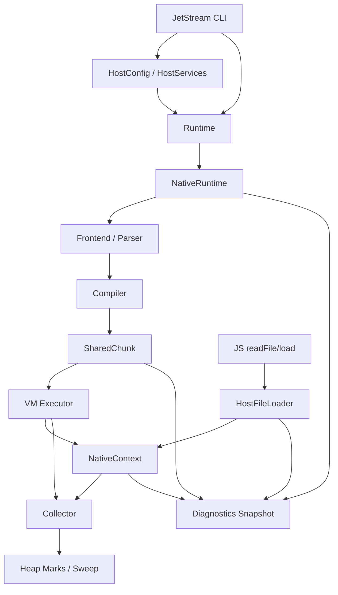

# AgentJS 三线并行修复接口共享文档

> 适用仓库：`ChaiXinran/CSCC-proj2`  
> 基线分支：`main`  
> 基线提交：`ec64a7dec2231421adb42c7f40c688338af26fe3`  
> 文档日期：2026-08-04  
> 并行任务：Runner / 共享字节码与常量池 / GC 正确性与统计

---

## 1. 文档目的

本轮三人并行开发分别处理三个最严重的结构性问题：

1. **Runner 组**：消除 JetStream 源码内嵌、整包拼接和重复解析造成的前端内存放大；
2. **Bytecode 组**：消除函数实例化、脚本缓存中的 `Chunk` 深复制，并优化常量池线性去重；
3. **GC 组**：保证根集合完整且不重复，降低构造根集合时的深复制，并提供可验证的 GC 统计。

本文档冻结三组共同依赖的类型、调用方向、文件所有权和合并规则。各组可以修改自己的内部实现，但不得绕开本文定义的共享边界直接依赖其他组的私有结构。

---

## 2. 最新代码基线

### 2.1 当前执行主链路

```text
CLI: src/main.rs
  └─ Runtime::new(RuntimeConfig)
       └─ create_runtime(BackendKind::Native, config)
            └─ NativeRuntime::new(config)
                 ├─ NativeContext
                 ├─ NativePipeline<Frontend, Compiler, Vm>
                 └─ NativeScriptCache

Runtime::eval(source)
  └─ NativeRuntime::evaluate(source)
       ├─ reset_limits()
       ├─ prepare_chunk(source)
       │    ├─ parse_current_source()
       │    └─ pipeline.compile(program)
       └─ pipeline.execute(chunk, context)
```

### 2.2 当前三个关键问题

#### Runner

当前 `scripts/prepare-jetstream2.mjs` 仍会：

```text
读取全部资源
→ JSON.stringify 到 __jetstreamResources
→ 生成巨型 runner.js
→ AgentJS 首次解析这些源码字符串字面量
→ this.scripts.join("\n") 再生成整包字符串
→ new Function 再次解析、编译
```

因此 Runner 组的目标不是继续压缩生成脚本，而是把资源内容移出 JavaScript runner，由 Rust 宿主按需提供。

#### Bytecode

当前结构为：

```rust
pub struct FunctionTemplate {
    pub chunk: Chunk,
    // ...
}

pub struct JsFunction {
    pub chunk: Chunk,
    // ...
}
```

`Chunk`、`FunctionTemplate` 和 `JsFunction` 均可深度 `Clone`。函数实例化请求当前按值持有 `FunctionTemplate`，脚本缓存也保存并复制完整 `Chunk`。此外，`Chunk::add_constant` 每插入一个常量都会线性扫描常量池。

#### GC

当前 `NativeContext::root_set(vm)` 会复制：

- `environment_stack`；
- `call_frames`，其中 `this_value`、`new_target` 会克隆；
- VM operand stack；
- pending exception；
- Context 内部根。

随后 `maybe_collect_garbage()` 又调用 `complete_root_set()`，克隆整个 `RootSet` 并再次加入内部根。当前 Collector 使用三个 `HashSet` 保存对象、环境和函数标记。

---

## 3. 三组职责和文件所有权

| 组别 | 主任务 | 主负责人文件 | 允许受限修改的共享文件 |
|---|---|---|---|
| A：Runner | Host 文件加载、runner manifest、逐文件执行、阶段诊断 | `scripts/prepare-jetstream2.mjs`、建议新增 `src/host/*`、JetStream 文档与脚本 | `src/main.rs`、`src/engine.rs`、`src/backend/mod.rs`、`src/runtime/context.rs` 的 Host Services 区域 |
| B：Bytecode | `SharedChunk`、函数代码共享、脚本缓存去深复制、常量池哈希去重 | `src/bytecode/*`、`src/runtime/function.rs`、`src/vm/invocation.rs`、编译器测试 | `src/contracts.rs`、`src/backend/mod.rs` 的 cache/prepare_chunk 区域 |
| C：GC | 根完整性、去重复、GC 统计、阈值一致性测试 | `src/runtime/gc.rs`、`src/runtime/heap.rs`、`src/runtime/context.rs` 的 GC 区域、GC 测试 | `src/vm/interpreter.rs` 的 GC 触发点、`src/main.rs` 的 GC 参数由 A 统一接入 |
| 集成人 | 冻结共享接口、解决跨组冲突、统一测试 | `src/contracts.rs`、`src/lib.rs` | `src/main.rs` 最终合并、公共文档 |

### 3.1 共享文件的修改规则

#### `src/main.rs`

- A 组拥有 `command_jetstream` 和 JetStream 参数解析的最终修改权；
- C 组不得直接重写该函数，只提交需要接入的参数表和调用接口，例如 `gc_threshold`、`gc_stats`；
- B 组不修改 `src/main.rs`；
- 禁止三组分别对整个文件执行自动格式化后提交。

#### `src/backend/mod.rs`

- A 组只修改 Runtime 创建和 Host Services 注入；
- B 组只修改 `NativeScriptCacheEntry`、`prepare_chunk` 和编译结果类型；
- C 组原则上不修改该文件；如需暴露 GC 诊断，只增加只读方法，不调整执行流程。

#### `src/runtime/context.rs`

- A 组只允许增加 `host_services` 字段以及对应的安装、读取方法；
- C 组拥有 `root_set`、`complete_root_set`、`add_internal_roots`、`collect_garbage_for_vm`、GC metrics 和元数据清理逻辑；
- A 组不得调整 GC root；C 组不得改变 Host 文件路径校验语义。

#### `src/contracts.rs`

该文件已经被定义为“稳定协作接口”。本轮所有跨组类型必须从这里导出。只有集成人合并接口变更，其他组通过独立小提交提出变更，不在功能提交中顺手扩大公共 API。

---

## 4. 目标架构



约束：

- Host 文件内容不进入 GC heap 的 root graph；
- 编译完成后的 `SharedChunk` 不允许修改；
- GC 不扫描 `SharedChunk`，因为编译结果不得包含 `ObjectId`、`FunctionId` 或 `EnvironmentId`；
- JavaScript 函数对象只持有共享代码引用和运行时环境引用；
- 三组统计通过统一只读诊断接口汇总，不通过 `println!` 散落在内部模块。

---

## 5. 共享接口一：Runtime 与 Host Services

### 5.1 保持 `RuntimeConfig` 只保存轻量配置

当前 `RuntimeConfig` 实现了 `Clone + Copy`，不应直接加入 `PathBuf`、`Arc<dyn Trait>` 或文件缓存。保留现有字段，并只增加可复制的开关：

```rust
#[derive(Debug, Clone, Copy)]
pub struct RuntimeConfig {
    pub loop_limit: u64,
    pub recursion_limit: usize,
    pub stack_limit: usize,
    pub backtrace_limit: usize,
    pub script_cache_capacity: usize,
    pub install_test262_host: bool,
    pub install_jetstream_host: bool,
    pub heap_object_limit: usize,
    pub heap_byte_limit: usize,
    pub wall_clock_limit: Option<std::time::Duration>,
    pub gc_allocation_threshold: usize,
}
```

兼容规则：

- `RuntimeConfig::default().install_jetstream_host == false`；
- 普通 `eval`、REPL、Test262 不自动获得文件系统访问；
- JetStream CLI 显式启用该开关；
- 不复用 `install_test262_host` 表示 JetStream 文件访问，避免测试宿主和基准宿主继续耦合。

### 5.2 Host 文件接口

建议新增：

```rust
// src/host/mod.rs

use std::{path::{Path, PathBuf}, sync::Arc};

#[derive(Debug, Clone, PartialEq, Eq)]
pub enum HostLoadError {
    Disabled,
    InvalidPath(String),
    EscapesRoot(PathBuf),
    NotFound(PathBuf),
    Io(String),
}

pub trait HostFileLoader: Send + Sync {
    fn read_text(&self, path: &Path) -> Result<Arc<str>, HostLoadError>;
}

#[derive(Clone, Default)]
pub struct HostServices {
    pub file_loader: Option<Arc<dyn HostFileLoader>>,
}
```

文件系统实现：

```rust
pub struct RootedFileLoader {
    root: PathBuf,
}

impl RootedFileLoader {
    pub fn new(root: PathBuf) -> Result<Self, HostLoadError>;
}
```

路径规则：

1. 只允许相对路径；
2. 将 `\\` 统一为 `/` 后再解析；
3. 拒绝空路径、绝对路径和 `..` 越界；
4. canonicalize 后必须仍位于 `root` 内；
5. UTF-8 读取失败返回 `HostLoadError`，不得 panic；
6. 可以缓存 `Arc<str>`，但缓存上限和淘汰策略由 A 组内部实现，不进入公共接口。

### 5.3 Runtime 构造接口

保留已有构造函数：

```rust
impl Runtime {
    pub fn new(config: RuntimeConfig) -> Result<Self, EvalFailure>;
}
```

新增显式 Host 构造：

```rust
impl Runtime {
    pub fn with_host(
        config: RuntimeConfig,
        host: HostServices,
    ) -> Result<Self, EvalFailure>;
}
```

Backend 内部边界：

```rust
pub(crate) fn create_runtime_with_host(
    kind: BackendKind,
    config: RuntimeConfig,
    host: HostServices,
) -> Result<Box<dyn RuntimeBackend>, EvalFailure>;
```

`Runtime::new` 等价于：

```rust
Runtime::with_host(config, HostServices::default())
```

### 5.4 NativeContext Host 边界

A 组可以在 `NativeContext` 增加以下最小接口：

```rust
impl NativeContext {
    pub(crate) fn install_host_services(&mut self, host: HostServices);

    pub(crate) fn read_host_text(
        &self,
        path: &str,
    ) -> Result<Arc<str>, VmError>;
}
```

约束：

- `HostServices` 不属于 JS heap，不参与 `Trace`；
- `read_host_text` 只做宿主访问和错误转换，不解析或执行 JavaScript；
- JS builtin 把 `Arc<str>` 转换为当前 `JsValue::String(String)` 时只能在边界复制一次；
- 禁止重新把所有资源预先转换为 JS `String` 并放入全局对象。

### 5.5 JetStream Runner Manifest v2

生成器不再输出 `__jetstreamResources`。Runner 文件只包含兼容层、适配后的 driver 和启动代码。资源清单写入 sidecar manifest：

```json
{
  "schemaVersion": 2,
  "benchmark": "WSL",
  "sourceCommit": "...",
  "requestedIterations": 1,
  "resourceRootMode": "cli",
  "entryFiles": ["./WSL/Node.js"],
  "preloadFiles": [],
  "runtimeDiscoveredFiles": [],
  "resourceHashes": {
    "./WSL/Node.js": "sha256:..."
  },
  "runnerSha256": "...",
  "phaseMarkers": true
}
```

CLI：

```text
agentjs jetstream <runner.js>
    --resource-root <JetStream2-root>
    [--loop-limit N]
    [--wall-clock-seconds N]
    [--gc-threshold N]
    [--diagnostics]
```

生成器和 CLI 的共同约定：

- manifest 中只保存规范化相对路径和哈希，不保存源码正文；
- `--resource-root` 是唯一文件根；
- CLI 启动前验证 manifest 所列文件存在；
- 运行期动态读取仍经过同一个 `RootedFileLoader`；
- `ShellScripts.run` 应逐文件调用 `loadString(script)`，不得重新使用 `scripts.join("\n")`；
- 所有文件在同一个 `Runtime`、Realm 和 global environment 中执行。

---

## 6. 共享接口二：不可变共享字节码

### 6.1 公共代码句柄

在 `src/contracts.rs` 导出：

```rust
use std::sync::Arc;

pub type SharedChunk = Arc<Chunk>;
```

第一阶段使用类型别名，避免一次引入全新的 CodeBlock 层。后续如需拆分 metadata，可在保持调用语义的前提下替换为 newtype。

### 6.2 编译接口

当前：

```rust
pub trait ProgramCompiler {
    fn compile_program(&mut self, program: &Program) -> Result<Chunk, NativeError>;
}
```

目标：

```rust
pub trait ProgramCompiler {
    fn compile_program(
        &mut self,
        program: &Program,
    ) -> Result<SharedChunk, NativeError>;
}
```

原则：

- 编译器内部仍可使用可变 `ChunkBuilder`；
- `compile_program` 返回前完成 jump patch、handler patch、stack validation；
- 一旦包装为 `Arc<Chunk>`，运行期不得再修改 instruction、constant、function 或 handler；
- VM 执行接口只读：

```rust
pub trait ChunkExecutor {
    fn execute_chunk(
        &mut self,
        chunk: &Chunk,
        context: &mut NativeContext,
    ) -> Result<JsValue, NativeError>;
}
```

`SharedChunk` 通过 `shared_chunk.as_ref()` 传给 VM，不要求 VM 感知 `Arc`。

### 6.3 FunctionTemplate 与 JsFunction

目标结构：

```rust
pub struct FunctionTemplate {
    pub name: Option<String>,
    pub params: Vec<String>,
    pub rest_param: Option<String>,
    pub chunk: SharedChunk,
    // 其余语义字段保持不变
}

pub struct JsFunction {
    pub name: Option<String>,
    pub params: Vec<String>,
    pub rest_param: Option<String>,
    pub chunk: SharedChunk,
    pub environment: Option<EnvironmentId>,
    // 其余运行时字段保持不变
}
```

`FunctionInstantiationRequest` 第一阶段可以继续按值持有 `FunctionTemplate`，因为最昂贵的 `chunk` 已变为 `Arc`。不得在本轮同时重构调用请求、参数表示、环境布局和 local slot。

### 6.4 脚本缓存接口

当前 cache entry 同时保存 `Program` 和 `Chunk`，cache hit 会返回 `self.chunk.clone()`。目标：

```rust
struct NativeScriptCacheEntry {
    key: NativeScriptCacheKey,
    chunk: SharedChunk,
    metadata: ChunkCacheMetadata,
}

impl NativeScriptCacheEntry {
    fn cached_chunk(&self) -> SharedChunk {
        Arc::clone(&self.chunk)
    }
}
```

规则：

- cache entry 不再长期保存完整 AST `Program`；
- cache hit 只增加 Arc 引用计数；
- `ChunkCacheMetadata` 必须由冻结后的 chunk 计算；
- cache capacity 为 `0` 时仍返回 `SharedChunk`，只是跳过缓存存储；
- `SharedChunk` 不含任何 Context-local ID，因此不需要 GC Trace。

### 6.5 常量池构建接口

常量池优化属于 B 组内部，不要求 A/C 调用。推荐内部接口：

```rust
#[derive(Debug, Clone, PartialEq, Eq, Hash)]
enum ConstantKey {
    Undefined,
    Null,
    Boolean(bool),
    Number(u64),
    BigInt(BigIntValue),
    String(String),
}

struct ConstantPoolBuilder {
    values: Vec<Constant>,
    index: std::collections::HashMap<ConstantKey, u16>,
}

impl ConstantPoolBuilder {
    fn intern(&mut self, constant: Constant) -> Result<u16, ChunkError>;
    fn finish(self) -> Vec<Constant>;
}
```

约束：

- `Number` 使用 `f64::to_bits()`；
- 保持当前 NaN 按 bit pattern 去重的语义；
- 哈希索引仅存在于编译阶段，不保留在冻结后的 `Chunk`；
- 不在本轮把 `String` 全局 intern 到运行时；
- 不改变常量索引的 `u16` ABI。

### 6.6 与 GC 的边界

- `JsFunction::trace` 只 trace `environment`、`lexical_this`、`lexical_new_target` 和 `home_object`；
- 不 trace `SharedChunk`；
- `estimated_bytes()` 不得把共享代码大小重复计入每一个函数实例；
- 共享代码大小由 Bytecode diagnostics 单独统计一次；
- GC 组不得把 `Arc<Chunk>` 纳入 heap mark graph。

---

## 7. 共享接口三：GC 根与统计

### 7.1 唯一运行期收集入口

A/B 组只允许调用：

```rust
impl NativeContext {
    pub fn should_collect_garbage(&self) -> bool;

    pub fn collect_garbage_for_vm(
        &mut self,
        vm: &Vm,
    ) -> Result<CollectionStats, VmError>;
}
```

以下接口属于 C 组内部实现，不作为跨组依赖：

```rust
root_set
complete_root_set
add_internal_roots
prune_swept_metadata
Collector::collect
```

B 组在函数实例化或 bytecode 执行中不得自行构造 `RootSet`。A 组不得为了 Host 字符串缓存把数据塞入 `temporary_roots`。

### 7.2 根集合去重目标

当前 `root_set()` 已加入内部 roots，随后 `maybe_collect_garbage()` 又再次调用 `add_internal_roots()`。本轮必须保证一次收集只遍历一遍 Context 内部 roots。

第一阶段允许继续保留拥有型 `RootSet` 用于测试，但运行期入口应满足：

```text
VM roots 构造一次
Context roots 加入一次
Collector mark 一次
Sweep 一次
```

第二阶段建议改为直接 tracing，避免复制完整 operand stack：

```rust
pub(crate) trait TraceRoots {
    fn trace_roots(&self, tracer: &mut Tracer<'_>);
}
```

目标调用模型：

```rust
impl Vm {
    pub(crate) fn trace_roots(&self, tracer: &mut Tracer<'_>);
}

impl NativeContext {
    fn trace_context_roots(&self, tracer: &mut Tracer<'_>);
}
```

如果借用规则导致第一阶段难以一次完成，优先保证正确性和“内部 roots 只加入一次”，随后再去掉 Vec clone。

### 7.3 必须覆盖的 Context 根

C 组必须逐项审计：

- global/current environment；
- environment stack；
- call frames；
- VM operand stack；
- pending exception；
- global object、top-level this；
- temporary roots；
- intrinsics 和 realms；
- function object/prototype/realm 映射；
- builtin backing object 和 bound target/this/args；
- module environments 和 namespace；
- private slots；
- promises、reactions 和 job queue；
- disposable stack；
- generator/async generator 的挂起状态；
- agent/worker 状态；
- Intl object data 中若未来加入 heap ID，必须同步增加 tracing。

Host Services 和 SharedChunk 不在此列表中。

### 7.4 GC Metrics

保留现有：

```rust
pub struct HeapStats {
    pub object_slots: usize,
    pub live_objects: usize,
    pub live_environments: usize,
    pub live_functions: usize,
    pub estimated_bytes: usize,
    pub allocation_count: u64,
    pub collection_count: u64,
}

pub struct CollectionStats {
    pub objects_before: usize,
    pub objects_after: usize,
    pub environments_before: usize,
    pub environments_after: usize,
    pub functions_before: usize,
    pub functions_after: usize,
    pub bytes_before: usize,
    pub bytes_after: usize,
}
```

新增累计指标：

```rust
#[derive(Debug, Clone, Copy, Default, PartialEq, Eq)]
pub struct GcMetrics {
    pub collection_count: u64,
    pub total_pause_ns: u64,
    pub max_pause_ns: u64,
    pub last_collection: CollectionStats,
}

impl NativeContext {
    pub fn gc_metrics(&self) -> GcMetrics;
}
```

统计规则：

- `collection_count` 与 HeapStats 保持一致；
- pause 只统计 mark + sweep + prune，不统计 benchmark 执行时间；
- 统计代码不得在每个对象 trace 时输出日志；
- 未启用 `--diagnostics` 时仍可累计轻量计数，但不得打印。

### 7.5 GC 阈值接口

JetStream CLI 最终由 A 组接入：

```text
--gc-threshold N
```

参数写入已有：

```rust
RuntimeConfig::gc_allocation_threshold
```

推荐测试矩阵：

```text
10_000
100_000
1_000_000
usize::MAX（仅诊断对照，近似关闭自动 GC）
```

四档运行结果必须保持 JavaScript 语义一致。低阈值导致状态消失应视为 root correctness bug，不能通过继续提高阈值规避。

---

## 8. 统一诊断接口

### 8.1 诊断快照

建议新增 `src/diagnostics.rs`，由集成人维护：

```rust
#[derive(Debug, Clone, Default)]
pub struct RunnerStats {
    pub files_read: u64,
    pub source_bytes_read: u64,
    pub cache_hits: u64,
    pub cache_misses: u64,
}

#[derive(Debug, Clone, Default)]
pub struct BytecodeStats {
    pub chunks_compiled: u64,
    pub instructions: u64,
    pub constants: u64,
    pub function_templates: u64,
    pub shared_code_bytes: u64,
    pub constant_dedup_hits: u64,
}

#[derive(Debug, Clone, Default)]
pub struct RuntimeDiagnostics {
    pub runner: RunnerStats,
    pub bytecode: BytecodeStats,
    pub heap: HeapStats,
    pub gc: GcMetrics,
}
```

只读访问：

```rust
impl NativeRuntime {
    pub fn diagnostics(&self) -> RuntimeDiagnostics;
}

impl Runtime {
    pub fn diagnostics(&self) -> RuntimeDiagnostics;
}
```

### 8.2 CLI 输出协议

`--diagnostics` 启用后，在运行结束时输出一行稳定前缀：

```text
AGENTJS_DIAGNOSTICS:{...JSON...}
```

JSON 至少包含：

```json
{
  "schemaVersion": 1,
  "runner": {},
  "bytecode": {},
  "heap": {},
  "gc": {}
}
```

规则：

- benchmark 自身输出不得使用该前缀；
- 诊断输出只在一次运行结束或失败退出前输出一次；
- OOM/进程被系统杀死时可能无法输出，因此外层测试脚本仍需采集 peak RSS；
- schema 增加字段不升级版本，删除或改名才升级版本。

---

## 9. 分支与合并协议

### 9.1 基线

三组先同步到：

```text
ec64a7dec2231421adb42c7f40c688338af26fe3
```

推荐先提交一个小型接口冻结 PR，只包含：

- 本文档；
- `HostServices`/`HostFileLoader` 类型骨架；
- `SharedChunk` 类型别名；
- `GcMetrics` 和 diagnostics 类型骨架；
- 不改变执行语义。

接口 PR 合并后，三组从新的 `main` 建分支。

### 9.2 分支命名

```text
perf/jetstream-host-loader
perf/shared-bytecode
fix/gc-roots-and-stats
```

### 9.3 功能提交粒度

#### A 组

```text
1. add rooted host file loader
2. add JetStream manifest v2
3. remove embedded resource payload
4. restore per-file loadString execution
5. add runner diagnostics and tests
```

#### B 组

```text
1. introduce SharedChunk
2. migrate FunctionTemplate and JsFunction
3. migrate pipeline and script cache
4. remove cached Program duplication
5. add compile-time constant interner
6. add sharing and regression tests
```

#### C 组

```text
1. add GC metrics without behavior change
2. remove duplicate internal-root insertion
3. add missing-root regression tests
4. reduce RootSet cloning
5. optimize mark storage only after correctness passes
```

### 9.4 合并顺序

接口冻结 PR 之后推荐：

1. **B 组**：先冻结代码所有权和 `SharedChunk`，使后续 heap accounting 基于最终函数布局；
2. **C 组**：适配共享代码后的 `estimated_bytes`，完成根正确性和统计；
3. **A 组**：最后接入新 Runtime/diagnostics，并用新版 runner 做统一大负载验证。

A 组可以与 B/C 同时开发，只是在最终合并前 rebase 并由 A 负责解决 `main.rs`、Runtime 创建部分的冲突。

---

## 10. 各组禁止事项

### A 组禁止

- 不改 `Chunk`、`FunctionTemplate`、`JsFunction` 布局；
- 不调整 GC threshold 默认值来“修复”OOM；
- 不把 Host 缓存对象加入 GC roots；
- 不重新引入源码正文到 manifest 或 runner；
- 不使用 `scripts.join("\n")` 作为最终方案。

### B 组禁止

- 不同时引入 local slot、upvalue slot、shape、inline cache 或 JIT；
- 不改变 bytecode instruction 的现有 `u16` 索引 ABI；
- 不让冻结后的 `SharedChunk` 继续暴露可变访问；
- 不把 `Arc<Chunk>` 纳入 GC tracing；
- 不顺手重构 `JsValue::String`。

### C 组禁止

- 不通过提高 `gc_allocation_threshold` 掩盖 root bug；
- 不把 Runner 文件缓存当成 JS heap 对象；
- 不修改共享字节码内容；
- 不在 root tracing 热路径输出逐对象日志；
- 在 root correctness 未稳定前不引入分代、移动或压缩 GC。

---

## 11. 测试接口和验收标准

### 11.1 公共快速门禁

每个 PR 必须通过：

```text
cargo fmt --check
cargo clippy --all-targets --all-features
cargo test
```

不得通过删除、ignore 或放宽已有测试完成门禁。

### 11.2 A 组验收

- generated runner 不含 `__jetstreamResources`；
- manifest 不含源码正文；
- runner 文件尺寸不再随资源源码总量线性增长；
- 所有 manifest 路径均通过 root containment 校验；
- 同一 workload 的资源读取顺序可复现；
- `RESOURCE_MISSING = 0`；
- Richards、Regexp、Intl 等当前可运行项目不回归；
- WSL/jsdom/threejs 至少能够进入更后的 phase，且 peak RSS 明显下降。

### 11.3 B 组验收

- 同一函数模板实例化 10,000 次时，代码主体只有一份共享 allocation；
- 可通过 `Arc::ptr_eq` 证明函数实例共享代码；
- closure、递归、generator、async、class constructor 语义不变；
- cache hit 不复制 instructions/constants/functions；
- cache entry 不再保存完整 AST；
- 常量池重复插入为平均 O(1) 查找；
- `estimated_bytes` 不按函数实例重复计算共享代码。

### 11.4 C 组验收

- Context internal roots 每轮只加入一次；
- threshold 为 10k、100k、1M、MAX 时结果一致；
- closure、bound function、promise、generator、module、proxy、private fields、Intl 对象在强制多轮 GC 后仍正确；
- 不可达临时对象可被回收，live object 数不持续线性增长；
- 输出 collection count、pause、before/after；
- 低阈值不再导致 harness/benchmark 状态被错误清除。

### 11.5 统一 JetStream 测试矩阵

| 层级 | 用例 | 目的 |
|---|---|---|
| 快速 | Richards、Regexp、Intl | 功能和基础执行回归 |
| 中型 | Splay、MobX、Raytrace、HashMap、Web-SSR | 编译、闭包、属性和 GC 综合验证 |
| 大型 | threejs、jsdom-d3-startup、WSL | 验证 OOM、长编译和大型对象图问题 |

统一采集：

```text
exit status
elapsed time
peak RSS
runner source bytes
files read
compile count
instruction/constant/function count
shared code bytes
heap before/after
GC count/total pause/max pause
最后到达的 phase marker
```

---

## 12. 冲突处理清单

| 冲突位置 | 决策 |
|---|---|
| `RuntimeConfig` 新字段 | 集成人统一添加；A 使用，C 不重复增加同义字段 |
| `NativeRuntime::new` | 保留原接口，新增 `with_host`；A 不删除默认构造 |
| `NativeRuntime::prepare_chunk` 返回类型 | 以 B 组 `SharedChunk` 为准；A/C 只适配调用 |
| `NativeScriptCacheEntry` | B 组拥有；A 不在此保存 Host source |
| `NativeContext` 字段 | A 只加 `host_services`；C 只加 GC metrics/root 状态 |
| `JsFunction::estimated_bytes` | B 调整共享代码计费；C 使用其结果，不重复修正 |
| JetStream GC 参数 | C 定义语义，A 接入 CLI |
| diagnostics 输出 | 各组提供 stats；A 在 CLI 统一输出 |
| 自动格式化冲突 | 只格式化修改文件；共享大文件禁止无关重排 |

---

## 13. Definition of Done

本轮三线全部完成需同时满足：

1. JetStream runner 不再内嵌资源源码，也不再把全部脚本拼成一个超大字符串；
2. 函数实例和脚本缓存共享不可变字节码，运行期不再深复制 `Chunk`；
3. 常量池构建不再对每个常量线性扫描整个池；
4. GC 根集合完整、内部根不重复加入，低阈值不改变程序语义；
5. 三组统一输出可比较的 Runner、Bytecode、Heap 和 GC 指标；
6. 现有快速用例无功能回归；
7. 对 WSL、jsdom、threejs 能明确判断瓶颈位于资源加载、编译还是执行，而不是仅得到 OOM/timeout；
8. 所有跨组依赖均从 `src/contracts.rs`、`src/host` 或 `src/diagnostics` 进入，不直接访问其他组私有实现。

---

## 14. 本轮之后再评估的方向

本轮完成并取得新基线后，再依据指标决定下一优先级：

```text
真实 local/upvalue slot
Shape / hidden class
Property inline cache
JsValue::String 共享表示
更紧凑的 mark bitmap
分代 GC
JIT
```

这些方向不得与当前三线混合提交，否则会同时改变字节码、对象布局、GC tracing 和性能基线，难以判断收益来源。
