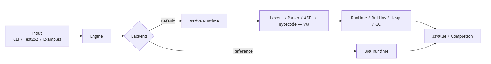

# AgentJS

> 基于 Rust 的轻量级 JavaScript 执行引擎，面向智能体场景中的短时、高频、即时执行任务。

## 项目简介

JavaScript 生态已经成为 AI 时代的重要技术设施。相比传统浏览器内部的重量级 JavaScript 引擎，一个能够快速启动、短时运行、频繁执行的轻量级 JS 引擎，在智能体工具调用和动态脚本执行场景中具有独特价值。

**AgentJS** 是一个基于 Rust 实现的轻量级 JavaScript 执行引擎。项目默认运行自研的 **Native Runtime**，并保留 Boa 作为显式选择的参考后端，用于兼容性验证和性能对比。Native 后端可以独立构建和运行，不依赖 Boa 完成 JavaScript 执行。

| 核心指标 | 当前结果 |
| --- | ---: |
| Test262 完整扫描 | **38,315 / 53,379** |
| Test262 通过率 | **71.78%** |
| SunSpider 1.0.2 | **26 / 26 passed** |
| Native-only release 体积 | **7.11 MiB** |

## 系统框架

项目支持后端分发，便于进行正确性验证和性能分析。默认路径是自研 Native Runtime，Boa 仅作为显式启用的参考后端，不会在 Native 执行失败时静默回退。



Native Runtime 的核心执行链由项目独立实现：

```text
source -> lexer -> parser / AST -> bytecode -> VM -> runtime / builtins -> JsValue
```

## 测试情况

### Test262

根据 `test262-final/final-all.json` 的最新完整运行结果，最终统计如下。

| 指标 | 数值 |
| --- | ---: |
| Total | 53,379 |
| Passed | **38,315** |
| Failed | 15,062 |
| Skipped | 2 |
| Conformance | **71.78%** |
| Elapsed | 253.021 s |

该结果超过赛题要求的 60% 通过率 **11.78 个百分点**。
同批次顶层目录独立运行结果如下：

| 目录 | 通过情况 | 通过率 |
| --- | ---: | ---: |
| `language` | 19,156 / 23,711 | **80.79%** |
| `annexB` | 848 / 1,086 | **78.08%** |
| `harness` | 86 / 116 | **74.14%** |
| `built-ins` | 16,996 / 23,643 | **71.89%** |
| `staging` | 754 / 1,482 | 50.88% |
| `intl402` | 474 / 3,341 | 14.19% |

完整结果见 [全量运行报告](test262-final/final-all.md) 和 [最终汇总报告](test262-final/final-latest-summary.md)。同批次六个目录独立运行合计与完整单次运行相差 1 个通过用例，因此总体通过率始终以 `final-all.json` 为准。

表现较好的代表性子目录：

| 子目录                  |          通过情况 |         通过率 |
| -------------------- | ------------: | ----------: |
| `built-ins/DataView` |     561 / 561 | **100.00%** |
| `built-ins/Reflect`  |     153 / 153 | **100.00%** |
| `language/asi`       |     101 / 102 |  **99.02%** |
| `built-ins/Math`     |     323 / 327 |  **98.78%** |
| `built-ins/Number`   |     334 / 340 |  **98.24%** |
| `language/literals`  |     517 / 534 |  **96.82%** |
| `built-ins/Proxy`    |     300 / 311 |  **96.46%** |
| `built-ins/String`   | 1,169 / 1,223 |  **95.58%** |
| `built-ins/Date`     |     554 / 594 |  **93.27%** |
| `built-ins/Object`   | 3,130 / 3,411 |  **91.76%** |

详细数据见 [一级目录统计](test262-final/test262-final-level1-pass-stats.csv)、[二级目录统计](test262-final/test262-final-level2-pass-stats.csv) 和 [三级目录统计](test262-final/test262-final-level3-pass-stats.csv)。

### SunSpider

AgentJS Native Runtime 已正确运行 SunSpider 1.0.2 的全部 26 个用例，覆盖 3D、数组访问、位运算、密码学、日期、数学、正则表达式和字符串等类别。

| 指标 | AgentJS | Boa |
| --- | ---: | ---: |
| 正确通过 | **26 / 26** | **26 / 26** |
| Wrong / Error / Timeout | **0 / 0 / 0** | **0 / 0 / 0** |
| `bitops-bitwise-and` 中位耗时 | **262 ms** | 286 ms |

- 完整结果见 [AgentJS SunSpider 报告](benchmarks/sunspider/results/agentjs-sunspider.md) 和 [Boa SunSpider 报告](benchmarks/sunspider/results/boa-sunspider.md)。
- 当前 Native 已实现完整运行能力，并在个别用例上达到或超过 Boa；字符串和正则等重负载仍是后续性能优化重点。

### Native Benchmark

项目设计了面向智能体场景的 AgentBench，覆盖描述符旁路表、大索引稠密数组和短数据过滤等负载。以下为 release 模式下 3 次运行的中位数：

| Case | AgentJS | Boa | 结果 |
| --- | ---: | ---: | ---: |
| `descriptor-side-table-array` | 770 ms | 1,282 ms | **1.67× faster** |
| `large-index-dense-array` | 1,147 ms | 2,741 ms | **2.39× faster** |
| `rule-filter-dense-window` | 808 ms | 982 ms | **1.22× faster** |

完整数据见 [AgentBench 报告](benchmarks/agent/results/agentjs.md)。

## 我们的特色

| 特色与优化 | 实现与效果 |
| --- | --- |
| **轻量化 Native 构建** | Windows release 下 Native-only 为 **7.10 MiB**；编译可选 Boa 后端后为 17.06 MiB |
| **分段稠密数组存储** | 64K inline 区后按 4K 槽位惰性分段；大索引数组 AgentBench 比 Boa 快 **2.39×** |
| **属性描述符旁路表** | 普通元素只存值，仅为非默认 descriptor 保存覆盖项；对应 AgentBench 比 Boa 快 **1.67×** |
| **Free List 堆对象复用** | GC 回收后复用 object、function 和 environment 槽位，减少短任务中的重复分配 |
| **String Primitive ASCII Fast Path** | `string-base64` 的 7 次运行中位数由 **769.9 ms 降至 273.0 ms**，提升 **2.82×** |
| **面向智能体的 benchmark** | 使用短数据处理、局部稠密数组和属性访问负载模拟高频脚本执行 |

## 命令行

### 构建项目

```sh
git submodule update --init --recursive
cargo build --release
```

运行 JavaScript：

```sh
cargo run -- eval "1 + 2"
cargo run -- run examples/hello.js
cargo run -- repl
```

### Test262 完整扫描

```sh
cargo run --release  -- test262 \
  --backend native \
  --root test262 \
  --suite test \
  --jobs 4 \
  --json test262-final/final-all.json
```

使用Boa后端对比结果：
```
cargo run --release --features boa-backend -- test262 `
  --backend boa `
  --root test262 `
  --suite test `
  --jobs 4 `
  --progress `
  --json reports/boa-test262-summary.json
```
### SunSpider 测试与 Boa 对比

```powershell
cargo build --release --manifest-path boa/Cargo.toml -p boa_cli

python benchmarks/sunspider/run_sunspider.py `
  --engine .\target\release\agentjs.exe `
  --label agentjs `
  --ref-engine .\boa\target\release\boa.exe `
  --ref-label boa `
  --repeat 3 `
  --timeout 60
```

### Native Benchmark 与 Boa 对比

```powershell
python benchmarks/agent/run_agentbench.py `
  --engine .\target\release\agentjs.exe `
  --label agentjs `
  --ref-engine .\boa\target\release\boa.exe `
  --ref-label boa `
  --repeat 3 `
  --timeout 120
```

## 提交材料汇总
| 材料类型    | 对应内容                                          | 仓库或文件位置                                 |
| ------- | --------------------------------------------- | --------------------------------------- |
| 源代码     | Rust JS 引擎实现、CLI、Native 后端、测试入口               | `src/`, `Cargo.toml`, `tests/`          |
| 设计方案文档  | 本文档，包含设计思路、实现说明、测试分析、问题解决、非本队来源说明、AI 工具使用说明   | `report.md`                             |
| 进展汇报幻灯片 | 队员分工、开发计划、阶段成果、测试结果、创新点、AI 使用声明               | `presentation/` 或提交平台附件                 |
| 作品演示视频  | 环境介绍、构建运行、JS 脚本执行、Test262 / benchmark 演示、结果说明 | 提交平台附件或视频链接                             |
| 迭代提交记录  | Git commit 历史、开发报告、版本报告                       | Git 历史、`reports/`, `docs/`, `thoughts/` |