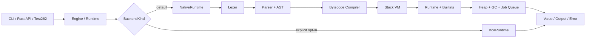

# AgentJS：基于 Rust 的轻量级 JavaScript 执行引擎

| 核心指标 | 最终结果 |
| --- | ---: |
| Test262 完整扫描 | **38,315 / 53,379** |
| Test262 通过率 | **71.78%** |
| Test262 失败 / 跳过 | 15,062 / 2 |
| Test262 全量耗时 | 253.021 秒 |
| SunSpider 1.0.2 | **26 / 26 passed** |
| Native-only release 体积 | **7.11 MiB** |

本文档中的总体正确率以生成时间最新的 `test262-final/final-all.json` 为准。`test262-final/` 中较早生成的目录 CSV 用于历史目录分析，不替代最终完整运行结果；跳过、失败、崩溃和超时均不计为通过。

---

## 1. 项目目标描述

### 1.1 项目背景

JavaScript 已成为 Web、自动化和 AI Agent 工具调用中的重要执行语言。传统浏览器引擎功能完整、性能强，但也包含大量浏览器宿主能力和复杂优化层。AI Agent 场景更常见的是短脚本、高频调用、状态隔离和资源受限执行，因此需要一个易嵌入、可控制、可验证的轻量级运行时。

AgentJS 使用 Rust 实现，目标是在保证内存安全和跨平台能力的同时，建立独立的 JavaScript 前端、字节码、虚拟机、运行时和标准库，并通过 Test262 与 benchmark 持续验证。

### 1.2 赛题目标

项目围绕四项要求展开：

1. 使用 Rust 构建可独立运行的轻量级 JavaScript 引擎；
2. 以 Test262 衡量 ECMAScript 兼容性，并超过赛题要求的 60%；
3. 提供可复现的功能测试和性能测试证据；
4. 证明核心执行路径为自研实现，而不是对现有引擎的简单包装。

### 1.3 当前完成状态

- 默认后端为自研 `NativeRuntime`，标准构建的 Cargo feature 集合为空；
- Boa 仅在显式开启 `boa-backend` feature 并选择 `--backend boa` 时使用；
- 已打通 `source -> lexer -> parser/AST -> bytecode -> VM -> runtime/builtins` 完整链路；
- 支持脚本与模块模式、函数与闭包、类、异常、迭代、生成器、异步任务、对象描述符、Proxy、Promise、集合、二进制数据、RegExp、Date 和部分 Intl/Temporal；
- 最新完整 Test262 运行通过 38,315 / 53,379，用例通过率 71.78%，超过 60% 目标 11.78 个百分点；
- SunSpider 1.0.2 的 26 个用例全部正确完成；
- 面向 Agent 场景的三个 AgentBench 用例相对 Boa 取得 1.22×–2.39× 的中位耗时优势；
- Native-only Windows release 二进制为 7,451,136 字节，即 7.11 MiB。

---

## 2. 比赛题目分析与相关资料调研

### 2.1 赛题要求分析

| 评审维度 | 项目应答 |
| --- | --- |
| 工程实现 | Rust 2024 edition，提供库接口和 `eval/run/repl/test262/bench/jetstream` CLI |
| 功能正确性 | 使用固定版本 Test262，完整运行并独立记录 passed、failed、skipped |
| 性能 | 使用 SunSpider、AgentBench、内置冷/热缓存基准和 JetStream 2 CLI 诊断 |
| 创新性 | 自研 Native 管线、分段稠密数组、描述符旁路表、Free List、ASCII fast path |
| 可复现性 | 固定子模块 revision、命令、构建配置、报告文件和版本进展记录 |

### 2.2 参考项目与资料

| 参考对象            | 用途                        | 是否进入 Native 执行路径 |
| --------------- | ------------------------- | ---------------- |
| Boa             | 行为 oracle、可选兼容后端、性能对照     | 否                |
| QuickJS         | 轻量引擎架构与性能参考               | 否                |
| Test262         | ECMAScript 一致性测试输入        | 仅作为测试语料          |
| JetStream 2     | 复杂 JavaScript workload 诊断 | 仅作为测试语料          |
| SunSpider 1.0.2 | 正确性和执行耗时对照                | 仅作为测试语料          |

### 2.3 “非套壳实现”说明

- AgentJS 的默认执行路径完全位于项目源码：`src/lexer/`、`src/parser/`、`src/ast/`、`src/bytecode/`、`src/vm/`、`src/runtime/` 和 `src/builtins/`。
- Boa 的引用被限制在 `src/backend/boa.rs`，且依赖为 optional feature；`cargo build --release` 默认不编译 Boa，只有显式携带参数 `--features boa-backend` 才会使用 Boa 后端。

Native 遇到未实现语义时返回分类错误，不会自动调用 Boa。报告中的 Test262 结果也由 `--backend native` 明确生成，因此 Boa 的兼容性不能被计入项目 Native 通过率。

---

## 3. 系统总体框架设计

### 3.1 总体架构



`Engine` 面向互不相关的 Agent action，每次创建全新 isolate，防止全局变量和原型修改泄漏；`Runtime` 面向 REPL 或连续调用，保留同一 isolate，并使用有界 LRU 脚本缓存复用解析和编译结果。

### 3.2 Native 执行流程

1. `Lexer` 扫描 UTF-8 源码，生成带 byte span 和换行信息的 Token；
2. `Parser` 根据脚本或模块上下文构建 `Program` 和 AST，同时执行语法早期错误检查；
3. `Compiler` 将 AST 降低为 `Chunk`、常量池、函数模板、异常处理表和 `Instruction`；
4. `Vm` 验证并解释 Chunk，维护操作数栈、调用帧、环境链和结构化完成记录；
5. `NativeContext` 保存堆、intrinsics、模块注册表、Promise/job queue、输出和执行预算；
6. `builtins` 安装标准构造器、原型和算法；
7. 执行结果转换为 `ExecutionReport`，统一返回值、输出、耗时或分类错误。

### 3.3 稳定接口与依赖方向

```text
lexer -> parser / AST -> bytecode -> VM -> runtime / builtins
```

`src/contracts.rs` 是跨模块稳定边界：

| 接口 | 输入 | 输出 |
| --- | --- | --- |
| `SourceParser::parse_source` | JavaScript source | `Program` |
| `ProgramCompiler::compile_program` | `Program` | `Chunk` |
| `ChunkExecutor::execute_chunk` | `Chunk + NativeContext` | `JsValue` |
| `NativePipeline::evaluate` | source + context | `JsValue` |

`NativePipeline::from_stages` 可以替换任一阶段，使 parser、compiler、VM 能使用 fake stage 独立测试。`backend/native.rs` 只负责装配和持久状态，不承载具体语法或对象算法。

---

## 4. 核心模块实现说明

### 4.1 入口层与后端

| 文件 | 实现职责 |
| --- | --- |
| `src/main.rs` | 实现 `eval`、`run`、`repl`、`test262`、`bench`、`jetstream` 命令及参数解析 |
| `src/lib.rs` | 导出 `Engine`、`Runtime`、配置、报告、错误和 Native pipeline contracts |
| `src/engine.rs` | 统一执行配置、隔离策略、错误分类和后端无关 API |
| `src/backend/mod.rs` | 定义 `BackendKind` 和内部 `RuntimeBackend` 契约，默认选择 Native |
| `src/backend/native.rs` | 管理 NativeContext、脚本缓存、模块求值和 job draining |
| `src/backend/boa.rs` | 封装可选 Boa 参考后端，是项目中唯一允许导入 Boa 的文件 |
| `src/test262.rs` | 解析 frontmatter、加载 harness、运行 strict variant/negative/async/module 测试并输出 JSON |

### 4.2 前端：Lexer、Parser 与 AST

| 模块 | 已实现能力 | 代表测试 |
| --- | --- | --- |
| `src/lexer/` | 注释、换行、Unicode identifier、数值分隔符、BigInt、字符串转义、模板、RegExp 和运算符 maximal munch | lexer 内联单测、`parser_fuzzing.rs` |
| `src/parser/` | 运算符优先级、赋值、对象/数组、函数/箭头函数、类、模板、optional chain、控制流、异常、解构、for-in/of/await、async/generator、模块和早期错误 | `parser_basics.rs`、`parser_control_flow.rs`、`parser_iteration.rs`、`parser_regexp_errors.rs` |
| `src/ast/` | 统一表示 Script/Module、表达式、语句、函数、类、绑定模式和 module declaration | parser 与 bytecode 相邻集成测试 |

AST 显式保留 `Parenthesized` 节点，用于区分 `-x ** y` 与 `(-x) ** y` 等早期错误；当前 17 个库测试失败正是旧测试仍期待去括号 AST，说明实现和测试期望尚需同步，而非解析器完全无法处理相关语法。

### 4.3 字节码编译器

`src/bytecode/` 将 `Program` 编译为栈式字节码。`Chunk` 保存指令、常量、函数模板和异常处理区间，并在执行前检查常量索引、跳转目标、栈效果和 handler 范围。

指令覆盖：

- 常量、变量声明、环境链加载与存储；
- 数值、BigInt、比较、位运算和逻辑短路；
- 对象/数组创建、属性访问、descriptor、accessor、delete、in、instanceof；
- 函数、构造调用、`this`、`super`、`new.target` 和闭包捕获；
- 跳转、循环、throw、return、try/finally 和 lexical environment；
- spread/rest、iterator、generator、await、module 和 RegExp literal 降低。

代表测试位于 `tests/bytecode_*.rs`、`parser_*_bytecode.rs`，既验证指令序列，也验证 hand-written Chunk 的边界和错误路径。

### 4.4 VM、Runtime 与 Builtins

`JsValue` 当前包含 `Undefined`、`Null`、`Boolean`、`Number`、`BigInt`、`String`、`Symbol`、`Object`、`Function`、`BuiltinFunction` 和 Error。VM 使用调用帧与 `Completion` 表示普通完成、return、throw、break 和 continue，并在顶层执行后按配置 drain job queue。

对象系统支持 ordinary object、Array、primitive wrapper、RegExp、ArrayBuffer、DataView、TypedArray、Iterator、Generator、Promise 和 Proxy。属性层实现 string/symbol key、原型链、data/accessor descriptor、extensible/frozen/sealed 相关操作和 ECMAScript own-key ordering。

运行时子模块还包括：

- 词法环境、函数记录、realm 与 module registry；
- Promise registry、FIFO job queue 与 iterator protocol；
- ArrayBuffer 共享字节存储和 TypedArray/DataView view metadata；
- 非移动 mark-and-sweep GC、显式 root tracing 和回收槽 Free List；
- 堆对象/堆字节/大分配保护和脚本 LRU 缓存。

`src/builtins/` 已实现或部分实现 Object、Function、Array、String、Number、Boolean、Math、JSON、Error、Symbol、BigInt、RegExp、Date、Intl、Temporal、Promise、Map/Set、WeakMap/WeakSet、Iterator、Proxy、ArrayBuffer、DataView、TypedArray 和 Annex B 相关能力。完整性以 Test262 结果为准，不能仅凭构造器或方法存在就视为完全兼容。

---

## 5. 项目目录与文件说明

| 路径 | 内容 |
| --- | --- |
| `src/` | 59 个 Rust 源文件，约 62,294 行核心实现 |
| `tests/` | 53 个 Rust 集成测试文件，约 11,626 行测试代码 |
| `examples/` | CLI 演示 JavaScript |
| `test262/` | 固定 revision 的 ECMAScript 一致性测试集 |
| `test262-final/` | 最终完整及顶层目录 Test262 JSON、日志和中文汇总 |
| `benchmarks/sunspider/` | SunSpider 1.0.2 runner、测试集与结果 |
| `benchmarks/agent/` | 面向 Agent 工作负载的 benchmark 与结果 |
| `benchmarks/JetStream2/` | 固定 JetStream 2 上游树 |
| `scripts/` | Test262 统计、JetStream runner 生成与运行脚本 |
| `docs/` | 架构、接口、依赖、版本 scope/interface/team plan |
| `reports/.version-report/` | 分版本和分 track 的变更、命令、delta 与风险记录 |
| `reports/jetstream2/` | JetStream 2 Native 诊断输出 |
| `boa/` | 固定版本 Boa 参考实现，不直接修改 |
| `Cargo.toml` / `Cargo.lock` | feature、依赖与 release profile |


---

## 6. 开发计划与阶段进展

### 6.1 版本化开发闭环

项目采用“scope 冻结 → interface 冻结 → track 分工 → focused test → 轻量扫描 → 完整扫描 → 报告复盘”的方式推进：

```text
失败数据与需求分析
        ↓
scope / interface / team plan
        ↓
Track A 前端 | Track B Runtime | Track C Builtins
        ↓
单元测试与相邻模块集成
        ↓
Native 固定门 / 目录扫描 / 完整 Test262
        ↓
版本报告与下一轮修复优先级
```

代码修改与对应 `reports/.version-report/` 报告同步更新，避免测试数据和实现脱节。

### 6.2 阶段路线

| 阶段 | 重点成果 |
| --- | --- |
| V1–V3 | 基础表达式、控制流、函数、复合值，打通 Native 最小闭环 |
| V4–V6 | 对象模型、descriptor、structured completion、核心 builtins 和 coercion |
| V7 | 执行预算、GC、大分配保护、脚本缓存和 crash-safe Test262 dashboard |
| V8 | 模板/类/模块前端解锁、module runner、5,000-case scan 机制 |
| V9 | async/generator/for-of、Promise/job queue、Iterator、Map/Set |
| V10 | BigInt、ArrayBuffer/TypedArray/DataView、Date/Intl/Temporal 基础 |
| V11–V12 | RegExp、descriptor 精度、Proxy、Annex B、异步与标准库功能簇修复 |
| Fixup | 根据完整 Test262 失败簇跨层修复，并持续检查回归 |

### 6.3 正确率演进

| 阶段 | Passed / Total | 通过率 | 相对上一记录 |
| --- | ---: | ---: | ---: |
| 2026-06-24 早期完整基线 | 14,035 / 53,379 | 26.29% | — |
| FixRTLE / Fixup8 锁定基线 | 35,472 / 53,379 | 66.45% | +21,437 passed |
| 2026-06-28 最终完整运行 | **38,315 / 53,379** | **71.78%** | **+2,843 passed** |

从早期完整基线到最终运行累计新增 24,280 个通过用例，提升 45.49 个百分点。最终结果高于 60% 赛题线 11.78 个百分点，也越过项目内部 70% 阶段目标。

### 6.4 协作分工证据

| Track | 主要职责 | 证据 |
| --- | --- | --- |
| A：Frontend | lexer、parser、AST、bytecode lowering | `docs/version/*scope*`、parser/bytecode tests、partA reports |
| B：Runtime | VM、environment、module、job queue、iterator、GC、buffer | runtime focused tests、partB reports |
| C：Builtins | JS 可见算法、Test262 目录扫描、性能优化 | native builtin tests、partC reports、benchmark results |
| Integration | CLI、Test262 runner、scan selector、最终报告 | `src/main.rs`、`src/test262.rs`、`test262-final/` |

共享 contract 修改需经过协作审查；各 track 通过 stable contract 和 fake stage 减少同时修改同一目录造成的冲突。

---

## 7. 系统测试情况

### 7.1 测试体系

| 层级 | 目的 | 代表入口 |
| --- | --- | --- |
| 模块单测 | 验证 token、AST、opcode、heap、value、object 等局部规则 | `src/**/tests` |
| 集成测试 | 验证 parser→bytecode、VM→runtime、builtins 等相邻边界 | `tests/*.rs` |
| Native 固定门 | 防止已经支持的 V1–V7 Test262 用例回归 | `tests/native_test262.rs` |
| 轻量扫描 | 使用锁定失败清单快速观察版本 delta | `--native-vN-scan` |
| 完整 Test262 | 衡量当前整体 ECMAScript 正确性 | `--suite test` |
| 性能测试 | 观察正确性、耗时和热点 | SunSpider、AgentBench、JetStream 2 |

### 7.2 最终实验环境

| 项目 | 记录 |
| --- | --- |
| 测试日期 | 2026-06-28 |
| 操作系统 | Microsoft Windows NT 10.0.26200.0，AMD64 |
| CPU 标识 | Intel64 Family 6 Model 183 Stepping 1，32 logical processors |
| Rust | `rustc 1.91.0 (f8297e351 2025-10-28)` |
| Cargo | `cargo 1.91.0 (ea2d97820 2025-10-10)` |
| AgentJS commit | `d0bbbb99abaeb0ff547092cd7dbadd3b2c7b8180` |
| Test262 revision | `de8e621cdba4f40cff3cf244e6cfb8cb48746b4a` |
| JetStream 2 revision | `60cdba17bef0dcdb3fca2263e3916c3c45bfb7c2` |
| Native release | `target/release/agentjs.exe`，7,451,136 bytes（7.11 MiB） |

Test262 使用 Native 后端、release 构建、4 个并发 job；完整运行命令记录于 `test262-final/final-commands.txt`。

### 7.3 最终 Test262 结果

`test262-final/final-all.json`：

| Total | Passed | Failed | Skipped | Conformance | Elapsed |
| ---: | ---: | ---: | ---: | ---: | ---: |
| 53,379 | **38,315** | 15,062 | 2 | **71.78%** | 253.021 s |

赛题 60% 对应至少 32,028 个通过用例，最终通过数高出 6,287 个。

同批次顶层目录独立运行结果：

| Suite | Passed / Total | Failed | Skipped | 通过率 | 耗时 |
| --- | ---: | ---: | ---: | ---: | ---: |
| `test/language` | 19,156 / 23,711 | 4,555 | 0 | **80.79%** | 35.359 s |
| `test/annexB` | 848 / 1,086 | 238 | 0 | **78.08%** | 2.199 s |
| `test/harness` | 86 / 116 | 30 | 0 | **74.14%** | 0.190 s |
| `test/built-ins` | 16,996 / 23,643 | 6,645 | 2 | **71.89%** | 166.975 s |
| `test/staging` | 754 / 1,482 | 728 | 0 | 50.88% | 49.384 s |
| `test/intl402` | 474 / 3,341 | 2,867 | 0 | 14.19% | 7.482 s |

六个目录独立运行合计为 38,314 passed，与完整 `test` 单次运行相差 1 个 case。报告不对该差异进行合并修正，总体数字始终以完整单次运行 `final-all.json` 为准。

### 7.4 失败分布与后续重点

从同批次目录结果看：

1. Intl402 通过率仅 14.19%，完整 locale、calendar、timezone、number/date formatting 仍是最大语义缺口；
2. built-ins 有 6,645 个失败，说明 Temporal、TypedArray、RegExp、Array、Promise 等边界算法仍需完善；
3. language 已达到 80.79%，剩余问题主要集中在模块链接、动态 import、复杂 class/async/generator 和早期错误；
4. staging 通过率 50.88%，其中包含实现特定和前沿特性，不应与稳定主套件混淆；
5. harness 仍有 30 个失败，需继续检查宿主 hook、realm 和 async 测试基础设施。

### 7.5 SunSpider 1.0.2

AgentJS 与 Boa 均完成 26 个 SunSpider 用例，AgentJS 无 wrong result、runtime error 或 timeout：

| 类别 | Cases | AgentJS Passed |
| --- | ---: | ---: |
| 3D / access / bitops / controlflow | 12 | 12 |
| crypto / date / math | 8 | 8 |
| regexp / string | 6 | 6 |
| **合计** | **26** | **26** |

代表性中位耗时：

| Case | AgentJS | Boa | 观察 |
| --- | ---: | ---: | --- |
| `bitops-bitwise-and` | **262 ms** | 286 ms | AgentJS 快约 8.4% |
| `math-partial-sums` | 139 ms | 109 ms | 接近但仍慢于 Boa |
| `access-nsieve` | 229 ms | 107 ms | 正确运行，仍需优化 |
| `regexp-dna` | 3,098 ms | 106 ms | RegExp 是明显热点 |
| `string-tagcloud` | 8,208 ms | 148 ms | 字符串/对象路径仍有较大差距 |

完整结果位于 `benchmarks/sunspider/results/agentjs-sunspider.json` 和 `boa-sunspider.json`。SunSpider 证明了 workload 正确运行能力，但不能据此宣称整体性能超过成熟引擎。

### 7.6 AgentBench 与专项优化

AgentBench 使用短数据过滤、局部稠密大索引数组和少量 descriptor override 模拟 Agent 脚本负载。表中为 release 模式 3 次运行中位数：

| Case | AgentJS | Boa | 结果 |
| --- | ---: | ---: | ---: |
| `descriptor-side-table-array` | 770 ms | 1,282 ms | **1.67× faster** |
| `large-index-dense-array` | 1,147 ms | 2,741 ms | **2.39× faster** |
| `rule-filter-dense-window` | 808 ms | 982 ms | **1.22× faster** |

String Primitive ASCII Fast Path 使用 7 次 PowerShell 测量的中位数：`string-base64` 从 769.9 ms 降至 273.0 ms，提升 2.82×；`string-tagcloud` 从 7,484.0 ms 到 7,463.3 ms，基本持平。优化只对确有收益的 ASCII code-unit 路径生效，没有夸大到所有字符串 workload。

### 7.7 测试结论

AgentJS 已以 Native 后端完成 53,379-case Test262 全量运行并达到 71.78%，证明项目已超过赛题正确率目标；SunSpider 和 AgentBench 进一步证明了复杂脚本执行与专项优化效果。同时，当前 parser test、Clippy 和 JetStream 结果明确暴露了仍需收尾的工程质量与复杂 workload 性能问题。

---

## 8. 类似项目对比分析

| 项目 | 实现语言 | 定位 | 优势 | 与 AgentJS 的关系 |
| --- | --- | --- | --- | --- |
| AgentJS | Rust | AI Agent 短时高频脚本引擎 | 自研可控管线、资源限制、可审计测试 | 本项目成果 |
| QuickJS | C | 小型通用 ECMAScript 引擎 | 成熟、紧凑、启动快 | 架构和性能参考 |
| Boa | Rust | 通用 ECMAScript 引擎 | Rust 生态与兼容性 oracle | 可选参考后端，不计入 Native 成果 |
| Node/V8 | C++ | 工业级 JS Runtime | JIT 性能和生态成熟度高 | 性能上界与兼容性参考 |

AgentJS 不以当前阶段全面超过成熟引擎为目标，而是强调：默认产物不依赖外部 JS 执行器、宿主面小、资源预算明确，并能针对 Agent 场景做结构性优化。

---

## 9. 主要问题与解决方法

项目中的困难并不是简单地“补齐若干语法或内置函数”，而是让前端、字节码、VM、运行时和标准库在异常、迭代、异步及对象语义上保持一致。开发过程中主要解决了以下六类问题。

### 9.1 从参考后端迁移到可证明的自研执行链

项目早期依赖 Boa 快速建立 CLI、Test262 runner 和行为基线，但这无法满足“核心引擎自研”的要求。问题的关键不是删除 Boa，而是明确参考实现与正式执行路径的边界。

解决方案是将 `Engine` 设计为后端无关入口，把自研链路拆分为 Lexer、Parser/AST、Bytecode、VM、Runtime 和 Builtins，并由 `src/contracts.rs` 固定阶段接口。Native 成为默认后端；Boa 仅在启用 `boa-backend` feature 且显式指定时使用，Native 遇到未实现能力会返回分类错误，不会静默回退。最终 Native-only 产物能够独立构建、运行和完成 Test262 全量扫描，报告中的 71.78% 也完全来自 Native 后端。

### 9.2 跨层语义容易“局部正确、整体错误”

JavaScript 的难点集中在完成记录和可观察顺序。仅让某个模块通过单元测试，并不代表完整执行链正确。例如：

- `eval()` 曾在执行前清空 VM 操作数栈，导致它作为函数参数或子表达式运行时破坏外层计算。修复方式不是给调用点加特例，而是新增保留栈深度的 eval 执行入口，执行后统一恢复外层栈。
- `yield*`、`for-of` 和 Iterator Helper 最初分别实现关闭逻辑，造成 `.return()`、`.throw()`、getter 抛错及异常优先级不一致。项目将 `GetIterator`、`IteratorNext` 和 `IteratorClose` 收敛到共享 VM 路径，并让生成器 abrupt completion 重新进入既有 `catch/finally` 处理器。
- `for-of break` 曾跳入“自然耗尽”使用的双 `Pop` 区域，既产生字节码栈深冲突，也遗漏 IteratorClose。修复后自然结束与 break 使用独立出口，break 先关闭迭代器，再汇合到词法环境清理。
- Promise 组合器曾错误要求自定义构造器必须返回 Native Promise。调整后组合器保存并调用 `NewPromiseCapability` 产生的 `resolve/reject`，统一进入 FIFO job queue，并增加 thenable assimilation、species 和重复回调保护。

这类共享根因修复的收益明显高于逐用例打补丁。一次 Fixup 聚焦回归中，Iterator 从 361/514 提升到 457/514，Promise 从 455/703 提升到 497/703，for-of 从 587/751 提升到 597/751。

### 9.3 Test262 规模大，失败原因不能只看最终错误

完整测试包含 53,379 个用例，同一条失败可能来自词法错误、AST 缺失、字节码栈布局、运行时语义、内置对象 descriptor、harness 能力或错误类型映射。如果只按文件逐个修复，容易重复实现同一协议，也可能把“预期 SyntaxError”误判为通过。

项目建立了“单元测试 → 相邻模块集成测试 → 固定回归门 → 重点目录 → 5,000-case 锁定扫描 → 阶段性全量扫描”的分层流程。每次扫描记录 passed、failed、skipped 和失败清单；跳过、超时和崩溃均不计为通过。开发时先按错误信息和目录聚类，再追踪共享调用路径，修复后同时运行旧版本门和目标目录。该方法使完整通过率从 14,035/53,379（26.29%）提升到 38,315/53,379（71.78%），同时避免频繁执行 253 秒全量测试拖慢迭代。

### 9.4 多人并行开发带来的接口和合并冲突

Parser、Compiler、VM 和 Builtins 之间耦合紧密，多次合并曾出现 `interpreter.rs`、`compiler.rs` 冲突，以及重复枚举、重复 `match` 分支和新旧函数被拼接在一起的问题。简单选择整份 ours/theirs 会丢失另一组已经完成的语义。

为此，项目在每个版本开始前冻结 scope、共享接口和文件所有权，再按 Frontend、Runtime、Builtins 和 Integration 分组。未完成的上下游通过手工 AST、Chunk、Runtime API 或 Fake Stage 隔离测试；共享接口先合并，功能分支只修改自己的主要目录。合并后固定检查冲突标记、编译、格式、测试和 Test262 回归，并要求各组同步维护 part report。这样既减少了同时编辑热点文件的概率，也保留了每次修改对应的命令、结果增量和协作边界。

### 9.5 对象模型、数组存储和 GC 必须同时兼顾语义与资源

ECMAScript 对属性顺序、字符串键与 Symbol 键、data/accessor descriptor、稀疏数组及原型链都有可观察要求；直接使用 Rust `HashMap` 或单一 `Vec` 难以同时满足语义和大索引性能。项目实现统一 PropertyDescriptor 模型、规范化 own-key 顺序、分段稠密数组和 sparse property 路径，并用 descriptor 旁路表避免默认数组元素承担额外存储成本。

对象通过稳定 `ObjectId` 被 VM、闭包、迭代器和 Promise 交叉引用，因此 GC 不能移动 live object。最终采用非移动 mark-and-sweep、显式 RootSet 和 Free List：保持存活 ID 稳定，同时复用已回收槽位。开发中还修复了迭代器仅保存在 Rust 局部变量、未进入 GC trace 而被提前回收的问题。执行步数、调用深度、堆对象和大分配预算则把失控脚本转换为可诊断的 RuntimeLimit，而不是进程崩溃。

---

## 10. 创新性说明

### 10.1 总体概括

AgentJS 的创新性可以概括为：**自研执行链路、面向 Agent 场景的轻量化设计、针对热点路径的数据结构优化，以及可审计的测试驱动流程**。

项目不是对现有 JavaScript 引擎的简单封装，而是默认使用自研 `NativeRuntime`，独立完成从源码输入到运行结果输出的完整执行过程。同时，项目没有盲目追求浏览器级大而全的能力，而是围绕 AI Agent 场景中常见的 **短时、高频、即时执行** 任务进行设计。

| 创新维度   | 核心内容                                            | 结果支撑                         |
| ------ | ----------------------------------------------- | ---------------------------- |
| 自研执行链  | Native Runtime 独立完成 JS 执行，不依赖 Boa 套壳            | Test262 通过率 **71.78%**       |
| 场景轻量化  | 面向 Agent action 的短任务、隔离执行和资源限制                  | Native-only 体积 **7.11 MiB**  |
| 结构性优化  | 分段稠密数组、Descriptor 旁路表、Free List、ASCII Fast Path | AgentBench 多项用例快于 Boa        |
| 测试驱动流程 | Test262、SunSpider、AgentBench 和版本报告共同验证          | SunSpider **26 / 26 passed** |

---

### 10.2 自研 Native 执行链

AgentJS 的默认执行路径为自研 `NativeRuntime`，核心链路如下：

```text
source -> lexer -> parser / AST -> bytecode -> VM -> runtime / builtins -> JsValue
```

该链路覆盖：

* 词法分析与语法分析；
* AST 表示与早期错误检查；
* 字节码编译；
* 栈式虚拟机解释执行；
* Runtime 上下文、对象系统与标准内建对象；
* Heap / GC、执行预算与错误分类。

Boa 仅作为显式选择的参考后端，用于兼容性验证和性能对比；Native 执行失败时不会自动回退到 Boa。因此，最终 Test262、SunSpider 和 AgentBench 的结果能够反映 AgentJS 自身 Native Runtime 的真实能力。

| 方面         | AgentJS 的处理方式                         |
| ---------- | ------------------------------------- |
| 默认后端       | 自研 `NativeRuntime`                    |
| Boa 的作用    | 仅作为显式参考后端                             |
| Native 失败时 | 返回分类错误，不静默回退                          |
| 结果可信度      | Test262 和 benchmark 均可用 Native 后端独立复现 |

---

### 10.3 面向 AI Agent 的轻量化设计

AgentJS 的目标不是复刻浏览器级 JavaScript 引擎，而是服务于 AI Agent 工具调用中的短脚本执行场景。这类场景通常具有以下特点：

* 单次脚本较短；
* 调用频率高；
* 需要快速启动和结束；
* 需要隔离不同 action 的状态；
* 需要限制资源占用，避免脚本失控。

为此，项目设计了两类执行入口：

| 运行方式      | 适用场景               | 设计特点                                      |
| --------- | ------------------ | ----------------------------------------- |
| `Engine`  | 互不相关的 Agent action | 每次创建 fresh isolate，避免状态泄漏                 |
| `Runtime` | 连续脚本调用             | 保留 isolate，并使用 LRU script cache 复用解析与编译结果 |

同时，AgentJS 通过多类预算限制增强运行可控性：

* 执行步数限制；
* 调用深度限制；
* 堆对象数量限制；
* 大对象分配限制；
* 超时和异常分类。

这些机制可以将失控脚本转换为可诊断的 `RuntimeLimit`，而不是直接导致进程崩溃。

---

### 10.4 数据结构与运行时优化

项目针对短时高频执行中的典型热点实现了多项结构性优化。

| 创新点                 | 设计思路                                                 | 实测效果                                                    |
| ------------------- | ---------------------------------------------------- | ------------------------------------------------------- |
| **分段稠密数组**          | 前 64K 槽位 inline，之后按 4K 槽位惰性分段，超大索引进入 sparse property | `large-index-dense-array` 比 Boa 快 **2.39×**             |
| **Descriptor 旁路表**  | 普通元素只保存 value，仅为非默认 descriptor 保存额外信息                | `descriptor-side-table-array` 比 Boa 快 **1.67×**         |
| **Free List 堆对象复用** | GC 后复用 object、function、environment 等 arena slot      | 减少短任务重复分配压力                                             |
| **ASCII Fast Path** | 对 ASCII 字符串直接使用 byte length 和 byte code unit 快速路径    | `string-base64` 中位耗时从 769.9 ms 降至 273.0 ms，提升 **2.82×** |

这些优化的共同特点是：
**不为了追求复杂 JIT 或浏览器级优化而牺牲可控性，而是在当前项目定位下优先优化 Agent 脚本中更常见的热点路径。**

---

### 10.5 面向 Agent 场景的 AgentBench

除 Test262 和 SunSpider 外，项目还设计了面向 Agent 场景的 AgentBench，用于模拟短脚本中的典型负载。

AgentBench 重点覆盖：

* 局部稠密大索引数组；
* 属性描述符访问；
* 短数据过滤；
* 窗口式规则处理；
* 高频对象和字符串操作。

| Case                          | 模拟场景           |   AgentJS 相对 Boa |
| ----------------------------- | -------------- | ---------------: |
| `descriptor-side-table-array` | 属性描述符与数组元素混合访问 | **1.67× faster** |
| `large-index-dense-array`     | 局部稠密的大索引数组     | **2.39× faster** |
| `rule-filter-dense-window`    | 短数据过滤和规则窗口处理   | **1.22× faster** |

这些结果不表示 AgentJS 在所有 JavaScript workload 上都超过成熟引擎，而是说明：
**在项目明确面向的 Agent 短任务负载中，Native Runtime 的数据结构优化已经取得可观察收益。**

---

### 10.6 可审计的测试驱动流程

AgentJS 的创新不仅体现在代码实现，也体现在工程流程上。项目形成了较完整的测试驱动闭环：

```text
失败数据分析
        ↓
scope / interface / team plan
        ↓
Frontend / Runtime / Builtins 分工修复
        ↓
focused test / 目录扫描 / 完整扫描
        ↓
版本报告与下一轮优化计划
```

这一流程带来了三点优势：

* **结果可复现**：最终通过率来自 Native 后端完整 Test262 扫描，而非精选用例；
* **问题可定位**：失败用例按目录、错误类型和功能簇聚类，便于后续优化；
* **迭代可审计**：文档、报告、测试命令和结果文件共同记录开发过程。

| 测试 / 报告    | 作用                       |
| ---------- | ------------------------ |
| Test262    | 验证 ECMAScript 兼容性        |
| SunSpider  | 验证经典 JS workload 的正确运行能力 |
| AgentBench | 验证 Agent 场景下的专项优化效果      |
| 版本报告       | 记录每轮修复目标、数据变化和风险         |
| 目录统计       | 分析剩余失败集中区域               |

---

### 10.7 小结

综上，AgentJS 的创新性主要体现在以下方面：

* **自研执行链路**：默认 Native Runtime 独立完成 JavaScript 执行，不依赖 Boa 套壳；
* **场景定位明确**：面向 AI Agent 中短时、高频、即时执行的脚本任务；
* **轻量化实现**：Native-only release 体积约 **7.11 MiB**，适合嵌入和审计；
* **结构性优化**：分段稠密数组、Descriptor 旁路表、Free List 和 ASCII Fast Path 针对真实热点设计；
* **测试结果支撑**：Test262 达到 **71.78%**，SunSpider **26 / 26** 通过，AgentBench 三个核心用例均快于 Boa；
* **流程可复现**：测试命令、结果文件、目录统计和版本报告共同支撑最终结论。

因此，AgentJS 的创新点不只是“重新实现一个 JavaScript 引擎”，而是在明确的 Agent 应用场景下，完成了一条 **轻量、可控、可测试、可审计** 的 Rust Native JavaScript Runtime。

---

## 11. 第三方来源与非本队实现说明

| 来源 | 仓库位置 | 用途 | 修改边界 | 进入 Native 核心 |
| --- | --- | --- | --- | --- |
| Boa | `boa/` | oracle、显式兼容后端、benchmark 对照 | 固定子模块，不直接承载 AgentJS 功能 | 否 |
| QuickJS | `quickjs/` | 架构与性能参考 | 固定 revision；当前工作树未初始化该目录 | 否 |
| Test262 | `test262/` | 一致性测试 | 固定子模块，不修改测试以制造通过 | 否 |
| JetStream 2 | `benchmarks/JetStream2/` | 性能输入 | runner/适配写在项目 `scripts/`，不改官方 scoring | 否 |
| SunSpider | `benchmarks/sunspider/webkit-sunspider/` | 性能与正确性输入 | 固定子模块，结果单独保存 | 否 |
| `regex` crate | Cargo dependency | Native RegExp 实现底层匹配能力 | 通过 Cargo.lock 固定，按其 license 使用 | 是，作为 Rust 库依赖 |

第三方 revision 已记录于 `docs/dependencies.md`。当前仓库没有独立的 `THIRD_PARTY_NOTICES.md`，正式打包前仍应补齐集中式许可清单；这一点列入提交检查，不以文档描述替代实际文件。

---

## 12. AI 工具使用声明

### 12.1 使用范围

项目使用 Codex、Claude Code 等 AI 辅助工具进行源码结构阅读、任务拆分、错误聚类、Test262 报告整理、性能优化建议和文档润色。AI 不替代最终判断；实现结果以 Rust 测试、Test262 JSON 和 benchmark 原始文件为准。

### 12.2 使用记录

| 工具 | 使用场景 | 产出 | 人工/工程复核 |
| --- | --- | --- | --- |
| Codex | 模块理解、代码修改、测试执行、最终报告整理 | 实现建议、patch、命令与报告文本 | `cargo` 门禁、Test262、benchmark、git diff 审查 |
| Claude Code | 阶段计划、代码协作和文档整理 | `.claude/` 配置、CLAUDE/协作记录相关内容 | 团队审阅、版本报告和回归测试 |
| AI 辅助分析 | Test262 失败簇与优化方向 | 修复优先级、局部 benchmark 设计 | focused suite 与完整扫描验证 |

---

## 13. 作品演示视频设计

---

## 14. 进展汇报 PPT 结构


---

## 15. 比赛收获与总结

AgentJS 从最小 Native 表达式执行链发展为包含现代前端、字节码 VM、对象模型、标准库、模块、异步任务、GC、资源预算和完整 Test262 runner 的 Rust JavaScript 引擎。最终 71.78% 的完整 Test262 结果表明项目已超过赛题要求，并且该数字来自可复现的 Native 全量运行，而非 Boa 兼容后端或精选用例。

项目的价值不仅是通过率，还包括一套可持续演进的方法：以稳定接口控制模块边界，以版本报告记录协作，以 Test262 失败簇驱动修复，以 benchmark 验证优化是否真实有效。当前 parser 测试、Clippy 和 JetStream 结果也说明项目仍有明确的工程收尾与性能提升空间；如实保留这些问题，使最终成果更可审计，也为后续继续完善 ECMAScript 兼容性提供了清晰路线。
