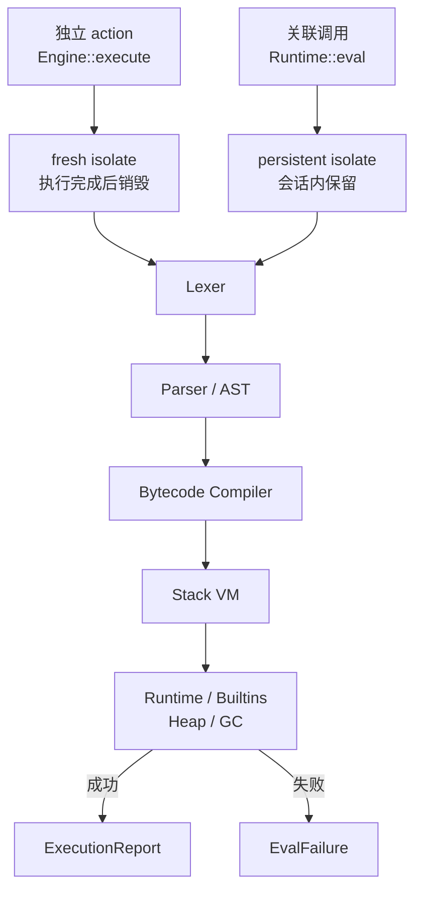
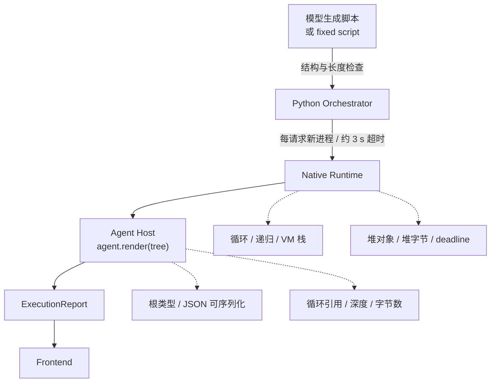
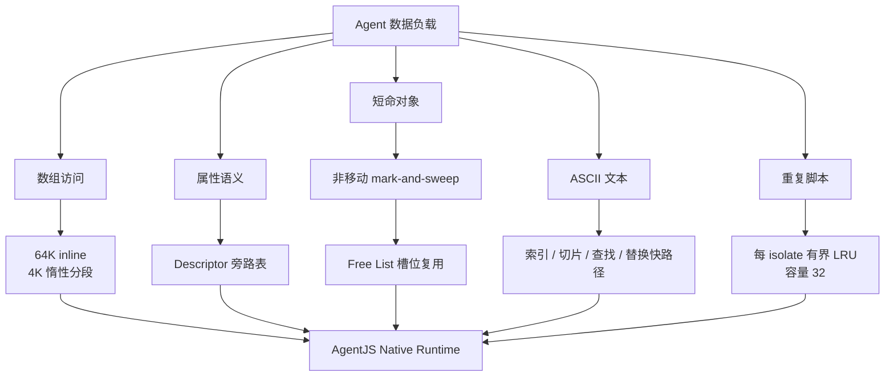
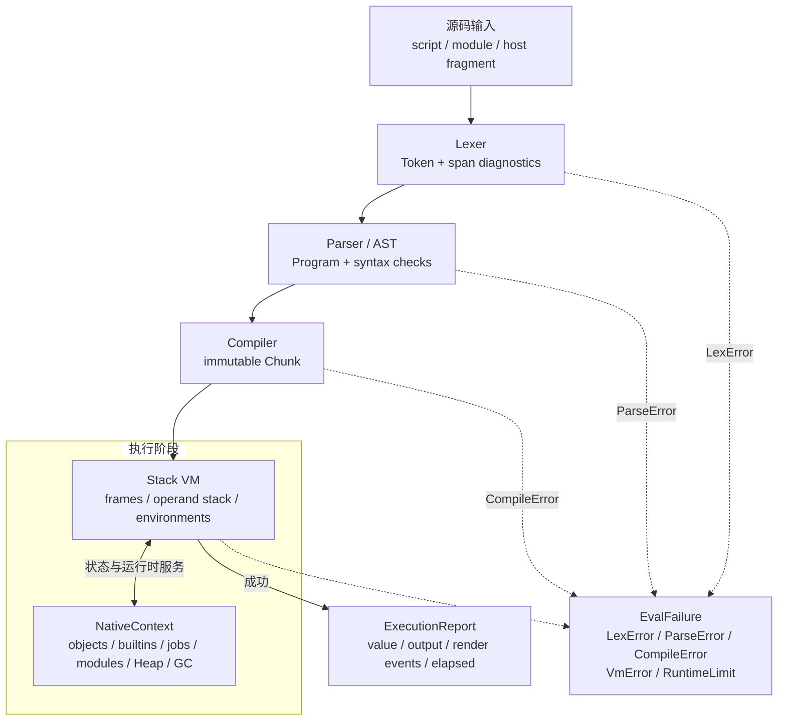
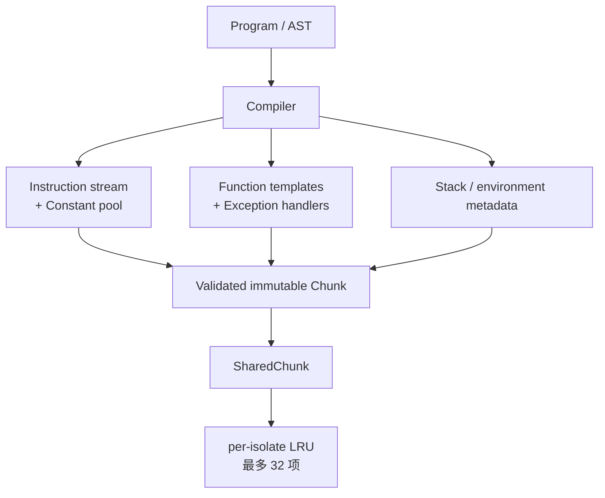
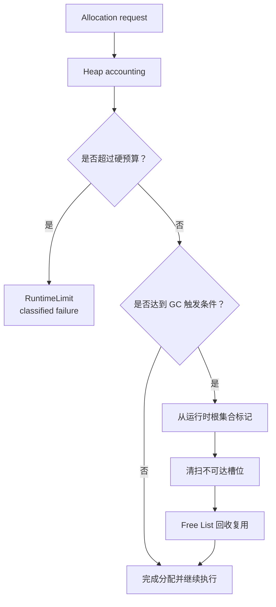
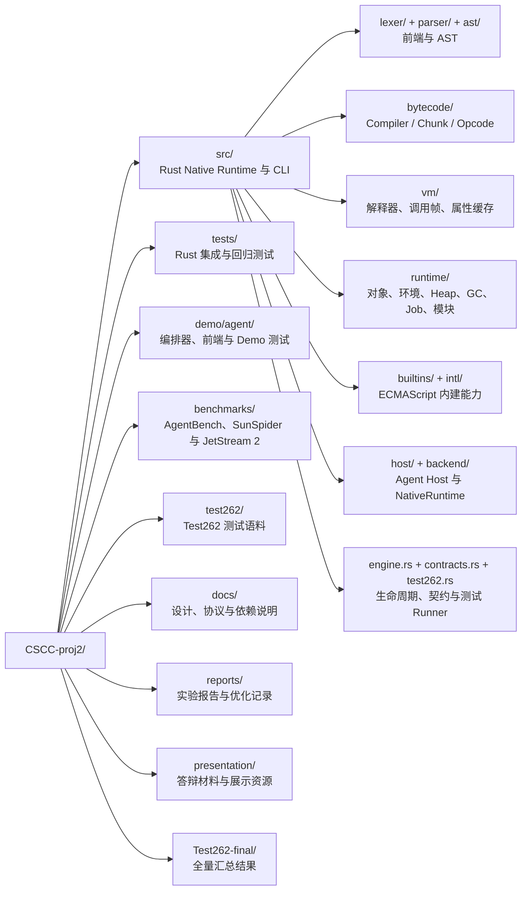
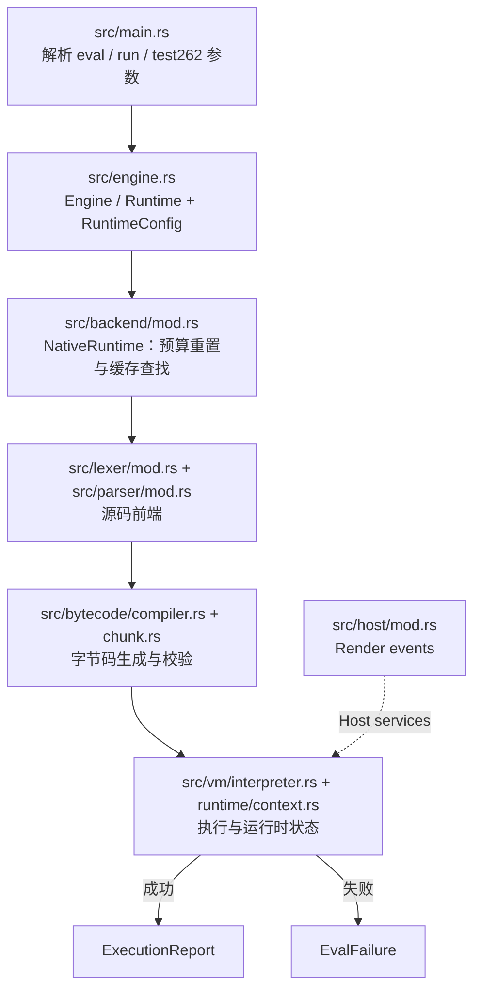
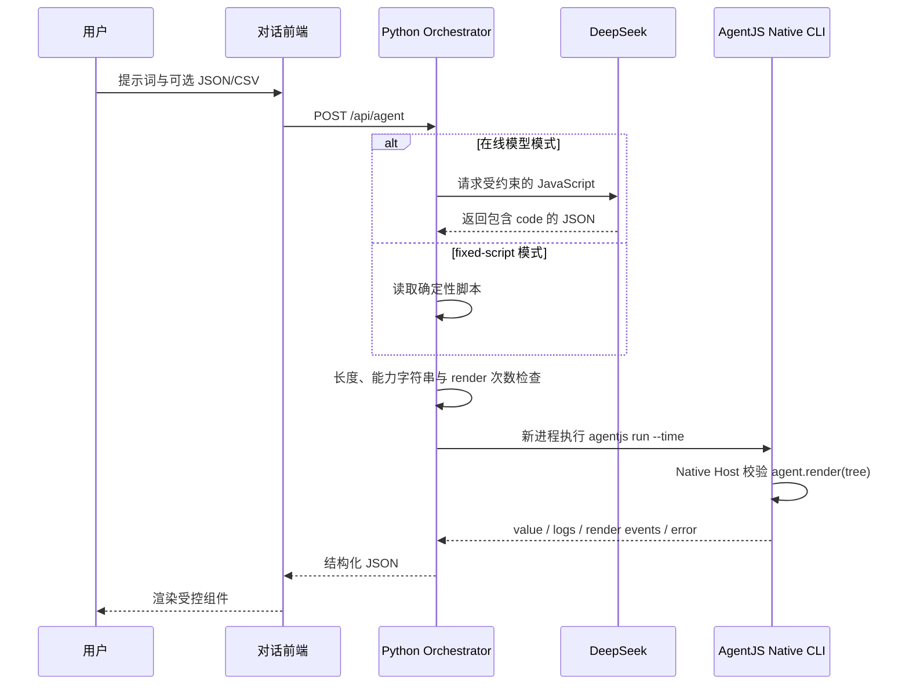

# AgentJS：面向 AI Agent 的轻量级 JavaScript 执行引擎设计与实验报告

> 项目名称：AgentJS
>
> 技术路线：Rust + 自研 Lexer/Parser/AST + 自定义字节码 + 栈式虚拟机 + Native Runtime
>
> 内嵌执行后端：Native（Boa 仅作外部性能参照）
>
---

## 项目概览

AI Agent 的脚本通常服务于一次工具调用：代码量不大，生命周期很短，却可能在一次规划中被反复生成和执行。AgentJS 针对这一工作负载，构建了从源码、词法分析、语法树、字节码到栈式 VM 和运行时对象模型的 Native 执行链，并把 action 级隔离、资源预算和结构化宿主输出作为一等设计约束。

本报告按照“设计思路—实现描述—代码落点—实验验证”的顺序，集中回答四项评审问题：Native 引擎能否独立完成脚本执行，短任务能否快速完成，资源边界能否由宿主控制，以及执行结果能否进入 Agent 展示链路。实验结论分别以 Test262 汇总、SunSpider 同步结果、AgentBench 样本、JetStream 2 CLI workload 和 Demo 页面为依据。

核心实验结果如下：Test262 共统计 **53,379** 个执行项，其中 **48,566** 个通过，通过率为 **90.98%**；SunSpider 1.0.2 的 **26 / 26** 个用例正确完成；AgentBench cold 模式的端到端耗时几何平均优于 Boa，batch 模式的总体耗时高于 Boa；JetStream 2 的六项同构 workload kernel 对照中，双方每项均完成 7 / 7 个测量样本，`Boa / AgentJS` 的 workload P50 几何平均比值为 **0.192x**；AgentBench 使用的 AgentJS 可执行文件大小为 **10.39 MiB**。

## 一、设计思路

### 1.1 问题背景

在数据整理、规则过滤、文本清洗和工具结果转换等 Agent action 中，JavaScript 执行有四个同时存在的要求：

- **返回要快**：脚本常在一次请求内完成，启动和解析成本会直接进入用户等待时间；
- **调用要稳**：同一服务可能连续执行彼此无关的代码，上一 action 的全局变量、原型修改或异常状态不能污染下一次调用；
- **边界要清楚**：模型生成的脚本是不可信输入，宿主必须能限制循环、递归、栈、堆、墙钟时间和输出规模；
- **结果要可编排**：Agent 需要得到可解析的值、日志和结构化渲染事件，而不是依赖浏览器 DOM 或非标准的隐式副作用。

这类工作负载与浏览器页面或 Node.js 长生命周期服务不同。AgentJS 因而不以复刻 DOM、Node.js API 或 JIT 生态为目标，而是把“短时、隔离、可控、可嵌入”作为执行内核的设计中心。

### 1.2 总体设计目标

| 目标 | 设计回答 | 评审证据 |
| :-- | :-- | :-- |
| Native 独立执行 | 自研 Lexer、Parser/AST、字节码编译器、栈式 VM、Runtime、Builtins、Heap 与 GC 组成完整内嵌链路 | 源码目录、Native CLI、构建与测试 |
| 短任务可预测 | 不走 JIT；源码直接编译为字节码解释执行，减少预热阶段 | AgentBench cold |
| action 级隔离 | `Engine` 为无关 action 创建 fresh isolate；相关调用由 `Runtime` 保持一个 isolate | Engine/Runtime 设计与 Demo 进程模型 |
| 宿主可控 | 循环、递归、VM 栈、堆对象、堆字节、大对象、墙钟和 RenderTree 均有预算 | `RuntimeConfig`、`RuntimeLimit`、Host 校验 |
| ECMAScript 兼容 | 以 Test262 全量汇总检验标准语义覆盖，以 SunSpider 检验经典脚本的完整执行 | Test262 48,566 / 53,379（90.98%）；SunSpider 26 / 26 |
| 复杂 workload 执行 | 通过 JetStream 2 CLI 适配器运行资源受限的长路径脚本，并用同构 kernel Runner 对照 Boa | `richards`、`splay` 的 CLI 诊断均完成 5 / 5；六项 kernel 对照中双方每项均完成 7 / 7 |
| 结构化集成与可复现 | `ExecutionReport` 承载 value、output 和 render events，失败由 `EvalFailure` 分类返回；实验保存原始结果与环境记录 | Agent Demo、AgentBench 结果与环境记录 |

上述目标之间存在取舍：兼容性要求扩大内建对象与语义覆盖，轻量化要求控制常驻状态，隔离性又会增加启动成本。报告后半部分不把单一指标当作总分，而是分别给出正确性、冷启动、批处理、内存、体积和集成证据。

### 1.3 创新点 1：Native 执行链与双入口隔离

AgentJS 的第一项核心设计是把“执行实现”和“调用生命周期”分开。所有 Native action 都经过同一条自研链路；宿主根据调用关系选择独立 `Engine` 或持久 `Runtime`，而不是把状态隔离和编译实现混在一个全局上下文中。


```mermaid
flowchart TB
    A["独立 action<br/>Engine::execute"] --> C["fresh isolate<br/>执行完成后销毁"]
    B["关联调用<br/>Runtime::eval"] --> D["persistent isolate<br/>会话内保留"]

    C --> E["Lexer"]
    D --> E
    E --> F["Parser / AST"]
    F --> G["Bytecode Compiler"]
    G --> H["Stack VM"]
    H --> I["Runtime / Builtins<br/>Heap / GC"]
    I -->|"成功"| J["ExecutionReport"]
    I -->|"失败"| K["EvalFailure"]
```

*图 1　AgentJS 双入口隔离与 Native 执行链*

两种入口的状态边界如下：

| 入口 | isolate 生命周期 | 适用场景 | 共享内容 |
| --- | --- | --- | --- |
| `Engine::execute` | 每次 action 新建并销毁 | 不同用户请求、模型生成的相互独立脚本 | 不共享可变全局、原型和异常状态 |
| `Runtime::eval` | 会话内持续存在 | REPL、同一工具链的连续片段 | 在明确会话内保留环境、Job Queue 和有界脚本缓存 |

Native 是程序唯一的内嵌执行后端。Boa 不参与 AgentJS 的执行，也不存在 Native 失败后静默回退到外部引擎的路径；它只在横向实验中作为性能参照。这一边界使兼容性与执行结果能够归因于 AgentJS 自身实现。

### 1.4 创新点 2：按 action 隔离的资源预算与受控 Host

Agent action 的安全边界不是单一的“禁止某个字符串”，而是由运行时预算、宿主 API 边界和进程生命周期共同构成：


```mermaid
flowchart TB
    A["模型生成脚本<br/>或 fixed script"]
    B["Python Orchestrator"]
    C["Native Runtime"]
    D["Agent Host<br/>agent.render(tree)"]
    E["ExecutionReport"]
    F["Frontend"]

    A -->|"结构与长度检查"| B
    B -->|"每请求新进程 / 约 3 s 超时"| C
    C --> D --> E --> F

    C -.-> C1["循环 / 递归 / VM 栈"]
    C -.-> C2["堆对象 / 堆字节 / deadline"]
    D -.-> D1["根类型 / JSON 可序列化"]
    D -.-> D2["循环引用 / 深度 / 字节数"]
```

*图 2　Agent action 的分层执行与宿主边界*

运行时预算及其作用如下：

| 预算 | 默认值/边界 | 超限行为 | 控制对象 |
| --- | --- | --- | --- |
| 循环检查 | 10,000,000 次 | 返回 `RuntimeLimit` | 无限循环与异常长循环 |
| 递归深度 | 256 层 | 返回 `RuntimeLimit` | 深递归调用 |
| VM 操作数栈 | 65,536 个值 | 返回 `RuntimeLimit` | 操作数栈深度增长 |
| 堆对象 | 500,000 个 | 返回 `RuntimeLimit` | 对象、函数和环境数量 |
| 堆字节 | 256 MiB | 返回 `RuntimeLimit` | Heap 与受保护的大块分配 |
| 大对象分配 | 单独计量 | 返回 `RuntimeLimit` | 一次性大数组、字符串等 |
| 墙钟时间 | 可配置 deadline | 返回 `RuntimeLimit` 或宿主超时 | 占用宿主进程的时间 |
| RenderTree | 字节数与嵌套深度上限 | Host 拒绝事件 | 输出数据规模与递归结构 |

默认 Runtime 不暴露文件系统、进程、网络、DOM 或 Node API；文件读取必须由宿主显式安装根目录受限的加载器。Demo 在这些运行时约束之外再启用进程隔离，形成可审计的 action 边界。需要强调的是，Python 层的字符串黑名单不是形式化沙箱，RenderTree 校验也不是完整字段级 Schema；安全结论限定于所述 API 暴露面和超时策略。

### 1.5 创新点 3：面向 Agent 负载的数据结构与快速路径

Agent 数据通常是“多数普通字段、少量特殊属性、局部大索引、短命临时对象和 ASCII 文本”的组合。AgentJS 针对这一形态做了局部优化，并保持对象 ID 和属性语义稳定：


```mermaid
flowchart TB
    A["Agent 数据负载"]

    A --> B["数组访问"]
    A --> C["属性语义"]
    A --> D["短命对象"]
    A --> E["ASCII 文本"]
    A --> F["重复脚本"]

    B --> B1["64K inline<br/>4K 惰性分段"]
    C --> C1["Descriptor 旁路表"]
    D --> D1["非移动 mark-and-sweep"]
    D1 --> D2["Free List 槽位复用"]
    E --> E1["索引 / 切片 / 查找 / 替换快路径"]
    F --> F1["每 isolate 有界 LRU<br/>容量 32"]

    B1 --> G["AgentJS Native Runtime"]
    C1 --> G
    D2 --> G
    E1 --> G
    F1 --> G
```

*图 3　面向 Agent 数据负载的运行时优化布局*

| 机制 | 核心实现 | 预期收益 |
| :-- | :-- | :-- |
| 分段稠密数组 | 前 64K 槽位 inline；之后按 4K 槽位惰性分段；超大索引转入 sparse property | 降低稀疏大索引数组的预分配成本 |
| Descriptor 旁路表 | 普通元素只保存值；非默认属性描述符存放在覆盖表 | 让普通元素路径保持紧凑 |
| 非移动 mark-and-sweep + Free List | 标记清扫保持对象 ID 稳定，回收槽位供后续对象复用 | 适合 action 内临时对象的创建与回收 |
| ASCII 快速路径 | 长度、索引、切片、查找、大小写和替换优先走 ASCII 路径 | 降低日志、JSON 字段和规则文本的处理开销 |
| 有界脚本缓存 | 键包含源码、严格模式和源码类型；命中后更新 LRU，容量为 32 | 复用重复脚本，同时避免缓存无限增长 |

这些优化共同构成 Native Runtime。AgentBench 未将它们设置为独立消融变量，因此单个 case 只能评价完整系统在相应负载上的表现，不能把差值直接归因于某一项优化。

## 二、实现描述

### 2.1 完整工作流程

一次普通脚本执行的输入、状态和输出可以概括为：


```mermaid
flowchart TB
    A["源码输入<br/>script / module / host fragment"]
    B["Lexer<br/>Token + span diagnostics"]
    C["Parser / AST<br/>Program + syntax checks"]
    D["Compiler<br/>immutable Chunk"]

    subgraph Execution["<span style='background-color:#fff'>&nbsp;&nbsp;执行阶段&nbsp;&nbsp;</span>"]
        E["Stack VM<br/>frames / operand stack / environments"]
        F["NativeContext<br/>objects / builtins / jobs / modules / Heap / GC"]
        E <-->|"状态与运行时服务"| F
    end

    G["ExecutionReport<br/>value / output / render events / elapsed"]
    H["EvalFailure<br/>LexError / ParseError / CompileError<br/>VmError / RuntimeLimit"]

    A --> B --> C --> D --> E
    E -->|"成功"| G
    B -.->|"LexError"| H
    C -.->|"ParseError"| H
    D -.->|"CompileError"| H
    E -.-> H
```

*图 4　一次 AgentJS 求值请求的完整流水线*

`NativePipeline` 以 `SourceParser`、`ProgramCompiler` 和 `ChunkExecutor` 三个契约连接前端、编译器和 VM，使每一层可以独立测试。`NativeRuntime` 负责缓存、预算重置、模块登记和报告组装；`Engine`/`Runtime` 负责把该后端放入正确的 isolate 生命周期。

### 2.2 Lexer、Parser 与 AST

`src/lexer/` 将源码切分为带 span 的 Token，处理关键字、标识符、数字、字符串、模板、正则和 Unicode 标识符；词法错误在进入 VM 前即被分类。`src/parser/` 构造 `Program`、表达式和语句 AST，区分 script、module 与 host fragment，并在解析阶段完成括号、绑定、控制流和模块语法检查。`src/ast/` 保存表达式、语句、函数、类、导入导出和绑定模式等稳定数据类型。

这一层的输出不是“可执行的字符串”，而是带结构信息的 AST。这样做有两个直接作用：一是让编译器可以对跳转、作用域和异常区间做静态布局；二是让 Test262 Runner 能在单个用例失败时区分词法/语法错误与运行时错误。

| 模块 | 输入 | 输出 | 失败形式 |
| --- | --- | --- | --- |
| `lexer` | UTF-8 源码 | `Token` 序列、span | `LexError` |
| `parser` | Token 序列 | `Program` / AST | `ParseError` |
| `ast` | 结构定义 | 编译器和模块系统共享的语义节点 | 由上游报告 |

### 2.3 Compiler 与字节码 Chunk

`src/bytecode/compiler.rs` 把 AST 降低为自定义 `Chunk`，`src/bytecode/opcode.rs` 定义栈效果明确的指令，`src/bytecode/chunk.rs` 保存常量池、函数表、异常处理区间和缓存元数据。编译器同时记录局部变量、上值和环境信息，并校验跳转目标、常量索引、函数索引以及指令栈深度，避免把结构错误推迟到执行阶段。


```mermaid
flowchart TB
    A["Program / AST"] --> B["Compiler"]

    B --> C["Instruction stream<br/>+ Constant pool"]
    B --> D["Function templates<br/>+ Exception handlers"]
    B --> E["Stack / environment metadata"]

    C --> F["Validated immutable Chunk"]
    D --> F
    E --> F

    F --> G["SharedChunk"]
    G --> H["per-isolate LRU<br/>最多 32 项"]
```

*图 5　字节码 Chunk 的组成、校验与缓存路径*

栈式字节码的取舍是明确的：它保留了表达式求值顺序和异常恢复所需的栈深度信息，便于完成语义覆盖与资源检查；代价是部分热点循环会承担更多解释器 dispatch。AgentBench 将字符串扫描和批处理路径识别为主要性能热点。

### 2.4 Stack VM、调用帧与异步作业

`src/vm/interpreter.rs` 是字节码执行核心。VM 维护操作数栈、`CallFrame` 调用帧、程序计数器、环境链和异常处理状态；`src/vm/frame.rs`、`src/vm/invocation.rs` 分别承载帧根和调用/构造请求。完成记录统一为 `Completion`，`return`、`throw`、`break`、`continue` 和异常传播在同一控制模型中处理。

执行中的关键路径包括：

1. 取指并根据指令的栈效果检查操作数栈；
2. 解析全局、局部和闭包环境，执行属性读写、调用和构造；
3. 遇到 `try/catch/finally` 或 `throw` 时按字节码异常区间恢复栈深度和环境深度；
4. 将 Promise、微任务和模块评估交给 `runtime/job.rs` 与模块注册表，在宿主要求时排空 Job Queue；
5. 在检查点读取循环、墙钟和堆预算，超限后返回可分类的 `EvalFailure`。

这条路径保持“Parser 不执行、VM 不承担顶层源码解析”的层次边界，便于对每一层分别做单元测试和差分检查。

### 2.5 Runtime、Heap、GC 与预算

`src/runtime/context.rs` 的 `NativeContext` 是每个 isolate 的运行时状态容器，连接全局环境、内建对象、模块注册表、Host 服务、Heap、GC 控制器和执行预算。`src/runtime/heap.rs`、`gc.rs`、`memory.rs` 共同记录对象槽位、环境、函数、估算字节数、分配次数和回收统计。

Runtime 的资源路径如下：


```mermaid
flowchart TB
    A["Allocation request"] --> B["Heap accounting"]
    B --> C{"是否超过硬预算？"}

    C -->|"是"| D["RuntimeLimit<br/>classified failure"]
    C -->|"否"| E{"是否达到 GC 触发条件？"}

    E -->|"否"| F["完成分配并继续执行"]
    E -->|"是"| G["从运行时根集合标记"]
    G --> H["清扫不可达槽位"]
    H --> I["Free List 回收复用"]
    I --> F
```

*图 6　Heap 预算检查与非移动 GC 决策流程*

GC 采用非移动 mark-and-sweep：从全局环境、当前环境、调用帧、操作数栈、待处理异常和内建根集合出发标记对象、环境和函数，清扫不可达槽位；对象 ID 在清扫过程中保持稳定，空槽由 Free List 重新分配。该设计优先保证属性引用和诊断信息的稳定性，换取了在局部压力负载上可能更高的峰值内存。报告中的 RSS 是宿主侧观测值，不能替代 Heap 内部统计。

### 2.6 对象模型、属性访问与场景优化

`src/runtime/object.rs`、`property.rs`、`property_map.rs` 和 `shape.rs` 定义对象、属性描述符、形状与属性存储；`src/vm/property_cache.rs` 提供属性访问的缓存入口。数组和字符串路径在通用对象模型上增加了针对 Agent 数据的快速分支。

| 实现部位 | 设计要点 | 与负载的对应 |
| --- | --- | --- |
| Array storage | 64K inline + 4K 惰性分段；超大索引进入 sparse property | `large-index-dense-array`、局部窗口写入 |
| Descriptor storage | 普通元素值与非默认 descriptor 分离 | `descriptor-side-table-array` |
| Property access | 形状/属性表与 VM property cache 协同 | `object-property-hot-loop`、规则过滤 |
| String value | ASCII 长度、索引、切片、查找、大小写、替换快路径 | `string-*` 系列任务 |
| Script cache | 源码内容摘要 + strict + source kind 作为键，LRU 容量受 `RuntimeConfig` 限制 | 重复规则和固定工具脚本 |

本节列出实现机制，不作逐项性能归因。实验未提供单项开关的消融数据，因此 case 结果仅代表完整系统表现。

### 2.7 Builtins、Agent Host 与 RenderTree

`src/builtins/` 安装 Object、Array、Function、String、JSON、Math、RegExp、Promise、Map/Set、TypedArray、Date/Intl 等标准对象；`src/host/mod.rs` 只安装面向 Agent 的最小 Host 面。`agent.render(tree)` 的处理顺序为：根对象类型检查 → 循环引用与 JSON 可序列化检查 → 深度和字节预算检查 → 记录规范化 JSON 事件。

允许的 RenderTree 根类型为 `panel`、`text`、`metrics`、`statuses`、`table` 和 `list`。前端不读取 VM 内部对象，只消费 `ExecutionReport` 中的 render events；因此引擎可以替换而不改变页面协议。Demo 通过 Python 编排器和 Native CLI 新进程完成一次 action，默认约 3 秒宿主超时；DeepSeek 仅是可选的脚本生成端，fixed-script 是可重复的展示路径。

### 2.8 Test262 Runner

`src/test262.rs` 负责发现测试、加载 harness、选择 strict/non-strict 变体、并行调度用例、捕获单用例 panic，并汇总 passed/failed/skipped 和耗时。Runner 的后端参数固定为 Native 时，测试只进入自研执行链。汇总 JSON 用于支持通过数、失败数、跳过数和通过率等兼容性结论。

## 三、代码说明

### 3.1 顶层目录


```mermaid
flowchart LR
    A["CSCC-proj2/"]

    A --> B["src/<br/>Rust Native Runtime 与 CLI"]
    A --> C["tests/<br/>Rust 集成与回归测试"]
    A --> D["demo/agent/<br/>编排器、前端与 Demo 测试"]
    A --> E["benchmarks/<br/>AgentBench、SunSpider 与 JetStream 2"]
    A --> F["test262/<br/>Test262 测试语料"]
    A --> G["docs/<br/>设计、协议与依赖说明"]
    A --> H["reports/<br/>实验报告与优化记录"]
    A --> I["presentation/<br/>答辩材料与展示资源"]
    A --> J["Test262-final/<br/>全量汇总结果"]

    B --> B1["lexer/ + parser/ + ast/<br/>前端与 AST"]
    B --> B2["bytecode/<br/>Compiler / Chunk / Opcode"]
    B --> B3["vm/<br/>解释器、调用帧、属性缓存"]
    B --> B4["runtime/<br/>对象、环境、Heap、GC、Job、模块"]
    B --> B5["builtins/ + intl/<br/>ECMAScript 内建能力"]
    B --> B6["host/ + backend/<br/>Agent Host 与 NativeRuntime"]
    B --> B7["engine.rs + contracts.rs + test262.rs<br/>生命周期、契约与测试 Runner"]
```

*图 7　AgentJS 仓库与核心源码层级*

### 3.2 核心模块职责

| 路径 | 职责 | 关键输出/边界 |
| --- | --- | --- |
| `src/lexer/` | Token 化、span 和 Unicode 标识符 | `Token`、`LexError` |
| `src/parser/`、`src/ast/` | 源码解析与稳定 AST | `Program`、`ParseError` |
| `src/bytecode/` | AST 编译、Opcode、Chunk 校验 | `SharedChunk`、常量池、异常区间 |
| `src/vm/` | 操作数栈、调用帧、异常和 Job 驱动 | `Vm`、`Completion` |
| `src/runtime/` | 值、对象、环境、Heap、GC、模块 | `NativeContext`、预算统计 |
| `src/builtins/`、`src/intl/` | 标准构造器、方法、Intl 能力和测试 harness | ECMAScript 内建对象 |
| `src/host/` | `agent.render`、Host 文件加载器、RenderTree 校验 | `RenderEvent` |
| `src/backend/mod.rs` | NativeRuntime、脚本缓存、后端契约 | `BackendKind::Native` |
| `src/engine.rs` | `Engine`/`Runtime` 生命周期、配置和报告 | `ExecutionReport`、`EvalFailure` |
| `src/contracts.rs` | Parser/Compiler/Executor 的可替换协作接口 | `NativePipeline` |
| `src/test262.rs` | 测试发现、调度、汇总和错误隔离 | JSON/Markdown 结果 |
| `demo/agent/server.py` | 请求编排、模型可选调用、进程隔离 | HTTP JSON 与前端数据 |

### 3.3 关键文件与代码工作流

一次从 CLI 到结果的代码路径可简化为：


```mermaid
flowchart TB
    A["src/main.rs<br/>解析 eval / run / test262 参数"]
    B["src/engine.rs<br/>Engine / Runtime + RuntimeConfig"]
    C["src/backend/mod.rs<br/>NativeRuntime：预算重置与缓存查找"]
    D["src/lexer/mod.rs + src/parser/mod.rs<br/>源码前端"]
    E["src/bytecode/compiler.rs + chunk.rs<br/>字节码生成与校验"]
    F["src/vm/interpreter.rs + runtime/context.rs<br/>执行与运行时状态"]
    G["src/host/mod.rs<br/>Render events"]
    H["ExecutionReport"]
    I["EvalFailure"]

    A --> B --> C --> D --> E --> F
    G -.->|"Host services"| F
    F -->|"成功"| H
    F -->|"失败"| I
```

*图 8　从 CLI 入口到执行报告的代码工作流*

`src/contracts.rs` 是跨层协作边界：Lexer/Parser 实现 `SourceParser`，Compiler 实现 `ProgramCompiler`，VM 实现 `ChunkExecutor`。这些接口隔离各实现层，使测试可以注入 fake stage，而不把测试逻辑耦合到具体实现细节。

### 3.4 设计点到代码位置快速导航

| 设计点 | 代码入口 |
| --- | --- |
| Engine/Runtime 双入口 | `src/engine.rs` 的 `Engine`、`Runtime` |
| Native-only 后端与 32 项 LRU | `src/backend/mod.rs` 的 `BackendKind`、`NativeRuntime` |
| Lexer/Parser/AST | `src/lexer/`、`src/parser/`、`src/ast/` |
| 自定义栈式字节码 | `src/bytecode/compiler.rs`、`src/bytecode/opcode.rs`、`src/bytecode/chunk.rs` |
| 调用帧、Completion、属性缓存 | `src/vm/frame.rs`、`src/vm/invocation.rs`、`src/vm/property_cache.rs` |
| Heap、非移动 GC、Free List | `src/runtime/heap.rs`、`src/runtime/gc.rs`、`src/runtime/stable_arena.rs` |
| 分段数组与 descriptor 旁路 | `src/runtime/object.rs`、`src/runtime/property.rs`、`src/runtime/property_map.rs` |
| ASCII 字符串路径 | `src/runtime/string_value.rs`、`src/builtins/string.rs` |
| `agent.render` 与 RenderTree | `src/host/mod.rs`、`demo/agent/protocol.md` |
| Test262 汇总 | `src/test262.rs`、`Test262-final/full-test262-summary.json` |
| AgentBench | `benchmarks/agent/manifest.json`、`benchmarks/agent/run_agentbench.py` |
| JetStream 2 CLI 适配与对照测量 | `src/main.rs`、`scripts/prepare-jetstream2.mjs`、`scripts/prepare-simple-benchmark.mjs`、`scripts/measure-jetstream2.ps1`、`scripts/measure-jetstream2-agentjs-boa.ps1` |

## 主要使用的开源项目与依赖说明

| 来源 | 本项目中的用途 | 是否进入 Native 核心 |
| --- | --- | --- |
| Boa | 外部正确性与性能参照 | 否 |
| Test262 | ECMAScript 测试语料 | 否 |
| SunSpider 1.0.2 | 经典脚本正确性与热点观察 | 否 |
| JetStream 2 | 复杂 JavaScript workload 测试语料 | 否 |
| DeepSeek | Demo 的可选 JavaScript 生成端 | 否 |
| Rust crates | RegExp、Unicode/Intl 等基础库能力 | 作为 Cargo 依赖进入构建 |

Boa 不被链接到 AgentJS Native 执行路径；只有明确选择的外部命令才会启动该参照引擎。第三方版本和许可证记录见 [`docs/dependencies.md`](../docs/dependencies.md)。

## 四、Benchmark 与评分体系

### 4.1 测试套件设计

| 套件 | 要回答的问题 | 输入规模/样本 | 控制条件 | 主要输出 |
| --- | --- | --- | --- | --- |
| Test262 | ECMAScript 语义覆盖是否达到赛题门槛 | 53,379 个执行项 | Native 全量扫描；失败和跳过均不计为通过 | passed、failed、skipped、通过率与耗时 |
| SunSpider 1.0.2 | 经典脚本能否完整执行，主要性能热点位于何处 | 26 个用例，每个引擎运行 3 次 | AgentJS 与 Boa 使用相同测试集合；单次超时 60 s | 正确性状态、代表性中位耗时 |
| JetStream 2 CLI 子集 | 复杂 workload 能否由 Native CLI 完整执行，主要资源热点位于何处 | `richards`、`splay`；每项 2 次内部迭代、5 个独立进程 | 固定测试语料、生成 Runner、根目录受限资源加载；180 s 超时 | 正确完成数、P50、P90、观测工作集峰值 |
| JetStream 2 workload kernel 对照 | 共同可执行的计算 workload 与 Boa 存在多大耗时和工作集差异 | 6 项；每个进程执行 1 次 workload；每引擎 warmup=2、repeat=7 | 双方使用相同 self-contained Runner，顺序执行；180 s 超时、1,536 MiB 工作集上限 | 正确完成数、workload P50、进程 P90、工作集峰值、相对耗时 |
| AgentBench 2.0 cold | 单次 Agent action 从进程启动到退出的端到端成本 | 12 个确定性 case | AgentJS 与 Boa 同机；warmup=3、repeat=15 | P50 端到端耗时、观测峰值 RSS |
| AgentBench 2.0 batch | 连续短任务的端到端吞吐与内存表现 | 同 12 个 case；每个进程连续执行同一 action 5 次 | 其余条件与 cold 相同 | 5 次 action 总耗时 P50、观测峰值 RSS |
| Agent Demo | 执行结果能否进入完整的 Agent 调用与展示链路 | fixed-script；可选 DeepSeek 在线模式 | Native CLI 新进程、Host 校验、约 3 s 宿主超时 | value、logs、RenderTree、页面结果 |

AgentBench 的 12 个确定性 case 覆盖 JSON 解析与转换、工具结果聚合、规则过滤、对象属性热循环、短命对象分配、数组 descriptor、大索引数组和字符串处理。每个 case 都设置确定性结果检查，执行错误、超时或结果不一致的样本不进入性能统计。

跨引擎核心测试不调用 AgentJS 专用的 `agent.render`，避免将 Host 专有能力混入 JavaScript 执行性能比较。RenderTree 及宿主集成能力由 Agent Demo 独立验证。

### 4.2 指标定义与统计口径

本项目不将性质不同的指标压缩为单一综合分数。正确性、耗时、内存和产物体积分别报告，便于评委直接判断各项目标的达成程度。

| 指标 | 定义 | 解释 |
| --- | --- | --- |
| Test262 通过率 | `passed / total × 100%` | failed 和 skipped 均不计为通过 |
| 正确完成数 | 通过结果检查，且无 error 或 timeout 的 case 数 | 用于 SunSpider、AgentBench 与两类 JetStream 实验的正确性门控 |
| 相对耗时 | `R_time = Boa 耗时 / AgentJS 耗时` | `R_time > 1` 表示 AgentJS 耗时更低 |
| 相对 RSS | `R_rss = Boa RSS / AgentJS RSS` | `R_rss > 1` 表示 AgentJS 占用更少内存 |
| AgentBench 总体值 | 12 个共同通过 case 的相对比值几何平均 | 避免高耗时 case 对结果产生不成比例的支配 |
| 单项耗时 | 15 个有效测量样本的 P50 | batch 的单个样本为同进程连续 5 次 action 的总耗时 |
| 峰值 RSS | Windows PSAPI `PeakWorkingSetSize` | 表示操作系统记录的进程峰值工作集，不等同于 VM Heap 内部占用 |
| JetStream CLI 进程耗时 | 5 个独立进程墙钟时间的 P50 与 P90 | 单个样本在一个进程内执行 workload 2 次 |
| JetStream kernel 耗时 | 2 个预热进程之后 7 个有效进程的 workload 内部耗时 P50 | 单个进程执行 workload 1 次；总体相对值对 6 项 `Boa / AgentJS` 比值取几何平均 |
| JetStream 工作集 | 每 50 ms 读取 `WorkingSet64`，报告通过样本中的最大值 | 属于离散采样值，不是连续监测的绝对峰值 |
| 产物体积 | 被测可执行文件的字节数 | 以参与本轮实验的 release 可执行文件为准 |

AgentJS 与 Boa 在 cold 和 batch 模式下均通过 12 / 12 个 case，因此全部用例进入几何平均。batch 衡量单进程内连续 5 次相同 action 的端到端表现，不等价于持久 `Runtime` 多次调用，也不构成脚本缓存收益的消融证据。

### 4.3 实验环境与证据索引

| 项目 | 记录值 |
| --- | --- |
| 测试平台 | Windows 11 `10.0.26200`，AMD64 |
| CPU 标识 | Intel64 Family 6 Model 183 Stepping 1 |
| Rust | `rustc 1.96.0` |
| Python | 3.14.5 |
| 内存采集方式 | Windows PSAPI `PeakWorkingSetSize` |

AgentBench、SunSpider 与 JetStream 的正文结论均以各自结果文件中的样本、统计口径和运行条件为依据。Test262 仅使用汇总统计评价标准覆盖率，不使用其总耗时进行跨引擎性能比较；JetStream CLI 诊断与 kernel 对照采用不同 Runner，二者分别呈现，不合并计算。

原始证据如下：

| 内容 | 仓库记录 |
| --- | --- |
| Test262 汇总 | [`Test262-final/full-test262-summary.json`](../Test262-final/full-test262-summary.json) |
| AgentBench 测试定义与方法 | [`manifest.json`](../benchmarks/agent/manifest.json)、[`run_agentbench.py`](../benchmarks/agent/run_agentbench.py) |
| AgentBench cold 数据 | [`agentjs-cold.json`](../presentation/assets/video/agentbench-formal/agentjs-cold.json)、[`agentjs-cold.md`](../presentation/assets/video/agentbench-formal/agentjs-cold.md)、[`environment-cold.json`](../presentation/assets/video/agentbench-formal/environment-cold.json) |
| AgentBench batch 数据 | [`agentjs-batch.json`](../presentation/assets/video/agentbench-formal/agentjs-batch.json)、[`agentjs-batch.md`](../presentation/assets/video/agentbench-formal/agentjs-batch.md)、[`environment-batch.json`](../presentation/assets/video/agentbench-formal/environment-batch.json) |
| SunSpider 同步结果 | [`sunspider-video.json`](../presentation/assets/video/sunspider-video.json)、[`sunspider-video.md`](../presentation/assets/video/sunspider-video.md) |
| JetStream 2 Native CLI 诊断 | [`jetstream2-performance.json`](../presentation/assets/video/jetstream2-performance.json) |
| JetStream 2 AgentJS/Boa kernel 对照 | [`jetstream2-agentjs-boa.json`](../presentation/assets/video/jetstream2-agentjs-boa.json)、[`measure-jetstream2-agentjs-boa.ps1`](../scripts/measure-jetstream2-agentjs-boa.ps1) |
| Demo 截图 | [`agentjs-demo-test262.png`](../presentation/assets/agentjs-demo-test262.png) |

### 4.4 Test262 兼容性

| Total | Passed | Failed | Skipped | Pass rate | Elapsed |
| ---: | ---: | ---: | ---: | ---: | ---: |
| 53,379 | **48,566** | 4,811 | 2 | **90.9833%** | 444.347 s |

汇总满足 `passed + failed + skipped = total`。按 `passed / total × 100%` 计算，通过率按两位小数记为 **90.98%**，高于赛题 60% 门槛 **30.98 个百分点**。Native Runner 分别统计通过、失败与跳过，失败和跳过均未计入通过；表中也未混入参照引擎数据。

该结果表明 AgentJS 的自研前端、字节码编译器、栈式 VM 与 Native Runtime 已覆盖大部分受测 ECMAScript 语义，并达到赛题规定的兼容性目标。汇总中仍有 **4,811** 个失败项；由于结果文件不包含按语法、内建对象或标准特性划分的失败分类，本文不对失败来源作比例推断，也不将 90.98% 等同于完整 ECMAScript 一致性。

### 4.5 SunSpider 1.0.2

| 类别 | 用例数 | AgentJS 通过 |
| --- | ---: | ---: |
| 3D / access / bitops / controlflow | 12 | 12 |
| crypto / date / math | 8 | 8 |
| regexp / string | 6 | 6 |
| **合计** | **26** | **26** |

AgentJS 与 Boa 在同一次 Runner 执行中各完成 26 / 26 个用例，结果中没有 wrong result、runtime error 或 timeout。每个用例运行 3 次，代表性中位耗时如下：

| Case | AgentJS | Boa | 观察 |
| --- | ---: | ---: | --- |
| `bitops-bitwise-and` | 299.9 ms | **269.5 ms** | 两者耗时接近 |
| `access-nsieve` | 126.3 ms | **124.5 ms** | 数组访问与整数循环耗时接近 |
| `regexp-dna` | 126.3 ms | **107.3 ms** | RegExp 路径的差距收敛至约 1.18 倍 |
| `string-tagcloud` | 431.8 ms | **146.2 ms** | 复杂字符串与对象处理仍是热点 |
| `string-unpack-code` | 605.6 ms | **282.3 ms** | 字符串解包仍有约 2.15 倍差距 |

同步结果文件保存双方的逐次样本、中位数、重复次数与 60 s 超时设置。因此，**26 / 26** 用于评价经典脚本的正确执行能力，同次运行的耗时用于识别热点，不将该组有限样本外推为通用引擎排名。

### 4.6 AgentBench 2.0

#### 4.6.1 总体结果

下表统一采用“Boa / AgentJS”比值，并对 12 个共同通过 case 取几何平均：

| 模式 | 指标 | Boa / AgentJS |
| --- | --- | ---: |
| cold | 端到端耗时 | **1.097x** |
| batch | 端到端耗时 | 0.619x |
| cold | 观测峰值 RSS | **1.123x** |
| batch | 观测峰值 RSS | 0.979x |

**关键观察：**

- cold 与赛题的即时执行场景最接近。其耗时比值为 1.097x，即 Boa 的几何平均端到端耗时为 AgentJS 的 1.097 倍，说明 AgentJS 在这组冷任务上具备竞争力。
- batch 耗时比值为 0.619x，即 Boa 完成相同连续任务的耗时约为 AgentJS 的 61.9%；换算后，AgentJS 的总体 batch 耗时约为 Boa 的 1.62 倍。12 个 case 均正确完成，但连续执行吞吐仍是主要性能限制。
- cold RSS 比值为 1.123x，AgentJS 的总体观测峰值低于 Boa；batch RSS 比值为 0.979x，两者总体接近，AgentJS 略高。
- `rule-filter-dense-window` 的内存峰值明显高于其他短任务，说明轻量化优势取决于具体数据结构与负载，不能由单项或总体均值外推到所有场景。

#### 4.6.2 cold 代表性用例

以下数值为单 action 端到端 P50，按启动、JSON、数组和字符串路径选取，既展示优势也展示短板：

| Case | AgentJS | Boa |
| --- | ---: | ---: |
| `startup-noop` | **13.9 ms** | 20.0 ms |
| `json-parse-transform` | **25.2 ms** | 30.9 ms |
| `descriptor-side-table-array` | **427.2 ms** | 485.7 ms |
| `large-index-dense-array` | **629.9 ms** | 766.2 ms |
| `string-cleanup-replace-window` | **138.9 ms** | 1,075.0 ms |
| `string-log-token-slice` | **424.4 ms** | 483.6 ms |
| `string-ascii-index-scan` | 362.3 ms | **108.9 ms** |
| `rule-filter-dense-window` | 455.9 ms | **339.6 ms** |

AgentJS 在进程启动、JSON 转换、descriptor 数组、大索引数组以及两项字符串清洗任务中取得更低的 P50。`string-ascii-index-scan` 和 `rule-filter-dense-window` 则显示，紧密字符扫描、数组窗口与对象筛选仍承担较高的解释器开销。

这些结果评价的是包含全部运行时组件的完整系统。单个 case 的差值可用于定位工程重点，但不能单独证明某项内部优化与性能变化之间的因果关系。

#### 4.6.3 RSS 与可执行文件体积

代表性观测峰值 RSS 如下（单位：MiB）：

| 模式 / Case | AgentJS | Boa |
| --- | ---: | ---: |
| cold / `startup-noop` | **6.86** | 10.97 |
| cold / `descriptor-side-table-array` | **13.04** | 25.54 |
| cold / `rule-filter-dense-window` | 101.95 | **26.77** |
| batch / `string-cleanup-replace-window` | **9.77** | 14.03 |
| batch / `string-log-token-slice` | **10.30** | 13.54 |

AgentBench 环境文件记录的可执行文件大小如下：

| 引擎 | Bytes | MiB |
| --- | ---: | ---: |
| AgentJS | 10,891,776 | **10.39** |
| Boa | 29,693,440 | 28.32 |

AgentJS 可执行文件体积为 Boa 的 **36.68%**，减少约 **63.32%**，直接体现了更小的可执行文件占用。内存结果同时表明，较小的二进制文件并不保证所有 workload 都具有更低的峰值 RSS；报告因此将产物体积、总体 RSS 和高峰值 case 分别呈现。

### 4.7 JetStream 2 CLI 与 workload kernel 对照

#### 4.7.1 Native CLI 适配诊断

AgentJS 通过 `prepare-jetstream2.mjs` 从固定 JetStream 2 测试语料生成 CLI Runner，并由 `agentjs jetstream` 在 `--resource-root` 限定的目录内加载 workload 资源。该适配路径保留测试计划与资源清单，适合检验调度、对象分配、长路径执行和 GC 压力；浏览器 API、Web Worker 与 WebAssembly workload 不属于该 CLI 路径。

Native CLI 诊断对 `richards` 和 `splay` 分别执行 5 个独立进程，每个进程完成 2 次内部迭代，单进程超时为 180 s：

| Workload | 完成 | Wall time P50 | Wall time P90 | 范围 | 最大观测工作集 |
| --- | ---: | ---: | ---: | ---: | ---: |
| `richards` | **5 / 5** | 8.363 s | 8.456 s | 8.246–8.488 s | 24.46 MiB |
| `splay` | **5 / 5** | 7.691 s | 14.207 s | 7.406–18.135 s | 986.54 MiB |

两个 workload 的全部测量进程均正确完成，说明生成 Runner、受限资源加载与 Native 执行链能够闭合。`richards` 的样本集中在 8.25–8.49 s；`splay` 包含一个 18.135 s 样本，P90 和工作集峰值也明显较高，表明该 workload 在此次诊断中存在稳定性和内存压力。

这组结果是两个固定 JavaScript workload 的 Native CLI 功能与资源诊断，因此这里只陈述结果文件直接支持的正确性、墙钟时间和工作集观测，不将其外推为完整套件表现。

#### 4.7.2 AgentJS 与 Boa 的 workload kernel 对照

双引擎对照使用 `prepare-simple-benchmark.mjs` 从同一份固定测试语料生成 self-contained Runner。六项均为可移植、同步、带结果检查且双方共同通过的 JavaScript 计算内核；这里的通过数不代表 JetStream 2 总体覆盖率。每个进程执行 1 次 workload；每个引擎先运行 2 个预热进程，再顺序采集 7 个独立测量进程。只有退出码为 0 且输出确定性完成标记的样本才计为通过。下表耗时为 7 个有效样本的 workload 内部耗时 P50，比值统一采用 `Boa / AgentJS`：

| Workload | AgentJS | Boa | AgentJS P50 | Boa P50 | Boa / AgentJS |
| --- | ---: | ---: | ---: | ---: | ---: |
| `n-body-SP` | 7 / 7 | 7 / 7 | 1,316 ms | 360 ms | 0.274x |
| `crypto-sha1-SP` | 7 / 7 | 7 / 7 | 4,324 ms | 673 ms | 0.156x |
| `crypto-md5-SP` | 7 / 7 | 7 / 7 | 5,162 ms | 486 ms | 0.094x |
| `3d-cube-SP` | 7 / 7 | 7 / 7 | 1,885 ms | 529 ms | 0.281x |
| `navier-stokes` | 7 / 7 | 7 / 7 | 842 ms | 260 ms | 0.309x |
| `richards` | 7 / 7 | 7 / 7 | 4,934 ms | 713 ms | 0.145x |

双方在六项 workload 的全部测量进程中均正确完成。六项 `Boa / AgentJS` P50 比值的几何平均为 **0.192x**，即 Boa 的 workload P50 在这组内核上约为 AgentJS 的 19.2%；反向换算后，AgentJS 约为 Boa 的 **5.21 倍**。最大观测工作集分别为 AgentJS **27.00 MiB**、Boa **16.04 MiB**。这组结果明确显示，AgentJS 已能覆盖所测计算路径，但复杂计算吞吐和部分 workload 的工作集仍需优化。

该对照直接调用 JetStream 2 中可移植的 JavaScript workload kernel，不包含浏览器驱动、Web API、Web Worker、WebAssembly workload 或官方评分流程，因而不是浏览器版 JetStream 2 的完整套件或综合分数。它与 4.7.1 的 Native CLI 适配诊断回答不同问题，两组耗时不合并计算。

### 4.8 Agent Demo 集成验证

#### 4.8.1 调用链


```mermaid
sequenceDiagram
    participant U as 用户
    participant F as 对话前端
    participant O as Python Orchestrator
    participant M as DeepSeek
    participant J as AgentJS Native CLI

    U->>F: 提示词与可选 JSON/CSV
    F->>O: POST /api/agent
    alt 在线模型模式
        O->>M: 请求受约束的 JavaScript
        M-->>O: 返回包含 code 的 JSON
    else fixed-script 模式
        O->>O: 读取确定性脚本
    end
    O->>O: 长度、能力字符串与 render 次数检查
    O->>J: 新进程执行 agentjs run --time
    J->>J: Native Host 校验 agent.render(tree)
    J-->>O: value / logs / render events / error
    O-->>F: 结构化 JSON
    F-->>U: 渲染受控组件
```

*图 9　Agent Demo 从脚本生成到结构化展示的调用链*

Python 编排器支持 fixed-script 和可选 DeepSeek 在线模式。脚本进入 Native 前会经过响应结构、长度、受限能力字符串、`return` 和 `agent.render` 调用次数检查；每个请求在独立进程中执行。Native Host 对 RenderTree 根类型、JSON 可序列化性、循环引用、嵌套深度和字节数进行二次校验，允许 `panel`、`text`、`metrics`、`statuses`、`table`、`list` 六类根节点。

#### 4.8.2 展示结果

下图展示 fixed-script 通过 Native AgentJS 完成“Compatibility report”的页面结果。它验证了“输入数据 → JavaScript 处理 → `agent.render` → RenderTree → 前端”的链路闭合，不代表 DeepSeek 在线生成质量、成功率或性能。


Demo 的价值在于验证宿主协议，而非把前端页面当作引擎性能测试：页面只消费 RenderTree，VM 的对象、堆和异常状态不会直接暴露给浏览器。

### 4.9 实验复现

#### 4.9.1 构建与 Rust 测试

```powershell
git submodule update --init --recursive
cargo build --release --locked
cargo test --all-targets
python -m unittest discover -s demo\agent\tests -p "test_*.py"
.\target\release\agentjs.exe eval "1 + 2"
```

验证结果为：Rust 全目标测试通过，Demo Python 测试 **37 / 37** 通过，release 构建成功，`eval "1 + 2"` 输出 `3`。Demo API 返回 Test262 passed **48,566**、failed **4,811**、total **53,379** 和 pass rate **90.98%**。

#### 4.9.2 Test262 运行命令

```powershell
.\target\release\agentjs.exe test262 `
  --root test262 `
  --suite test `
  --backend native `
  --jobs 4 `
  --json reports\test262-summary.json
```

完整的 Test262 结果由统计 JSON 与运行命令共同组成；复现时应保持测试目录、suite、后端和并行任务数一致。

#### 4.9.3 SunSpider 运行命令

```powershell
python benchmarks\sunspider\run_sunspider.py `
  --engine .\target\release\agentjs.exe `
  --label agentjs-video `
  --ref-engine .\boa\target\release\boa.exe `
  --ref-label boa `
  --repeat 3 `
  --timeout 60 `
  --out-json presentation\assets\video\sunspider-video.json `
  --out-md presentation\assets\video\sunspider-video.md
```

Runner 对双方使用同一组 26 个用例，并在同一个结果 JSON 中保存逐次状态、耗时与中位数；报告按该结果文件的重复次数和超时设置解释数据。

#### 4.9.4 JetStream 2 运行命令

```powershell
.\scripts\measure-jetstream2.ps1 `
  -Tests richards,splay `
  -Iterations 2 `
  -Repeats 5 `
  -TimeoutSeconds 180 `
  -Output presentation\assets\video\jetstream2-performance.json
```

上述命令为每个 workload 生成带资源清单的 Native CLI Runner，并以独立进程采集墙钟时间及工作集。AgentJS/Boa workload kernel 对照命令如下：

```powershell
.\scripts\measure-jetstream2-agentjs-boa.ps1 `
  -Tests n-body-SP,crypto-sha1-SP,crypto-md5-SP,3d-cube-SP,navier-stokes,richards `
  -Iterations 1 `
  -Warmup 2 `
  -Repeats 7 `
  -TimeoutSeconds 180 `
  -MaxRssMiB 1536 `
  -Output presentation\assets\video\jetstream2-agentjs-boa.json
```

对照脚本为双方生成相同的 self-contained kernel Runner，记录逐次状态、workload 耗时、进程墙钟时间和 50 ms 工作集采样。两组结果都只表示所列 workload，不生成或替代官方浏览器综合分数。

#### 4.9.5 AgentBench 运行命令

```powershell
python benchmarks\agent\run_agentbench.py `
  --engine .\target\release\agentjs.exe `
  --ref boa=.\boa\target\release\boa.exe `
  --group all `
  --mode both `
  --warmup 3 `
  --repeat 15 `
  --batch-repeat 5 `
  --out-dir benchmarks\agent\results\agentjs-boa
```

命令要求 AgentJS 与 Boa 的 release 可执行文件均已构建，并采用相同的 12 个 case、预热次数和测量次数。Runner 输出 cold/batch Markdown、完整 JSON、环境记录与文件体积。

#### 4.9.6 Demo 启动

```powershell
cargo build --release --locked
python demo\agent\server.py --host 127.0.0.1 --port 8787 --no-browser
```

浏览器访问 `http://127.0.0.1:8787/frontend/agent-chat.html`。未设置 `DEEPSEEK_API_KEY` 时使用 fixed-script；设置后才启用在线模式。现场演示建议优先使用 fixed-script，以保证输入和输出可重复。

## 五、工程问题与解决方案

本节讨论影响设计正确性与实验解释的工程问题，并分别给出实现措施和证据边界。

### 5.1 跨层语义必须保持一致的栈约束

**问题：** 同一项 JavaScript 语义会同时影响 Parser 的 AST 形状、Compiler 的跳转布局，以及 VM 的栈和环境恢复。任一层的约束不一致，都可能使组合语句出现错误。

**原因：** 栈式 VM 要求每条指令的消费量和产生量、异常处理区间、跳转目标及环境深度在所有控制流路径上保持一致。

**设计措施：** 以 `contracts.rs` 中的 `SourceParser`、`ProgramCompiler` 和 `ChunkExecutor` 固定跨层边界；Chunk 构建阶段检查栈效果、跳转目标和 handler 深度；VM 回归测试覆盖控制流、闭包、异常和 Job Queue。

**实验边界：** Test262 **90.98%** 的通过率与 SunSpider **26 / 26** 的正确执行支持大范围语义链路的可用性；Test262 中 **4,811** 个失败项同时界定了兼容性覆盖范围。

### 5.2 大规模兼容性统计必须区分通过、失败与跳过

**问题：** Test262 同时包含通过、失败和跳过项；如果只报告通过数，或把跳过项排除在分母之外，会高估兼容性水平。

**影响：** 不统一分母和状态定义，便无法复核通过率，也无法与赛题的 60% 门槛进行有效比较。

**统计口径：** 报告固定采用 `passed / total × 100%`，并同时列出 passed、failed、skipped 和 total；失败与跳过均不计为通过，同时校验三类状态之和等于总数。

**实验结论：** 48,566 / 53,379 对应通过率 **90.98%**，高于 60% 门槛 **30.98 个百分点**；4,811 个失败项和 2 个跳过项仍保留在统计中。

### 5.3 AgentBench 统计含义必须与调用模型分开

**现象：** batch 比 cold 更慢或更快，容易被误读为持久 Runtime 或脚本缓存的收益证明。

**根因：** AgentBench 的 batch 模式在同一脚本进程中循环执行同一 case 5 次；它测量进程内连续 action 的端到端吞吐，并没有调用 `Runtime` 多次，也没有做优化开关消融。

**解决思路：** 在结果表前定义 P50、几何平均和“参考引擎 / AgentJS”比值，并把 batch 与 cold 的结论分开。

**证据/边界：** 实验结果支持“cold 相对 Boa 有竞争力、batch 总体未领先”，不支持缓存收益或通用吞吐领先的说法。

### 5.4 模型生成脚本与 Host 协议需要双重校验

**现象：** Demo 既要展示模型生成代码，又不能让模型代码直接取得文件、进程或网络能力。

**根因：** Python 字符串黑名单只能挡住已知文本，不能替代语言级沙箱；RenderTree 如果只在前端检查，也会把不受控数据带出宿主。

**解决思路：** 编排器做长度、能力字符串和调用次数检查；Native 进程提供 Runtime 预算和 `agent.render` 校验；Host 只接受六类根节点并限制 JSON 深度和字节数。

**证据/边界：** fixed-script 截图证明协议闭环；黑名单和所述 RenderTree 校验不构成形式化安全证明，在线模型质量也未量化。

### 5.5 已知性能与可推广性短板

**现象：** `string-ascii-index-scan`、`rule-filter-dense-window` 和部分 batch 组合落后于参照引擎；JetStream 2 CLI 子集中的 `splay` 同时出现较高的 P90 和约 986.54 MiB 工作集峰值；六项 JetStream workload kernel 的 `Boa / AgentJS` P50 几何平均为 0.192x。

**可能因素：** 栈式解释器 dispatch、字符串循环、数组窗口存活对象和 GC 时机可能共同影响结果。AgentBench 每个 case 有 15 个测量样本；JetStream CLI 诊断每项有 5 个独立进程，kernel 对照每项有 7 个测量进程。所有数据均来自单机测量，样本规模和 workload 范围限定了结论的适用范围。

**分析方法：** AgentBench 的 case 差值用于识别 batch 执行、字符串扫描和数组峰值等热点；JetStream CLI 的墙钟分布和工作集用于定位复杂 workload 的稳定性与内存压力，双引擎 kernel P50 用于量化计算吞吐差距。在缺少逐项 profiling 与消融实验时，不对单个内部机制作因果归因。

**证据/边界：** 本报告不把一个 case 的差值直接归因于某一数据结构，也不把单机结果外推为所有平台表现。

## 六、AI 使用情况说明

项目使用 Codex、Claude Code 等 AI 工具辅助代码阅读、任务拆分、失败聚类、表格整理和文字校对。AI 输出不直接作为实验结论：实现主张以 `src/` 源码和测试为准，实验数字以仓库中的 JSON/Markdown 原始产物为准。

## 七、结论

### 7.1 实验结论

| 评审问题 | 结论 | 证据 |
| --- | --- | --- |
| ECMAScript 兼容性是否达标 | **达成** | Test262 48,566 / 53,379（90.98%），高于 60% 门槛 30.98 个百分点；SunSpider 26 / 26 |
| 单次冷任务是否有竞争力 | **达成** | cold 耗时几何平均比值为 1.097x，AgentJS 低于 Boa |
| 高频 batch 是否总体领先 | **尚未达成** | batch 耗时几何平均比值为 0.619x，AgentJS 高于 Boa；双方均通过 12 / 12 个 case |
| 是否体现轻量化 | **部分达成** | AgentJS 二进制体积为 Boa 的 36.68%，cold RSS 总体更低；batch RSS 接近，个别峰值偏高 |
| 能否执行复杂 JavaScript workload | **CLI 子集达成，性能仍需优化** | `richards`、`splay` 的 CLI 诊断均完成 5 / 5；六项 kernel 对照中双方每项均完成 7 / 7，`Boa / AgentJS` P50 几何平均为 0.192x；均不等同于完整套件综合分数 |
| 能否进入 Agent 调用链 | **固定脚本路径达成** | Native Host、进程隔离、RenderTree 和前端展示闭环；在线生成质量未量化 |

实验结果将 AgentJS 定位为一个不依赖外部执行引擎、Test262 通过率达到 **90.98%**、宿主边界清晰，并在 cold 短任务中具备竞争力的 Native Agent Runtime。SunSpider 26 / 26、两个 JetStream 2 CLI workload 的完整执行和六项 kernel 的全样本通过，为经典脚本与复杂长路径的可执行性提供了诊断证据。数据同时给出了适用边界：batch 吞吐、JetStream kernel 计算吞吐、字符串热点、`splay` 的稳定性与部分 workload 的峰值 RSS 仍是主要局限，因此不能将局部优势外推为所有负载上的性能领先。

---

## 附录：RenderTree 协议脚本示例

以下脚本展示 Demo wrapper 如何读取输入、计算 Test262 汇总并调用 Native `agent.render`。该脚本仅用于说明协议，不计入实验测量结果：

```javascript
var modules = input.modules || [];
var total = modules.reduce(function (sum, item) {
  return sum + item.total;
}, 0);
var passed = modules.reduce(function (sum, item) {
  return sum + item.passed;
}, 0);
var passRate = total === 0 ? "0.00%" : (passed / total * 100).toFixed(2) + "%";

agent.render({
  type: "panel",
  title: "AgentJS Test262 accuracy",
  children: [
    {
      type: "metrics",
      items: [
        { label: "Passed", value: passed },
        { label: "Total", value: total },
        { label: "Pass rate", value: passRate }
      ]
    },
    {
      type: "table",
      columns: ["Module", "Passed", "Total"],
      rows: modules.map(function (item) {
        return [item.module, item.passed, item.total];
      })
    }
  ]
});

return passRate;
```

## License

本报告随 AgentJS 项目仓库发布；代码和第三方依赖的具体许可证以仓库根目录及 [`docs/dependencies.md`](../docs/dependencies.md) 中的声明为准。
