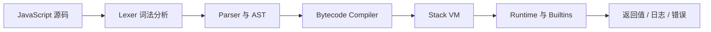
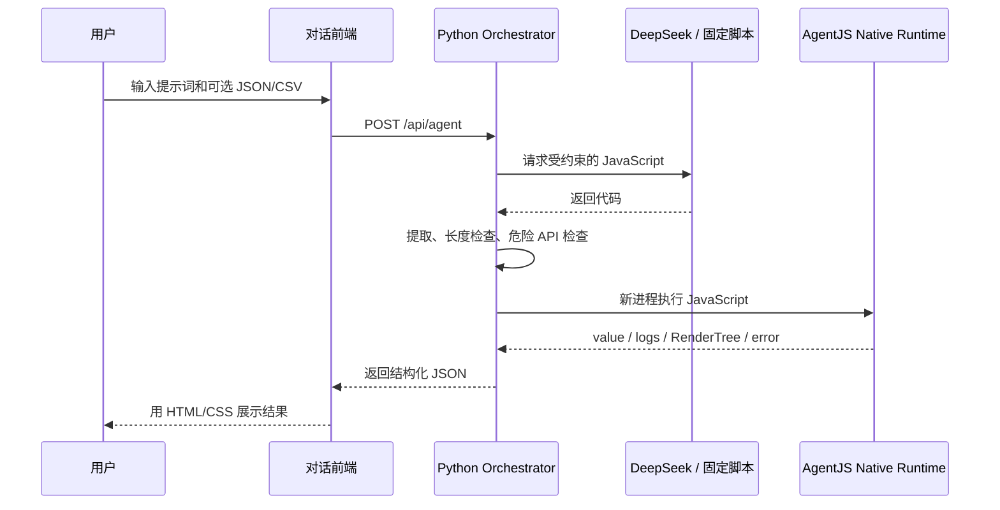
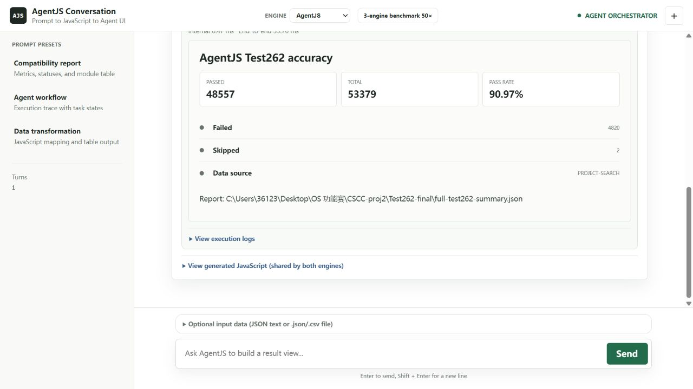

# AgentJS 实验报告

> 项目名称：AgentJS，基于 Rust 的轻量级 JavaScript 执行引擎
>
> 参赛队伍：**【待补】**
>
> 成员与分工：**【待补】**
>
> 报告版本：2026-08-11 样例版
> 对应提交：`a9e2f71f2f27c8a6b9b0414d1446d9822ec5c908`（报告完成时工作区提交）

## 0. 实验结果概览

我们用 Rust 实现了一条完整的 JavaScript 执行链：源码先经过词法分析和语法分析，再编译成自定义字节码，最后交给栈式虚拟机和运行时执行。

当前可以确认的主要结果如下。

| 项目 | 当前结果 | 数据来源 |
| --- | ---: | --- |
| Test262 | **48,557 / 53,379，90.97%** | `Test262-final/full-test262-summary.json` |
| Test262 失败 / 跳过 | 4,820 / 2 | 同上 |
| SunSpider 1.0.2 | **26 / 26 通过** | `benchmarks/sunspider/results/` |
| AgentBench 2.0 cold | AgentJS 与 Boa 几何平均比 **1.643x** | `benchmarks/agent/results/comparison/` |
| AgentBench 2.0 batch | AgentJS 与 Boa 几何平均比 **2.039x** | 同上 |
| cold 峰值内存 | Boa / AgentJS = **1.631x**，Node / AgentJS = **3.969x** | 同上 |
| benchmark 记录的二进制体积 | AgentJS **10.36 MiB**，Boa 28.32 MiB，Node 88.00 MiB | `environment-cold.json` |

这里的“几何平均比”定义为 `参考引擎耗时 / AgentJS 耗时`，大于 1 表示 AgentJS 更快。这个结果只适用于 AgentBench 当前覆盖的短脚本任务，不能理解为 AgentJS 已经在所有 JavaScript 程序上超过 Boa 或 Node。

> 数据口径说明：旧 `report.md` 中的 71.78% 是 2026-06-28 的阶段性完整扫描；当前 90.97% 来自更新时间更晚的 `Test262-final/full-test262-summary.json`。该最新 JSON 还没有记录 commit、CPU 和完整命令，答辩前应补跑一次带环境信息的正式全量测试，避免只有百分比而缺少复现上下文。

## 1. 实验目的

这次实验主要解决三个问题：

1. 能不能用 Rust 完成 JavaScript 从源码分析、字节码生成到运行时执行的完整过程；
2. 这个引擎能不能正确执行足够多的 ECMAScript 语法和标准库功能；
3. 面向 AI Agent 常见的短脚本、高频调用和受限执行场景，能不能做到体积较小、内存可控，并在部分典型任务中获得性能优势。

项目最终展示了一个对话式 Agent Demo，但 Demo 只是应用验证。作品主体始终是 JavaScript 引擎：DeepSeek、对话历史、网页布局和 CSS 不计入引擎能力。

## 2. 实验环境与材料

### 2.1 当前可复现实验环境

| 项目 | 记录 |
| --- | --- |
| 操作系统 | Windows 11 `10.0.26200` |
| CPU | Intel64 Family 6 Model 183 Stepping 1 |
| Rust | `rustc 1.96.0 (ac68faa20 2026-05-25)` |
| Python | 3.14.5 |
| AgentBench 生成时间 | 2026-08-11 |
| AgentJS benchmark SHA-256 | `cc012c31...dffd66626` |
| Test262 revision | **【正式复测时补充】** |
| 最新 Test262 对应 AgentJS commit | **【正式复测时补充】** |

AgentBench 的完整环境、命令和二进制指纹保存在：

- `benchmarks/agent/results/comparison/environment-cold.json`
- `benchmarks/agent/results/comparison/environment-batch.json`

### 2.2 使用的测试集

| 测试 | 用途 | 我们主要看什么 |
| --- | --- | --- |
| Test262 | ECMAScript 一致性测试 | 语法、运行时和标准库是否符合规范 |
| SunSpider 1.0.2 | 经典 JavaScript workload | 复杂脚本能否正确跑完，以及明显的性能短板 |
| AgentBench 2.0 | 自定义 Agent 场景测试 | 冷启动、短字符串处理、数组、对象和压力任务 |
| Demo 固定脚本 / DeepSeek 模式 | 上层应用验证 | AI 生成代码能否经过 AgentJS 形成结构化结果 |

## 3. 我们实现了什么

### 3.1 一段 JavaScript 在引擎中怎样运行



可以把这条链路通俗地理解成：

- Lexer 先把源码拆成一个个有意义的词；
- Parser 判断这些词组成了什么语句，并生成 AST；
- Compiler 把 AST 翻译成更适合虚拟机执行的指令；
- VM 一条条解释指令，维护变量、函数调用和异常；
- Runtime 提供对象、数组、字符串、Promise、正则等运行时能力；
- 最后统一返回执行结果，而不是直接操作浏览器页面。

这条执行链的主要实现位于 `src/lexer/`、`src/parser/`、`src/ast/`、`src/bytecode/`、`src/vm/`、`src/runtime/` 和 `src/builtins/`。

### 3.2 面向 Agent 场景做的设计

#### Engine 和 Runtime 两种入口

| 入口 | 适用情况 | 特点 |
| --- | --- | --- |
| `Engine` | 互不相关的 Agent action | 每次使用新的执行上下文，降低状态泄漏风险 |
| `Runtime` | 同一会话中的连续脚本 | 保留 isolate，并用 32 项 LRU 缓存复用解析和编译结果 |

#### 资源限制

Agent 生成的脚本不一定可靠，所以引擎不能默认相信输入。当前运行时可以限制：

- 执行步数；
- 调用深度；
- 堆对象数量和堆字节；
- 大对象分配；
- 宿主进程等待时间。

超过限制时返回可识别的 `RuntimeLimit` 或超时错误，使单段异常脚本的影响被限制在当前任务内，避免影响整个 Agent 服务的可用性。

### 3.3 几项有针对性的优化

| 优化 | 通俗解释 | 适合的负载 |
| --- | --- | --- |
| 分段稠密数组 | 不为一个很大的数组一次性申请全部空间，需要哪一段再分配哪一段 | 局部连续但索引较大的数组 |
| Descriptor 旁路表 | 普通数组元素只存值，只有特殊属性才额外保存 writable 等描述信息 | 大量普通元素、少量特殊描述符 |
| 非移动 GC + Free List | 活对象地址编号保持稳定，回收后的槽位继续复用 | 短任务中反复创建临时对象 |
| ASCII Fast Path | 纯 ASCII 字符串直接按字节快速处理，复杂 Unicode 再走完整路径 | 日志、Token、JSON 字段等英文文本 |
| 有界脚本缓存 | 相同脚本不用每次都重新解析和编译 | 同一 Agent workflow 中重复执行规则 |

这些优化没有引入 JIT，目的不是和 V8 比峰值吞吐，而是在实现复杂度可控的前提下，优先优化 Agent 短任务里较常见的路径。

## 4. 正确性实验

### 4.1 测试方法

项目没有只挑能通过的用例展示，而是采用分层测试：

```text
模块单元测试
  -> Parser/Bytecode/VM 相邻模块测试
  -> 固定回归用例
  -> Test262 目录扫描
  -> Test262 完整扫描
```

完整扫描中，失败、跳过、崩溃和超时都不算通过。修复时先按错误信息和目录聚类，再寻找多个失败背后的共享原因，避免仅针对单个用例进行定向处理。

### 4.2 Test262 结果

最新汇总如下：

| Total | Passed | Failed | Skipped | Pass rate | Elapsed |
| ---: | ---: | ---: | ---: | ---: | ---: |
| 53,379 | **48,557** | 4,820 | 2 | **90.97%** | 452.354 s |

通过率的阶段变化能够比较直观地反映项目迭代过程：

| 阶段 | Passed / Total | 通过率 | 说明 |
| --- | ---: | ---: | --- |
| 早期完整基线 | 14,035 / 53,379 | 26.29% | Native 最小链路形成后 |
| FixRTLE / Fixup8 | 35,472 / 53,379 | 66.45% | 跨层语义集中修复 |
| 2026-06-28 完整扫描 | 38,315 / 53,379 | 71.78% | 原 `report.md` 的最终值 |
| 2026-08-09 最新汇总 | **48,557 / 53,379** | **90.97%** | 当前最新结果 |

从早期基线到最新汇总，共新增 34,522 个通过用例，提高 64.68 个百分点。最新结果已经超过赛题 60% 的基础要求，但仍有 4,820 个失败，不能把“构造器存在”或“部分方法可用”描述成完全兼容。

### 4.3 SunSpider 结果

AgentJS 可以正确完成 SunSpider 1.0.2 的全部 26 个用例：

| 类别 | 用例数 | 通过 |
| --- | ---: | ---: |
| 3D / access / bitops / controlflow | 12 | 12 |
| crypto / date / math | 8 | 8 |
| regexp / string | 6 | 6 |
| **合计** | **26** | **26** |

不过，“全部正确”不等于“全部更快”。例如旧批次中 `bitops-bitwise-and` 为 262 ms，略快于 Boa 的 286 ms；但 `regexp-dna` 为 3,098 ms，Boa 为 106 ms，`string-tagcloud` 为 8,208 ms，Boa 为 148 ms。这些结果说明 RegExp 和复杂字符串/对象路径仍是明显短板。

## 5. AgentBench 性能实验

### 5.1 为什么还要自定义 benchmark

Test262 主要回答“对不对”，SunSpider 更接近传统 JavaScript 程序。Agent 场景还经常出现下面这些任务：

- 启动一个进程执行很短的脚本；
- 清洗模型输出或日志文本；
- 从 JSON 记录中筛选字段并汇总；
- 创建很多短命对象；
- 对局部稠密的大索引数组进行处理；
- 连续执行多次相似规则。

因此项目增加了 AgentBench 2.0，并把用例分成 `general` 和 `pressure` 两组。所有引擎必须先得到正确结果，只有共同通过的用例才进入速度比计算。

### 5.2 cold 模式

配置为 warmup=1、repeat=3，每次从新进程开始：

| Case | AgentJS P50 | Boa P50 | Node P50 | AgentJS RSS | Boa RSS | Node RSS |
| --- | ---: | ---: | ---: | ---: | ---: | ---: |
| startup-noop | **14.3 ms** | 21.0 ms | 47.8 ms | **7.00 MiB** | 11.23 MiB | 34.02 MiB |
| descriptor-side-table-array | **431.2 ms** | 470.0 ms | 75.2 ms | **13.46 MiB** | 26.23 MiB | 47.39 MiB |
| large-index-dense-array | 622.2 ms | **614.7 ms** | 52.8 ms | **14.39 MiB** | 18.38 MiB | 39.82 MiB |
| string-cleanup-replace-window | **141.6 ms** | 1,057.4 ms | 46.8 ms | **8.14 MiB** | 14.76 MiB | 38.81 MiB |
| string-log-token-slice | **472.4 ms** | 479.4 ms | 46.9 ms | **8.82 MiB** | 14.04 MiB | 38.50 MiB |

五个用例三种引擎均为 5/5 正确。几何平均结果为：

- Boa / AgentJS：全部 1.643x，general 2.233x，pressure 1.038x；
- Node / AgentJS：全部 0.277x，说明 Node 在纯执行耗时上总体更快；
- 峰值 RSS：Boa / AgentJS 为 1.631x，Node / AgentJS 为 3.969x。

这组数据体现出的优势主要是冷启动和内存，并不表示 AgentJS 的整体执行性能已经超过带 JIT 的 Node。

### 5.3 batch 模式

batch 模式让每个新进程连续执行 5 次任务：

| Case | AgentJS P50 | Boa P50 | Node P50 | AgentJS RSS | Boa RSS | Node RSS |
| --- | ---: | ---: | ---: | ---: | ---: | ---: |
| startup-noop | **16.3 ms** | 22.1 ms | 47.9 ms | **7.25 MiB** | 11.61 MiB | 34.02 MiB |
| descriptor-side-table-array | 1,016.7 ms | 571.0 ms | **173.5 ms** | **27.25 MiB** | 76.73 MiB | 63.32 MiB |
| large-index-dense-array | 1,633.5 ms | 894.0 ms | **58.2 ms** | 42.66 MiB | **37.40 MiB** | 40.26 MiB |
| string-cleanup-replace-window | **252.1 ms** | 9,486.7 ms | 60.2 ms | **9.70 MiB** | 14.40 MiB | 48.14 MiB |
| string-log-token-slice | **1,006.4 ms** | 2,261.6 ms | 56.1 ms | **10.68 MiB** | 14.02 MiB | 40.76 MiB |

综合结果中，Boa / AgentJS 的 general 比为 4.858x，但 pressure 比只有 0.554x，也就是 AgentJS 在连续数组压力用例中反而较慢。这是很重要的边界：目前的结构优化对一般短字符串任务效果明显，但批量压力下的数组分配、GC 或循环执行仍需继续优化。

### 5.4 体积对比

AgentBench 记录的同批次可执行文件体积为：

| 引擎 | Bytes | MiB |
| --- | ---: | ---: |
| AgentJS | 10,859,520 | **10.36** |
| Boa | 29,693,440 | 28.32 |
| Node | 92,279,112 | 88.00 |
| QuickJS | **【待在同一环境构建并补测】** | **【待补】** |

2026-08-11 按当前提交重新构建后的 `agentjs.exe` 为 10,891,776 bytes（10.39 MiB），与 benchmark 记录相差约 32 KiB。正式答辩数据应重新锁定同一 commit、同一二进制哈希后再统一表格。

## 6. Agent Demo 实验

### 6.1 Demo 想证明什么

Demo 不是要证明 JavaScript 可以自己画网页，而是验证 AgentJS 能否放进真实 Agent 调用链：



其中：

- JavaScript 计算数据并调用 `agent.render(tree)`；
- `agent.render` 是 AgentJS 在 Rust Host 层注册的宿主 API；
- AgentJS 收集并校验 RenderTree，但不负责生成屏幕像素；
- 最终界面仍由前端 HTML/CSS 渲染。

当前 RenderTree v1 只允许六种节点：`panel`、`text`、`metrics`、`statuses`、`table` 和 `list`。限制类型的好处是模型输出更容易校验，也避免直接把 AI 生成的 HTML 当作可信页面执行。

### 6.2 实际展示效果

下面是 2026-08-11 使用 fixed-script 模式、Native AgentJS 后端运行“Compatibility report”后的真实截图。页面中的 Test262 数据来自 `Test262-final/full-test262-summary.json`。



截图中的单次 `Internal` 和 `End-to-end` 时间只用于说明页面能够显示两类计时，不作为正式性能结论。正式对比使用 AgentBench 的多次测量数据。

### 6.3 可供模型生成的脚本示例

```javascript
var modules = input.modules || [];
var total = modules.reduce(function (sum, item) {
  return sum + item.total;
}, 0);
var passed = modules.reduce(function (sum, item) {
  return sum + item.passed;
}, 0);
var passRate = total === 0 ? "0.00%" : (passed / total * 100).toFixed(2) + "%";

agent.render({
  type: "panel",
  title: "AgentJS Test262 accuracy",
  children: [
    {
      type: "metrics",
      items: [
        { label: "Passed", value: passed },
        { label: "Total", value: total },
        { label: "Pass rate", value: passRate }
      ]
    },
    {
      type: "table",
      columns: ["Module", "Passed", "Total"],
      rows: modules.map(function (item) {
        return [item.module, item.passed, item.total];
      })
    }
  ]
});

return passRate;
```

为降低 AI 输出不符合协议的概率，线上提示词需要明确写出：

1. 只返回一个 JSON 对象中的 `code` 字段，不使用 Markdown 代码围栏；
2. 只允许调用 `agent.render` 和 `console.log`；
3. RenderTree 只能使用六种类型；
4. 输入数据只从已存在的 `input` 参数读取，不能重新声明 `input`；
5. 禁止 `eval`、`Function`、网络、文件、DOM、Node API 和动态模块加载；
6. 代码长度不得超过 16,000 字符。

### 6.4 Demo 调用链复测

本次生成报告时实际进行了一次调用链复测：

1. `GET /api/health` 确认 AgentJS Runtime 可用；
2. 首次请求报错：`unknown option --time`；
3. 检查发现 `src/main.rs` 已支持 `--time`，但 `target/release/agentjs.exe` 是三天前的旧产物；
4. 重新执行 `cargo build --release --locked`；
5. 再次请求成功，页面展示 48,557 / 53,379 和 90.97%。

这个问题说明 Demo 部署时不能只复制前端和 `server.py`，还要确保可执行文件与源码/协议是同一版本。建议打包阶段写入版本号和 SHA-256，并让 `/api/health` 同时返回 CLI 协议版本。

## 7. 实验中遇到的典型问题

### 7.1 局部模块正确，但整条链路仍然错误

JavaScript 很多语义跨越 Parser、Compiler、VM 和 Builtins。例如 `for-of break` 不仅要跳出循环，还必须执行 IteratorClose；`eval` 作为子表达式时不能清掉外层操作数栈。我们的处理方式是寻找共享协议和完成记录的根因，而不是给单个 Test262 文件加特例。

### 7.2 测试规模大，完整扫描不适合每次都跑

53,379 个 Test262 用例适合做阶段验收，但不适合每次修改后立即全跑。项目采用单元测试、固定回归门、目录扫描和完整扫描逐级放大的方式，既缩短反馈时间，也保留最终完整数据。

### 7.3 多人并行容易发生跨层冲突

Parser、Bytecode、VM 和 Builtins 之间联系很紧。项目通过 `src/contracts.rs` 固定主要接口，并按 Frontend、Runtime、Builtins 分工；未完成的上下游使用手工 AST、Chunk 或 Fake Stage 测试，减少所有人同时修改同一个大文件。

### 7.4 AI 会生成语法正确但协议错误的代码

模型可能使用不存在的 RenderTree 类型，也可能重新声明包装函数已有的 `input` 参数。Demo 在模型提示词之外又增加了代码长度、危险 token 和 RenderTree 结构检查；协议错误会返回稳定错误码，前端无需根据非结构化文本推断失败原因。

## 8. 如何复现实验

### 8.1 构建 AgentJS

```powershell
cargo build --release --locked
.\target\release\agentjs.exe eval "1 + 2"
```

### 8.2 运行测试

```powershell
cargo test --all-targets

New-Item -ItemType Directory -Path reports/test262-20260811-a9e2f71 -Force
.\target\release\agentjs.exe test262 `
  --root test262 `
  --suite test `
  --backend native `
  --jobs 4 `
  --json reports/test262-20260811-a9e2f71/full-summary.json
```

正式运行前应先确认当前 CLI 的实际参数，并把 stdout/stderr、commit、Test262 revision 和环境信息一起保存。不要直接覆盖已有正式 JSON，建议先输出到带日期和 commit 的新目录。

### 8.3 运行 AgentBench

```powershell
python benchmarks/agent/run_agentbench.py --help
```

具体引擎路径、warmup、repeat、cold/batch 模式以 `benchmarks/agent/README.md` 和结果目录中的 `environment-*.json` 为准。

### 8.4 运行 Demo

```powershell
cargo build --release --locked
cargo build --release --locked --manifest-path boa/Cargo.toml -p boa_cli
python demo/agent/server.py --host 127.0.0.1 --port 8787 --no-browser
```

浏览器打开：`http://127.0.0.1:8787/frontend/agent-chat.html`

无 API Key 时使用 fixed-script 模式；设置 `DEEPSEEK_API_KEY` 后可以使用 DeepSeek。API Key 只能通过环境变量或桌面启动输入框提供，不能写入仓库。

## 9. 当前不足和下一步工作

| 问题 | 影响 | 短期改进 |
| --- | --- | --- |
| 最新 Test262 JSON 缺少 commit 和环境字段 | 90.97% 可验证性不够完整 | 在固定提交上重新全量扫描，并同时保存 environment.json |
| AgentBench warmup=1、repeat=3 | 样本量偏小 | 答辩前使用 warmup>=3、repeat>=15，报告 P50/P90/P95 |
| batch pressure 慢于 Boa | 连续数组压力场景优势不足 | 分离解析、执行、GC 时间，检查数组扩容和回收频率 |
| Node 在纯计算吞吐上明显更快 | 没有 JIT 的解释器峰值有限 | 强调冷启动、体积、内存和可控性，不做“全面更快”表述 |
| QuickJS 没有进入同批次数据 | 轻量引擎对比不完整 | 同机器、同脚本、同统计方式补测 QuickJS |
| Demo CLI 协议没有版本握手 | 旧二进制会造成运行期报错 | health 返回版本和功能列表，打包时校验 SHA-256 |
| RenderTree 类型有限 | 复杂 UI 表达能力有限 | 保持 v1 稳定，按真实需求增量增加 chart 等受控节点 |

## 10. 第三方项目和 AI 使用说明

- Boa 和 Node 仅作为 benchmark 中的横向对比对象；
- QuickJS 用于轻量引擎设计参考，当前正式性能表尚未补齐；
- Test262、SunSpider 和 JetStream 只作为测试输入，不进入 Native 执行实现；
- 项目使用 Codex、Claude Code 等 AI 工具辅助代码阅读、任务拆分、失败聚类和文档整理；
- 所有 AI 产出最终都以 Rust 测试、Test262 JSON、benchmark 原始文件和人工审查为准。

## 11. 实验总结

本项目完成的不是一个网页渲染器，也不只是一个调用大模型的 Agent 前端，而是一套由 Rust 实现的独立 JavaScript 引擎。当前 Native 执行链已经能够完成从源码、AST、字节码到 VM 和 Runtime 的完整流程，最新 Test262 汇总达到 90.97%，SunSpider 26/26 正确通过。

性能实验表明，AgentJS 在冷启动、可执行文件体积、峰值内存和部分字符串短任务上具有明确优势；同时，Node 的计算吞吐和 Boa 在 batch pressure 中的表现也说明项目还存在真实短板。这样的结论比单一“综合得分”更能说明引擎当前适合什么、不适合什么。

最后的对话式 Demo 把自然语言、受约束 JavaScript、AgentJS Host API 和结构化前端连接起来，证明引擎可以进入实际 Agent 工作流。Demo 是成果的使用方式，而 AgentJS Native Runtime 才是本项目的核心作品。

---

## 附录：答辩前数据检查表

- [ ] 锁定 AgentJS commit 和 Test262 revision；
- [ ] 在同一 release 二进制上重新生成 Test262 全量 JSON；
- [ ] 记录 CPU、操作系统、电源模式、Rust 版本和并发数；
- [ ] 将 AgentBench 提高到正式 warmup/repeat 配置；
- [ ] 补测 QuickJS，避免只和 Boa、Node 比较；
- [ ] 保存所有二进制 SHA-256 和体积；
- [ ] 更新 Demo 截图中的最终数据；
- [ ] 检查报告、PPT 和现场 Demo 使用相同数字；
- [ ] 补齐队伍名称、成员分工和演示视频链接。
